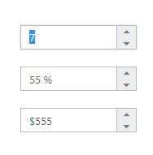

# Accessibility

The term Accessibility in general, refers to the process of designing a product that is easily accessible to all kinds of people irrespective of their disabilities. The developer should keep in mind the concept of Accessibility as their prime motive while creating any of the web applications. So that the application and the web content will be easily accessible to the people with disabilities. Such applications created with Accessibility support is generally termed as ARIA (Accessible Rich Internet Applications).

Sometimes, the content and the functionalities used in the websites cannot be conveyed to the users who mainly relies on screen readers and the one who cannot use the mouse. To overcome such circumstances and to address these accessibility challenges, WAI-ARIA (Web Accessibility Initiative) has defined a new way/specification to achieve those functionalities with the use of some assistive technologies. The assistive technologies will make use of the widget’s attribute information (roles, states, and properties) and then convey the appropriate information to the persons with disabilities.

The WAI-ARIA specification suite defines a set of roles, states, and properties for the user-accessible DOM elements, that makes the accessibility and interoperability of the web content and applications easier than before.

## Creating accessible widgets using WAI-ARIA

This section describes about the approaches followed to make the widgets accessible using the Roles, States, and Properties defined by WAI-ARIA specifications. The WAI-ARIA specifications recommends several attributes to be used along with the DOM element structure to make it accessible.

The common widgets that can be made as accessible using WAI-ARIA are listed [here](https://www.w3.org/TR/wai-aria-practices-1.1/). The various ARIA attributes that are used to make the widgets accessible are listed [here](https://msdn.microsoft.com/en-us/library/hh801958%28v=vs.85%29.aspx).

The basic steps for converting a common widget into accessible are as follows:

1.	Choose the appropriate [role](https://www.w3.org/WAI/PF/aria/roles.html) for your widget that defines the general component type. For example, if you need to create a button, set the role to button.



    <button id="button1" role="button">Submit</button>



2.	Once the role is selected, now you can set its state/properties avails for it from the link given [here](https://www.w3.org/WAI/PF/aria/states_and_properties#aria-describedby).



    <button id="button1" role="button" aria-disabled="false" aria-describedby="Submit the Form" >Submit</button>



i.	The above code will make the button widget accessible, as it was defined with aria-disabled state set to false. It states that if none of that button actions are currently available, then the button is said to be in an aria-disabled state.  
ii.	The property aria-describedby has been assigned with some related button text that denotes the button description to be notified to the user.

N> Note: If your button is a togglebutton, it can be defined with an additional aria-pressed state that returns the value true if the button undergoes toggling, else the state remains as false. 
An example with button control that has been made accessible can be referred from this [link](https://www.w3.org/TR/wai-aria-practices-1.1/examples/button/button.html).

## Usage of Accessibility in Syncfusion Widgets

All our Syncfusion Widgets are developed based on the standards mentioned in the ARIA specifications, therefore it supports the full-fledged feature of Web Accessibility Initiative (WAI). Since our Essential JavaScript has provided the built-in support for accessibility in all its UI widgets, therefore it allows the user to create the widgets that are easily used by the assistive technologies. The two major concepts that has been mainly focused for providing such accessibility support are as follows:

•	Keyboard navigation  
•	Defining ARIA attributes to the required DOM elements  

As of now, the keyboard navigation functionality is provided as a default feature for all the Syncfusion widgets that allows all the keyboard enabled widgets to interact with the user.

### Keyboard Navigation

Any Syncfusion widgets used within an application are easily accessible to all - especially for the visually disabled peoples and those who cannot use mouse for navigating through the application. To make it more accessible, the built-in keyboard navigation support has been provided for almost all the components available within the Essential Studio package. Simply by pressing the TAB key will move the focus from one element to another within the application.

With this support enabled for the widgets, the various elements present within that particular widget can be easily focused by pressing the appropriate keyboard shortcuts. The currently focused element within the widget is clearly indicated with its unique visual style which denotes that it is now ready to accept the user inputs.

Such visual indications through keyboard navigation are very useful for the accessibility support, as it needs to be properly conveyed to the assistive technologies that the focus has been changed.

Each and every widget available within the Syncfusion Essential JavaScript suite has its unique behavior and responds appropriately to the keyboard actions. As an example, look onto the below 3 editors placed on the same page and how to navigate between them through keyboard.

 

Initially, the focus is on the first editor (numeric textbox) that is indicated with the text selection and the border effect provided for the widget’s outline through CSS.
Having the current focus on the numeric text box, now pressing the up arrow will increase the numeric value and down arrow will decrease the value. Pressing tab key will advance the focus to the next widget present in the page. Here the percentage textbox that is placed as second will get focused on pressing the tab key.

To enable the default tab key navigation, all the Syncfusion widgets are set with appropriate tabIndex property with the provided value as 0 (zero). The element with keyboard focus is essential because it communicates essential information about the widget to the assistive technologies like screen readers.

Pressing Tab key will traverse the focus in a forward direction and if the shift + Tab combination of keys are pressed, the focus will be moved to the previous elements (focus traverse through backward direction).

### Defining ARIA attributes to the required DOM elements

As discussed in the previous topics - To make a component more accessible by all kind of users, it needs to be defined with some essential information along with its initial element creation. Here, the essential information to be defined for the components are its suitable role, state, and its properties. Usually the assistive technologies will make use of these information retrieved from the specific attributes and use it to convey the appropriate information to the users.

#### Roles, States and Properties

As the widget role defines the component type, therefore all the Syncfusion widgets are provided with corresponding roles. The roles can be anything like button, toolbar, checkbox, radiobutton, and so on.

All the Syncfusion widgets are assigned with built-in States and properties based on its role. Usually the states and properties are defined for a widget using the ARIA attributes that will convey appropriate current state and action of the control to the assistive technologies.

For example, our Syncfusion button widget, when created through JavaScript code will be rendered in the web browser with HTML DOM elements (along with the assigned built-in ARIA attributes) as shown in the following.



    <ej:Button ID="button11" runat="server" Type="Button" Text="login" Size="Normal" ShowRoundedCorner="true"></ej:Button>



When the above code is executed on the browser, the Syncfusion button widget will be rendered with the following equivalent HTML DOM attributes created for it.



    <button id="button11" class="e-button e-js e-btn-normal e-btn e-select e-widget e-corner-all" tabindex="" type="submit" role="button" aria-describedby="login" aria-disabled="false"></button>



Here, the aria-describedby is the ARIA property assigned to the Syncfusion button widget as built-in, so that the button description is notified to the user through assistive technologies.

Likewise, the aria-disabled is one of the ARIA state assigned built-in to the button, which states that if none of that button actions are currently available, the button is said to be in an aria-disabled state.
