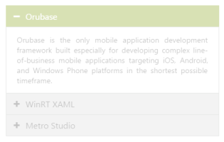

# Accordion Panel enabler

## Enable or Disable control

You can enable or disable the Accordion control on initial rendering by using the Enabled property. By default Enabled property is set to true and the Accordion panels are active always. 

 The following steps explain you on how to disable the Accordion control.

 In an ASPX page, define the Accordion control and add the contents correspondingly.



<ej:Accordion ID="BasicAccordion" runat="server" Enabled="false">

        <Items>

            <ej:AccordionItem Text="Orubase">

                <ContentSection>

                     Orubase is the only mobile application development Framework built especially for developing complex line-of-business mobile applications targeting iOS, Android, and Windows Phone platforms in the shortest possible time frame. 

                </ContentSection>

            </ej:AccordionItem>

            <ej:AccordionItem Text="WinRT XAML">

                <ContentSection>

                    Essential Studio for WinRT contains all the controls you need to build line-of-business tablet applications including grid, chart, map, tree map, SSRS report viewer, rich-text editor, PDF viewer, gauges, barcode, editors, and much more. It also includes a unique set of controls for reading and writing Excel, Word, and PDF documents in Windows store apps.

                </ContentSection>

            </ej:AccordionItem>

            <ej:AccordionItem Text="Metro Studio">

                <ContentSection>

                    Syncfusion Metro Studio is a collection of over 2500 Metro-style icon templates that can be easily customized to create thousands of unique Metro icons. 

                </ContentSection>

            </ej:AccordionItem>

        </Items>

    </ej:Accordion>



Output for disabled Accordion control is as follows.

  

## Enable panel items

You can enable the Accordion control items on initial loading by using EnabledItems property. This property takes array of indices that has to be enabled in Accordion control. 

The DisabledItems property disables the Accordion items based on the index. This takes array of indices whose panel is to be disabled. 

### Enabling accordion panel items

The following steps explains you on how to enable the panel items in Accordion control.

In an ASPX page, define a &lt;div&gt; element that is a container for Accordion control and add the contents correspondingly.



     

<ej:Accordion ID="BasicAccordion" runat="server" SelectedItemIndex="1" EnableMultipleOpen="true">

    <Items>

        <ej:AccordionItem Text="Orubase">

            <contentsection>

                Orubase is the only mobile application development Framework built especially for developing complex line-of-business mobile applications targeting iOS, Android, and Windows Phone platforms in the shortest possible time frame. 

            </contentsection>

        </ej:AccordionItem>

        <ej:AccordionItem Text="WinRT XAML">

            <contentsection>

                Essential Studio for WinRT contains all the controls you need to build line-of-business tablet applications including grid, chart, map, tree map, SSRS report viewer, rich-text editor, PDF viewer, gauges, barcode, editors, and much more. It also includes a unique set of controls for reading and writing Excel, Word, and PDF documents in Windows store apps.

            </contentsection>

        </ej:AccordionItem>

        <ej:AccordionItem Text="Metro Studio">

            <contentsection>

                Syncfusion Metro Studio is a collection of over 2500 Metro-style icon templates that can be easily customized to create thousands of unique Metro icons. 

            </contentsection>

        </ej:AccordionItem>

    </Items>

    </ej:Accordion>



Define the items to be enabled and disabled then assign the integer array to EnabledItems and DisabledItems properties in code behind.



protected void Page_Load(object sender, EventArgs e)

        {

            List<int> enabledItem = new List<int>() { 1, 2 };

            List<int> disabledItem = new List<int>() { 0 };

            this.BasicAccordion.EnabledItems = enabledItem;

            this.BasicAccordion.DisableItems = disabledItem;

        }



Output for Accordion control with some enabled and disabled items, where first panel is disabled and it can’t be expanded or collapsed is as follows.

  

## State Maintenance

Accordion control can store the model value in the browser cookies and on every time after initial rendering, the control get the model from the cookie only. By using EnablePersistence property you can store the model value in cookies. Thus when any changes are made dynamically then those values are updated in cookie. On refreshing the page, the past state of the Accordion control is maintained in cookie and control is rendered from it

### Configure state persistence of Accordion panel

The following steps explains to enable state maintenance for Accordion.

In an ASPX page, define a &lt;div&gt; element that is a container for Accordion control and add the contents correspondingly



     

<ej:Accordion ID="BasicAccordion" runat="server" EnablePersistence="true">

    <Items>

        <ej:AccordionItem Text="Orubase">

            <contentsection>

                Orubase is the only mobile application development Framework built especially for developing complex line-of-business mobile applications targeting iOS, Android, and Windows Phone platforms in the shortest possible time frame. 

            </contentsection>

        </ej:AccordionItem>

        <ej:AccordionItem Text="WinRT XAML">

            <contentsection>

                Essential Studio for WinRT contains all the controls you need to build line-of-business tablet applications including grid, chart, map, tree map, SSRS report viewer, rich-text editor, PDF viewer, gauges, barcode, editors, and much more. It also includes a unique set of controls for reading and writing Excel, Word, and PDF documents in Windows store apps.

            </contentsection>

        </ej:AccordionItem>

        <ej:AccordionItem Text="Metro Studio">

            <contentsection>

                Syncfusion Metro Studio is a collection of over 2500 Metro-style icon templates that can be easily customized to create thousands of unique Metro icons. 

            </contentsection>

        </ej:AccordionItem>

    </Items>

    </ej:Accordion>



Output after page refresh maintaining the previous state of Accordion control is as follows.

 

