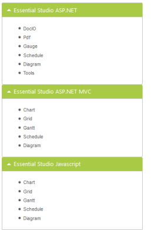

# Getting Started

## Create your first Accordion in ASP.NET

The ASP.NET Web Forms Accordion control allows you to provide multiple panes and display them one at a time. In this section, you can learn how the Accordion control is configured and how to customize it with various properties such as multiple open, rounded corner and icons for the Accordion header according to your requirement.

## Create a Simple Accordion

The following steps describe the creation of Accordion control.

* You can create an ASP.NET Web Forms Project and add necessary Dll’s and Scripts with the help of the given [ASP.NET Web Forms-Getting Started](http://help.syncfusion.com/aspnetmvc/accordion/getting-started) Documentation.
* Add the following code example to the corresponding aspx page to render Accordion.
* Add Accordion widget, and initialize Accordion control as follows.


        <ej:Accordion ID="Accordion1" runat="server">

            <Items>

                <ej:AccordionItem Text="Essential Studio ASP.NET">

                    <ContentSection>

                        <ul>

                            <li>

                                <h5>DocIO</h5>

                            </li>

                            <li>

                                <h5>PDF  </h5>

                            </li>

                            <li>

                                <h5>Gauge  </h5>

                            </li>

                            <li>

                                <h5>Schedule  </h5>

                            </li>

                            <li>

                                <h5>Diagram  </h5>

                            </li>

                            <li>

                                <h5>Tools </h5>

                            </li>

                        </ul>

                    </ContentSection>

                </ej:AccordionItem>

                <ej:AccordionItem Text="Essential Studio ASP.NET MVC">

                    <ContentSection>

                        <ul>

                            <li>

                                <h5>Chart </h5>

                            </li>

                            <li>

                                <h5>Grid  </h5>

                            </li>

                            <li>

                                <h5>Gantt  </h5>

                            </li>

                            <li>

                                <h5>Schedule  </h5>

                            </li>

                            <li>

                                <h5>Diagram  </h5>

                            </li>

                        </ul>

                    </ContentSection>

                </ej:AccordionItem>

                <ej:AccordionItem Text="Essential Studio Javascript">

                    <ContentSection>

                        <ul>

                            <li>

                                <h5>Chart </h5>

                            </li>

                            <li>

                                <h5>Grid  </h5>

                            </li>

                            <li>

                                <h5>Gantt  </h5>

                            </li>

                            <li>

                                <h5>Schedule  </h5>

                            </li>

                            <li>

                                <h5>Diagram  </h5>

                            </li>

                        </ul>

                    </ContentSection>

                </ej:AccordionItem>

            </Items>

        </ej:Accordion>

    



Execute the above code sample to display the Accordion control with simple control list.

### Configure Multiple Open

You can open multiple Accordion tabs to view all products at a time. To render this, set the EnableMultipleOpen property of the Accordion control to true.

N> EnableMultipleOpen _property is_ _false_ by default. 

You can also open all the panels during initialization by using the SelectedItems property of the Accordion control. The following code sample illustrates the opening of multiple tabs by passing the tab index values to SelectedItems property.



    <ej:Accordion ID="Accordion1" runat="server" EnableMultipleOpen="true">

        <Items>

            <ej:AccordionItem Text="Essential Studio ASP.NET">

                <ContentSection>

                    <ul>

                        <li>

                            <h5>DocIO</h5>

                        </li>

                        <li>

                            <h5>PDF  </h5>

                        </li>

                        <li>

                            <h5>Gauge  </h5>

                        </li>

                        <li>

                            <h5>Schedule  </h5>

                        </li>

                        <li>

                            <h5>Diagram  </h5>

                        </li>

                        <li>

                            <h5>Tools </h5>

                        </li>

                    </ul>

                </ContentSection>

            </ej:AccordionItem>

            <ej:AccordionItem Text="Essential Studio ASP.NET MVC">

                <ContentSection>

                    <ul>

                        <li>

                            <h5>Chart </h5>

                        </li>

                        <li>

                            <h5>Grid  </h5>

                        </li>

                        <li>

                            <h5>Gantt  </h5>

                        </li>

                        <li>

                            <h5>Schedule  </h5>

                        </li>

                        <li>

                            <h5>Diagram  </h5>

                        </li>

                    </ul>

                </ContentSection>

            </ej:AccordionItem>

            <ej:AccordionItem Text="Essential Studio Javascript">

                <ContentSection>

                    <ul>

                        <li>

                            <h5>Chart </h5>

                        </li>

                        <li>

                            <h5>Grid  </h5>

                        </li>

                        <li>

                            <h5>Gantt  </h5>

                        </li>

                        <li>

                            <h5>Schedule  </h5>

                        </li>

                        <li>

                            <h5>Diagram  </h5>

                        </li>

                    </ul>

                </ContentSection>

            </ej:AccordionItem>

        </Items>

    </ej:Accordion>



Accordion control with EnableMultipleOpen property with value as true is illustrated in the following screenshot.

 

### Setting Rounded corner

Accordion control by default is renders in a regular rectangle. You can modify the regular rectangles with rounded corners by setting the ShowRoundedCorner property to “True”.

N> ShowRoundedCorner _property is False by default.



    <ej:Accordion ID="Accordion1" runat="server" EnableMultipleOpen="true" ShowRoundedCorner="true">

        <Items>

            <ej:AccordionItem Text="Essential Studio ASP.NET">

                <ContentSection>

                    <ul>

                        <li>

                            <h5>DocIO</h5>

                        </li>

                        <li>

                            <h5>PDF  </h5>

                        </li>

                        <li>

                            <h5>Gauge  </h5>

                        </li>

                        <li>

                            <h5>Schedule  </h5>

                        </li>

                        <li>

                            <h5>Diagram  </h5>

                        </li>

                        <li>

                            <h5>Tools </h5>

                        </li>

                    </ul>

                </ContentSection>

            </ej:AccordionItem>

            <ej:AccordionItem Text="Essential Studio ASP.NET MVC">

                <ContentSection>

                    <ul>

                        <li>

                            <h5>Chart </h5>

                        </li>

                        <li>

                            <h5>Grid  </h5>

                        </li>

                        <li>

                            <h5>Gantt  </h5>

                        </li>

                        <li>

                            <h5>Schedule  </h5>

                        </li>

                        <li>

                            <h5>Diagram  </h5>

                        </li>

                    </ul>

                </ContentSection>

            </ej:AccordionItem>

            <ej:AccordionItem Text="Essential Studio Javascript">

                <ContentSection>

                    <ul>

                        <li>

                            <h5>Chart </h5>

                        </li>

                        <li>

                            <h5>Grid  </h5>

                        </li>

                        <li>

                            <h5>Gantt  </h5>

                        </li>

                        <li>

                            <h5>Schedule  </h5>

                        </li>

                        <li>

                            <h5>Diagram  </h5>

                        </li>

                    </ul>

                </ContentSection>

            </ej:AccordionItem>

        </Items>

    </ej:Accordion>



The following screenshot illustrates the Accordion control with rounded corners.

 

### Customize Icon

You can customize the Header icon by using CustomIcon property. This property is having two features such as Header and SelectedHeader. By default, the classes of Header and SelectedHeader are e-collapse and e-expand respectively.

You can change the +/- symbol in the Accordion header, that are default icons with Up/Down arrow icon. 

Up/Down arrow icons are available in e-arrowheadup and e-arrowheaddown classes respectively in the ej.widgets.core.min.css stylesheets from the sample. You can set the Up/Down arrow icon to Accordion header, by adding e-arrowheadup and e-arrowheaddown class to SelectedHeader and Header properties respectively.



    <ej:Accordion ID="Accordion1" runat="server" EnableMultipleOpen="true" ShowRoundedCorner="true">

        <CustomIcon Header="e-arrowheaddown" SelectedHeader="e-arrowheadup"/>

        <Items>

            <ej:AccordionItem Text="Essential Studio ASP.NET">

                <ContentSection>

                    <ul>

                        <li>

                            <h5>DocIO</h5>

                        </li>

                        <li>

                            <h5>PDF  </h5>

                        </li>

                        <li>

                            <h5>Gauge  </h5>

                        </li>

                        <li>

                            <h5>Schedule  </h5>

                        </li>

                        <li>

                            <h5>Diagram  </h5>

                        </li>

                        <li>

                            <h5>Tools </h5>

                        </li>

                    </ul>

                </ContentSection>

            </ej:AccordionItem>

            <ej:AccordionItem Text="Essential Studio ASP.NET MVC">

                <ContentSection>

                    <ul>

                        <li>

                            <h5>Chart </h5>

                        </li>

                        <li>

                            <h5>Grid  </h5>

                        </li>

                        <li>

                            <h5>Gantt  </h5>

                        </li>

                        <li>

                            <h5>Schedule  </h5>

                        </li>

                        <li>

                            <h5>Diagram  </h5>

                        </li>

                    </ul>

                </ContentSection>

            </ej:AccordionItem>

            <ej:AccordionItem Text="Essential Studio Javascript">

                <ContentSection>

                    <ul>

                        <li>

                            <h5>Chart </h5>

                        </li>

                        <li>

                            <h5>Grid  </h5>

                        </li>

                        <li>

                            <h5>Gantt  </h5>

                        </li>

                        <li>

                            <h5>Schedule  </h5>

                        </li>

                        <li>

                            <h5>Diagram  </h5>

                        </li>

                    </ul>

                </ContentSection>

            </ej:AccordionItem>

        </Items>

    </ej:Accordion>



The following screenshot illustrates the customization of SelectedHeader and Header of the Accordion control.

 

