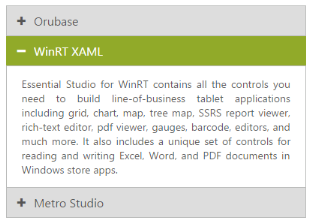
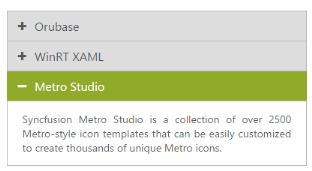
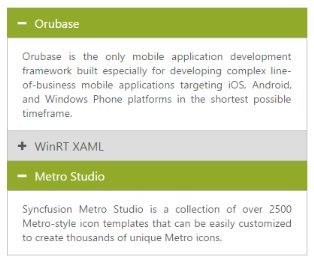

# Header customization

## Collapsible

Accordion control allows you to set Collapsible state for an Accordion header. Thus you can expand and collapse accordion contents. By default Collapsible is set to false.

### Enable Collapsible settings

The following steps explains to enable Collapsible state for Accordion.

In an ASPX page, define the Accordion control and add the contents correspondingly. Set the Collapsible property as true.



     

    <ej:Accordion ID="BasicAccordion" runat="server" Collapsible="true">

    <Items>

        <ej:AccordionItem Text="Orubase">

            <contentsection>

                Orubase is the only mobile application development Framework built especially for developing complex line-of-business mobile applications targeting iOS, Android, and Windows Phone platforms in the shortest possible time frame. 

            </contentsection>

        </ej:AccordionItem>

        <ej:AccordionItem Text="WinRT XAML">

            <contentsection>

                Essential Studio for WinRT contains all the controls you need to build line-of-business tablet applications including grid, chart, map, tree map, SSRS report viewer, rich-text editor, PDF viewer, gauges, barcode, editors, and much more. It also includes a unique set of controls for reading and writing Excel, Word, and PDF documents in Windows store apps.

            </contentsection>

        </ej:AccordionItem>

        <ej:AccordionItem Text="Metro Studio">

            <contentsection>

                Syncfusion Metro Studio is a collection of over 2500 Metro-style icon templates that can be easily customized to create thousands of unique Metro icons. 

            </contentsection>

        </ej:AccordionItem>

    </Items>

    </ej:Accordion>



 Output for Accordion control with collapsible headers.

 

## Enable Header expand

Accordion control provides you support to set the event, where the headers should expand and collapse. The Events properties takes default events like mouseout, mouseover, and click.

### Configure header expand event

The following steps explains you to configure header expand event for Accordion.

In an ASPX page, define the Accordion control and add the contents correspondingly. Set the Events property value as mouseout.



     

    <ej:Accordion ID="BasicAccordion" runat="server" Events="mouseout">

    <Items>

        <ej:AccordionItem Text="Orubase">

            <contentsection>

                Orubase is the only mobile application development Framework built especially for developing complex line-of-business mobile applications targeting iOS, Android, and Windows Phone platforms in the shortest possible time frame. 

            </contentsection>

        </ej:AccordionItem>

        <ej:AccordionItem Text="WinRT XAML">

            <contentsection>

                Essential Studio for WinRT contains all the controls you need to build line-of-business tablet applications including grid, chart, map, tree map, SSRS report viewer, rich-text editor, PDF viewer, gauges, barcode, editors, and much more. It also includes a unique set of controls for reading and writing Excel, Word, and PDF documents in Windows store apps.

            </contentsection>

        </ej:AccordionItem>

        <ej:AccordionItem Text="Metro Studio">

            <contentsection>

                Syncfusion Metro Studio is a collection of over 2500 Metro-style icon templates that can be easily customized to create thousands of unique Metro icons. 

            </contentsection>

        </ej:AccordionItem>

    </Items>

    </ej:Accordion>



Output for Accordion control that expands header on mouseout event is as follows.

 

## Set selected header
  
## Single selection

BY using SelectedItemIndex property you can modify the expanded panel when the control is rendered. By default SelectedItemIndex is ‘0’ that always activate the first Accordion panel.

### Specify the selected item in Accordion panel

The following steps explains you to configure selected item for Accordion.

In an ASPX page, define the Accordion control and add the contents correspondingly. Set the SelectedItemIndex value as 2 for activating that panel.



     

<ej:Accordion ID="BasicAccordion" runat="server" SelectedItemIndex="2">

    <Items>

        <ej:AccordionItem Text="Orubase">

            <contentsection>

                Orubase is the only mobile application development Framework built especially for developing complex line-of-business mobile applications targeting iOS, Android, and Windows Phone platforms in the shortest possible time frame. 

            </contentsection>

        </ej:AccordionItem>

        <ej:AccordionItem Text="WinRT XAML">

            <contentsection>

                Essential Studio for WinRT contains all the controls you need to build line-of-business tablet applications including grid, chart, map, tree map, SSRS report viewer, rich-text editor, PDF viewer, gauges, barcode, editors, and much more. It also includes a unique set of controls for reading and writing Excel, Word, and PDF documents in Windows store apps.

            </contentsection>

        </ej:AccordionItem>

        <ej:AccordionItem Text="Metro Studio">

            <contentsection>

                Syncfusion Metro Studio is a collection of over 2500 Metro-style icon templates that can be easily customized to create thousands of unique Metro icons. 

            </contentsection>

        </ej:AccordionItem>

    </Items>

    </ej:Accordion>



Output for Accordion control with the selected item by index is as follows.

 

## Multiple selection

In Accordion control you can select multiple panel items by using SelectedItems property. It takes array of indices that needs to be selected on rendering the control. To select multiple items, you have to set EnableMultipleOpen to true.

### Configure multiple selection in Accordion panel

The following steps explains to configure selected items for Accordion.

In an ASPX page, define the Accordion control and add the contents correspondingly. Set the EnableMultipleOpen property as true.



     

<ej:Accordion ID=”BasicAccordion” runat=”server” EnableMultipleOpen=”true”>

<Items>

        <ej:AccordionItem Text=”Orubase”>

            <contentsection>

                Orubase is the only mobile application development Framework built especially for developing complex line-of-business mobile applications targeting iOS, Android, and Windows Phone platforms in the shortest possible time frame. 

            </contentsection>

        </ej:AccordionItem>

        <ej:AccordionItem Text=”WinRT XAML”>

            <contentsection>

                Essential Studio for WinRT contains all the controls you need to build line-of-business tablet applications including grid, chart, map, tree map, SSRS report viewer, rich-text editor, PDF viewer, gauges, barcode, editors, and much more. It also includes a unique set of controls for reading and writing Excel, Word, and PDF documents in Windows store apps.

            </contentsection>

        </ej:AccordionItem>

        <ej:AccordionItem Text=”Metro Studio”>

            <contentsection>

                Syncfusion Metro Studio is a collection of over 2500 Metro-style icon templates that can be easily customized to create thousands of unique Metro icons. 

            </contentsection>

        </ej:AccordionItem>

</Items>

</ej:Accordion>



Set the items that are to be selected on initial loading in code behind



protected void Page_Load(object sender, EventArgs e)

        {

            List<int> SelectedItems = new List<int>() { 0, 2 };

            this.BasicAccordion.SelectedItems = SelectedItems;

        }



Output for Accordion control with the multiple selected items is as follows.

 

