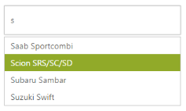
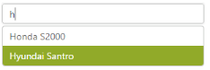
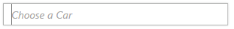
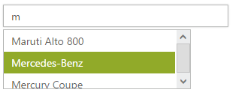
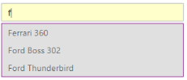

# Appearance and Styling

## Adjusting AutoComplete size

AutoComplete control allows you to set the height and width of the textbox element in AutoComplete. The Height and Width property takes pixel values, to set the dimension accordingly.

### Define height and width for autocomplete textbox

In the design page define the AutoComplete control and configure its dimensions by using Height and Width properties.



<%--Refer the ObjectDataSource binding for DataBinding to this code snippet--%>

<ej:Autocomplete ID="AutoComplete" runat="server" DataSourceID="ObjectDataSource1" DataUniqueKeyField="ID" DataTextField="Text" Height="50px" Width="300px" />



The following image is the output for AutoComplete textbox with customized dimensions.

 

## Rounded corner

By enabling the ShowRoundedCorner property, you can customize the shape of the AutoComplete control, from a regular rectangular shape to a rounded rectangle shape that is set to false by default.

### Enabling Rounded corner property

In the design page, define the AutoComplete control and configure the ShowRoundedCorner property for it



<%--Refer the ObjectDataSource binding for DataBinding to this code snippet--%>

<ej:Autocomplete ID="AutoComplete" runat="server" DataSourceID="ObjectDataSource1" DataUniqueKeyField="ID" DataTextField="Text" Width="300px" ShowRoundedCorner="true" />



The following screenshot is the output for AutoComplete when ShowRoundedCorner is set to true.

## Watermark text

Watermark text property provides with an option to display a faded text in the AutoComplete textbox when the textbox is empty.

### Defining Watermark text 

In the design page, define the AutoComplete control and set a text value for WatermarkText property



<%--Refer the ObjectDataSource binding for DataBinding to this code snippet--%>

<ej:Autocomplete ID="AutoComplete" runat="server" DataSourceID="ObjectDataSource1" DataUniqueKeyField="ID" DataTextField="Text" Width="300px" WatermarkText="ChooseaCar" />



The following screenshot is the output for AutoComplete when WatermarkText is defined.

## Adjusting Suggestion list size	

AutoComplete control provides you with a property to define the dimensions of the popup panel that holds the suggestions list items. The PopupHeight and PopupWidth properties, allow you to set the maximum height and width of the popup element, for use when the content exceeds the default dimensions.

### Configure dimensions of PopUp panel

In the design page, define the AutoComplete control and set the value for PopupHeight and PopupWidth property



<%--Refer the ObjectDataSource binding for DataBinding to this code snippet--%>

<ej:Autocomplete ID="AutoComplete" runat="server" DataSourceID="ObjectDataSource1" DataUniqueKeyField="ID" DataTextField="Text" Width="300px" PopupHeight="80px" PopupWidth="250px" />



The following screenshot is the output for AutoComplete, after configuring the height and width of the popup panel.

## PopUp Time Delay

AutoComplete control allows you to set the time delay to fetch the list items. The value of DelaySuggestionTimeout is set in milliseconds, so that the data search time can be configured. This enhances the turnaround time to populate the list items.

### Configure dimensions of PopUp panel

In the design page, define the AutoComplete control and set the value for DelaySuggestionTimeout property.



<%--Refer the ObjectDataSource binding for DataBinding to this code snippet--%>

<ej:Autocomplete ID="AutoComplete1" runat="server" DataSourceID="ObjectDataSource1" DataUniqueKeyField="ID" DataTextField="Text" DelaySuggestionTimeout="1000" />



The following image is the output for AutoComplete, this takes 1000ms to display the popup panel list items.

 

## Theme

AutoComplete control’s style and appearance can be controlled based on CSS classes. In order to apply styles to the AutoComplete control, refer to 2 files namely, ej.widgets.core.min.css and ej.theme.min.css. When you refer ej.widgets.all.min.css file, it is not necessary to include the files ej.widgets.core.min.css and ej.theme.min.css in your project, as ej.widgets.all.min.css is the combination of these two. 

By default, there are 13 theme support available for AutoComplete control, namely:

* default-theme
* flat-azure-dark
* fat-lime
* flat-lime-dark
* flat-saffron
* flat-saffron-dark
* gradient-azure
* gradient-azure-dark
* gradient-lime
* gradient-lime-dark
* gradient-saffron
* gradient-saffron-dark
* bootstrap

## CSS Class

CSS class can be used to customize the AutoComplete control’s appearance. Define a CSS class, as per requirement and assign the class name to CssClass property.

### Configure AutoComplete textbox using CSS class

Define CSS class to customize the AutoComplete control.





In the design page, define the AutoComplete control and set the value for CssClass property



<%--Refer the ObjectDataSource binding for DataBinding to this code snippet--%>

<ej:Autocomplete ID="AutoComplete" runat="server" DataSourceID="ObjectDataSource1" DataUniqueKeyField="ID" DataTextField="Text" Width="300px" CssClass="customCss" />



The following screenshot is the output of an AutoComplete textbox configured based on CSS class.

