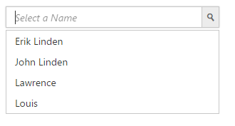

# Data Adaptors

The Data adaptor is a mechanism through which the DataManager interact with the remote service or local dataSource. The DataManager has several preconfigured Data Adaptors, refer to the [link](http://help.syncfusion.com/aspnetmvc/datamanager/data-adaptors).

## OData

OData is a standardized protocol for creating and consuming data. You can provide the [OData service](http://www.odata.org/) URL directly to the Datasource URL property or can give it in the DataManager.


                <ej:Autocomplete ID="auto" runat="server" Width="300px" DataTextField="CustomerID" Query="ej.Query().from('Customers').take(10)">
                    <DataManager URL="http://js.syncfusion.com/ejservices/Wcf/Northwind.svc/" CrossDomain="true"></DataManager>
                </ej:Autocomplete>



Run the code to get the following output

## OData4

ODataV4Adaptor is used for consuming data from OData V4 Service. To consume OData service, set the service link to the Url property and set adaptor type as **ODataAdaptor** to the Adaptor Property of DataManager and then you can assign it to Autocomplete **DataSource**.



<ej:Autocomplete ID="auto" runat="server" Width="300px" DataTextField="RegionDescription" Query="ej.Query()" ShowPopupButton="true">
                   <DataManager URL="http://services.odata.org/V4/Northwind/Northwind.svc/Regions/" Adaptor="ODataV4Adaptor" CrossDomain="true" />           
                </ej:Autocomplete>



Run the code to get the following output.

## WebAPI Adaptor

WebAPI Adaptor that is extended from ODataAdaptor, is used for consuming data from WebApi Service. To consume Web API service, set the service link to the Url property and set the adaptor type as **WebApiAdaptor** to the Adaptor Property of Autocomplete **DataManager**.

You can use the following code example to use WebAPI adaptor.



  <ej:Autocomplete ID="auto" runat="server" Width="300px" Query="ej.Query().from('Customers').take(10)" DataTextField="CompanyName"  >
                    <DataManager URL="http://js.syncfusion.com/ejServices/wcf/NorthWind.svc/" Adaptor="WebApiAdaptor" CrossDomain="true" />           
                </ej:Autocomplete>



Run the code to get the following output.

## WebMethod Adaptor

The WebMethod Adaptor is used to bind data source from remote services and code behind methods. 

By using **WebMethodAdaptor** we can bind data from WebService to the Autocomplete control and also we need to include **ScriptService** Attribute to WebService in order to enable request from client-side.



    [System.Web.Script.Services.ScriptService]
    public class WebService1 : System.Web.Services.WebService
    {

        [WebMethod]
        public object Get()
        {

            List<Employee> EmpData = new List<Employee>();
            EmpData.Add(new Employee
            {
                Name = "Erik Linden",
                Role = "Executive"
                
            });
            EmpData.Add(new Employee
            {
                Name = "John Linden",
                Role = "Representative"
                
            });
            EmpData.Add(new Employee
            {
                Name = "Louis",
                Role = "Representative"
               
            });
            EmpData.Add(new Employee
            {
                Name = "Lawrence",
                Role = "Executive"
               
            });
            dynamic count = EmpData.Count;
            return new
            {
                result = EmpData,
                count = count
            };

        }
        public class Employee
        {
            public string Name { get; set; }
            public string Role { get; set; }
         
        }

    }
    


Initialize the Autocomplete as follows



    <ej:Autocomplete ID="auto" runat="server" Width="300px" DataTextField="Name" ShowPopupButton="true" DataUniqueKeyField="Role" Query="ej.Query().requiresCount()">    
                 <DataManager URL="WebMethod.aspx/Get" Adaptor="WebMethodAdaptor"  />   
                </ej:Autocomplete>



