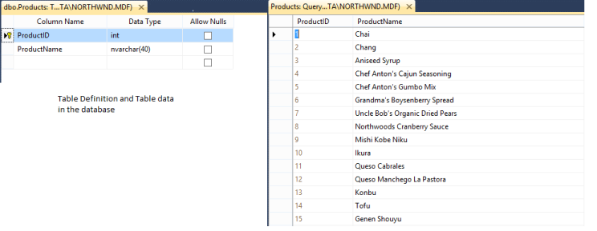
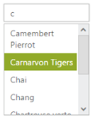
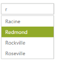

# Data-Binding

In order to render the AutoComplete control, the data needs to be bound to it in a proper way. The following sub-properties provide a way to bind, either the local or remote data, to the AutoComplete control, by binding the appropriate data fields to the corresponding options.

## Fields

### DataSource 

This property assigns the local JSON data or remote data, that is the URL binding, to the AutoComplete control.

### Query 

It accepts the data of object type, usually the query string, to fetch the required data from a specific table based on certain condition. This property is optional, if it is not specified, the entire records that are initially assigned through dataSource are taken into consideration.

### DataUniqueKeyField

It maps the corresponding key field name from the data table or JSON data that is assigned to the dataSource, with the key property of the AutoComplete control. The key value that is fetched from the table has to be unique for each records.

### DataTextField

It maps the corresponding text field name from the data table or JSON data that is assigned to the dataSource, with the text property of the AutoComplete control. The text value that is fetched from the table gets the value to be displayed in the AutoComplete textbox.

### DataGroupByField

It maps the groupBy field name from the data table or JSON data that is assigned to the dataSource. The groupBy value that is fetched from the table is made to group the values in the datasource.

### DataHtmlAttributesField

This allows you to map the CSS styles or classes to the corresponding data from table or JSON data with the AutoComplete items. The DataHtmlAttributesField value customizes the AutoComplete items, based on HTML styling or class assigned to it. 

## Local data

AutoComplete provides data binding support to populate AutoComplete items, so that the values can be mapped to the AutoComplete fields, namely DataUniqueKeyField and DataTextField. DataBinding helps you bind a key value pair to AutoComplete textbox. DataUniqueKeyField takes the unique id of the dataSource elements. DataTextField gets the value to be displayed in the AutoComplete textbox.

### Defining the Local data for AutoComplete

The following steps explain local data binding of a list data to an AutoComplete textbox.

Define local DataSource elements by using the Key and Text fields in code behind and map the list data to DataSource property



  protected void Page_Load(object sender, EventArgs e)

        {

this.AutoComplete.DataSource = new LocalData().GetDataItems().ToList();

        }

public class LocalData

        {

            public LocalData(int _id, string _text)

            {

                this.ID = _id;

                this.Text = _text;

            }

            public LocalData() { }

            public int ID

            {

                get;

                set;

            }

            public string Text

            {

                get;

                set;

            }

            public List<LocalData> GetDataItems()

            {

                List<LocalData> data = new List<LocalData>();

                data.Add(new LocalData(1, "Audi S6"));

                data.Add(new LocalData(2, "Austin-Healey"));

                data.Add(new LocalData(3, "Aston Martin"));

                data.Add(new LocalData(4, "BMW 7"));

                data.Add(new LocalData(5, "Bentley Mulsanne"));

                data.Add(new LocalData(6, "Bugatti Veyron"));

                data.Add(new LocalData(7, "Chevrolet Camaro"));

                data.Add(new LocalData(8, "Cadillac "));

                data.Add(new LocalData(9, "Honda S2000"));

                data.Add(new LocalData(10, "Hyundai Santro"));

                data.Add(new LocalData(11, "Mercedes-Benz "));

                data.Add(new LocalData(12, "Mercury Coupe"));

                data.Add(new LocalData(13, "Maruti Alto 800"));

                data.Add(new LocalData(14, "Volkswagen Shirako"));

                data.Add(new LocalData(15, "Lotus Esprit "));

                data.Add(new LocalData(16, "Lamborghini Diablo"));

                data.Add(new LocalData(17, "Nissan Qashqai "));

                data.Add(new LocalData(18, "Oldsmobile S98 "));

                data.Add(new LocalData(19, "Opel Superboss "));

                data.Add(new LocalData(20, "Scion SRS/SC/SD "));

                data.Add(new LocalData(21, "Saab Sportcombi "));

                data.Add(new LocalData(22, "Subaru Sambar "));

                data.Add(new LocalData(23, "Suzuki Swift "));

                data.Add(new LocalData(24, "Volvo P1800 "));

                data.Add(new LocalData(25, "Kia Sedona EX "));

                data.Add(new LocalData(26, "Koenigsegg Agera "));

                data.Add(new LocalData(27, "Ford Boss 302 "));

                data.Add(new LocalData(28, "Ferrari 360 "));

                data.Add(new LocalData(29, "Ford Thunderbird "));

                data.Add(new LocalData(30, "Alfa Romeo"));

                return data;

            }

        }



In the Design page, add an AutoComplete element from ToolBox and assign values for DataTextField and DataUniqueKeyField.


 
    <ej:Autocomplete ID="AutoComplete" runat="server" DataTextField="Text" DataUniqueKeyField="ID" />

 

The following screenshot is the output for AutoComplete control with local data binding.

## Remote data

AutoComplete provides remote data binding support to populate AutoComplete items, so that the values can be mapped to the AutoComplete fields from a remote web service by using DataSource and Query. 

### Configuring remote data for AutoComplete

The following steps explain the remote data binding to an AutoComplete textbox.

In CodeBehind assign the DataSource property with corresponding web host service URL. So that it gets the data from remote service



        protected void Page_Load(object sender, EventArgs e)

        {

this.AutoComplete.DataSource="http://mvc.syncfusion.com/Services/Northwnd.svc/";

        }



In the Design page, add an AutoComplete element from ToolBox and assign values for DataTextField and DataUniqueKeyField. By using Query property, extract the corresponding data table.



       <ej:Autocomplete ID="AutoComplete" runat="server" Query="ej.Query().from('Suppliers').select('SupplierID', 'ContactName')"

            DataTextField="ContactName" DataUniqueKeyField="SupplierID" />



The following screenshot is the output for AutoComplete control with remote data binding.

## SQL data

The [SqlDataSource](https://msdn.microsoft.com/en-us/library/dz12d98w.aspx) control enables you to use a Web server control to access data that is located in a relational database. It can work with any database that has an associated ADO.NET provider including Microsoft SQL Server, Oracle, ODBC, or OLE DB databases such as Microsoft Access. 

To retrieve data from a database by using the [SqlDataSource](https://msdn.microsoft.com/en-us/library/system.web.ui.webcontrols.sqldatasource.aspx) control, set the following properties:

  * [ProviderName](https://msdn.microsoft.com/en-us/library/system.web.ui.webcontrols.sqldatasource.providername.aspx) - Set to the name of the ADO.NET provider that represents the database you are working with. When you are working with Microsoft SQL Server, set the [ProviderName](https://msdn.microsoft.com/en-us/library/system.web.ui.webcontrols.sqldatasource.providername.aspx) property to System.Data.SqlClient; When working with an Oracle database, set the [ProviderName](https://msdn.microsoft.com/en-us/library/system.web.ui.webcontrols.sqldatasource.providername.aspx) property to "System.Data.OracleClient"; and so on.
  * [ConnectionString](https://msdn.microsoft.com/en-us/library/system.web.ui.webcontrols.sqldatasource.connectionstring.aspx) - Set to a connection string that works for your database.	
  * [SelectCommand](https://msdn.microsoft.com/en-us/library/system.web.ui.webcontrols.sqldatasource.selectcommand.aspx) - Set to an SQL query or stored procedure that returns data from the database. 

AutoComplete provides an extensive data binding support to populate AutoComplete items, so that the values can be mapped to the AutoComplete fields from an existing SQL data source. You can achieve this by using DataSourceID property. 

### Configuring SQL data for AutoComplete

The following steps explain the SQL data binding to an AutoComplete textbox.

The following steps explain local data binding of a list data to an AutoComplete textbox.

* Define an SQL data source in the web page and configure the data source as per requirement.
* In the following code example, an SQL data table with a ProductID in integer type and ProductName in var char type is created.
* The following screenshot illustrates the sample database used.

 

In the Design page, add an AutoComplete element from ToolBox and assign values for DataTextField and DataUniqueKeyField. In DataSourceID field, assign the ID of the existing SQL data source 


 
    <ej:Autocomplete ID="AutoComplete" runat="server" DataSourceID="NorthWind"

            DataTextField="ProductName" DataUniqueKeyField="ProductID" />

       <%--DataBase configured for AutoComplete control--%>

        <asp:SqlDataSource ID="NorthWind" runat="server"

            ConnectionString="<%$ ConnectionStrings:ConnectionString %>"

            SelectCommand="SELECT [ProductID], [ProductName] FROM [Alphabetical list of products]"></asp:SqlDataSource>

 

The following screenshot is the output for AutoComplete control with SQL data binding.

 

## Object DataSource

The ObjectDataSource control allows you to bind a specific data layer, in a similar manner to which other controls bind to the database. The ObjectDataSource control can bind to any method that returns a DataSet or an IEnumerable object (for example, a DataReader or a collection of Classes). The major advantage of binding through ObjectDataSource is, only the records that are required in the current view are retrieved from the database, greatly optimizing the performance and runtime memory usage.

To retrieve data using the [ObjectDataSource](https://msdn.microsoft.com/en-us/library/system.web.ui.webcontrols.objectdatasource(v=vs.110).aspx) control, set the following properties:

[TypeName](https://msdn.microsoft.com/en-us/library/system.web.ui.webcontrols.objectdatasource.typename(v=vs.110).aspx)- specifies an object type (class name) to instantiate for performing data operations.

[SelectMethod](https://msdn.microsoft.com/en-us/library/system.web.ui.webcontrols.objectdatasource.selectmethod(v=vs.110).aspx) - Specify methods of the associated type to call to perform data operations that returns a DataSet or an IEnumerable object
AutoComplete provides ObjectDataSource data binding support to populate AutoComplete items, so that the values can be mapped to the AutoComplete fields from an existing ObjectDataSource. You can achieve this by using DataSourceID property.

### Configuring ObjectDataSource for AutoComplete

The following steps explain the ObjectDataSource data binding to an AutoComplete textbox.

Define an ObjectDataSource in the web page and configure the data source elements. Add the class file to App_Data folder in your web application.



namespace ASPWeb

{

public class ObjectData

    {

        public ObjectData(int _id, string _text)

        {

            this.ID = _id;

            this.Text = _text;

        }

        public ObjectData() { }

        public int ID

        {

            get;

            set;

        }

        public string Text

        {

            get;

            set;

        }

        public List<ObjectData> GetDataItems()

        {

            List<ObjectData> data = new List<ObjectData>();

            data.Add(new ObjectData(1, "Audi S6"));

            data.Add(new ObjectData(2, "Austin-Healey"));

            data.Add(new ObjectData(3, "Aston Martin"));

            data.Add(new ObjectData(4, "BMW 7"));

            data.Add(new ObjectData(5, "Bentley Mulsanne"));

            data.Add(new ObjectData(6, "Bugatti Veyron"));

            data.Add(new ObjectData(7, "Chevrolet Camaro"));

            data.Add(new ObjectData(8, "Cadillac "));

            data.Add(new ObjectData(9, "Honda S2000"));

            data.Add(new ObjectData(10, "Hyundai Santro"));

            data.Add(new ObjectData(11, "Mercedes-Benz "));

            data.Add(new ObjectData(12, "Mercury Coupe"));

            data.Add(new ObjectData(13, "Maruti Alto 800"));

            data.Add(new ObjectData(14, "Volkswagen Shirako"));

            data.Add(new ObjectData(15, "Lotus Esprit "));

            data.Add(new ObjectData(16, "Lamborghini Diablo"));

            data.Add(new ObjectData(17, "Nissan Qashqai "));

            data.Add(new ObjectData(18, "Oldsmobile S98 "));

            data.Add(new ObjectData(19, "Opel Superboss "));

            data.Add(new ObjectData(20, "Scion SRS/SC/SD "));

            data.Add(new ObjectData(21, "Saab Sportcombi "));

            data.Add(new ObjectData(22, "Subaru Sambar "));

            data.Add(new ObjectData(23, "Suzuki Swift "));

            data.Add(new ObjectData(24, "Volvo P1800 "));

            data.Add(new ObjectData(25, "Kia Sedona EX "));

            data.Add(new ObjectData(26, "Koenigsegg Agera "));

            data.Add(new ObjectData(27, "Ford Boss 302 "));

            data.Add(new ObjectData(28, "Ferrari 360 "));

            data.Add(new ObjectData(29, "Ford Thunderbird "));

            data.Add(new ObjectData(30, "Alfa Romeo"));

            return data;

        }

    }

}



In the Design page, add an AutoComplete element from ToolBox and assign values for DataTextField and DataUniqueKeyField. In DataSourceID field assign the ID of the existing ObjectDataSource



<ej:Autocomplete ID="AutoComplete" runat="server" DataSourceID="ObjectDataSource"

DataTextField="Text" DataUniqueKeyField="ID" />

        <%--DataBase configured for AutoComplete control--%>

<asp:ObjectDataSource ID="ObjectDataSource" runat="server"

            SelectMethod="GetDataItems" TypeName="ASPWeb.ObjectData"></asp:ObjectDataSource> 



The following screenshot is the output for AutoComplete control with ObjectDataSource data binding.

 

## LINQ-to-SQL data

The [LinqDataSource](https://msdn.microsoft.com/en-us/library/system.web.ui.webcontrols.linqdatasource(v=vs.110).aspx) control exposes Language-Integrated Query (LINQ) to Web developers through the ASP.NET data-source control architecture. It doesn’t connect directly to the database, instead, interacts with entity classes that represent the database and the tables. You can generate the entity classes with one class that represents the database and one class for each table in the database and it is typically be located in the App_Code folder of the Web application. 

To retrieve data from Entity classes by using LinqDataSource, define the following properties,

1. [ContextTypeName](https://msdn.microsoft.com/en-us/library/system.web.ui.webcontrols.linqdatasource.contexttypename(v=vs.110).aspx) – Set the name of the class that represents the database.
2. [TableName](https://msdn.microsoft.com/en-us/library/system.web.ui.webcontrols.linqdatasource.tablename(v=vs.110).aspx) – Set the name of the class that represents the data table.
3. [Select](https://msdn.microsoft.com/en-us/library/system.web.ui.webcontrols.linqdatasource.select(v=vs.110).aspx) - Set the names of the properties that has to be retrieved from the table class

AutoComplete provides an extensive data binding support to populate AutoComplete items, so that the values can be mapped to the AutoComplete fields from an existing LINQ-to-SQL data source. You can achieve this by using DataSourceID property.

### Configuring LINQ-to-SQL data for AutoComplete

The following steps explain the SQL data binding to an AutoComplete textbox.

The following steps explain local data binding of a list data to an AutoComplete textbox.

Define a LINQ-to-SQL data source in the web page and configure the data source as per your requirement by using the database. In the following code example, an SQL table with TerritoryID and TerritoryDescription in var char type is used, to create a DBML class.

In the Design page, add an AutoComplete element from ToolBox and assign values for DataTextField and DataUniqueKeyField. In DataSourceID field, assign the ID of the existing LINQ-to-SQL data source. 



<ej:Autocomplete ID="AutoComplete" runat="server" DataSourceID="LinqDataSource"

DataTextField="TerritoryDescription" DataUniqueKeyField="TerritoryID" />

        <%--DataBase configured for AutoComplete control--%>

        <%--DataClassesDataContext is the LINQ-To-Sql class in the web application--%>

        <asp:LinqDataSource ID="LinqDataSource" runat="server"

            ContextTypeName="ASPWeb.DataClassesDataContext" EntityTypeName=""

            Select="new (TerritoryID, TerritoryDescription)"

            TableName="Territories" AutoGenerateOrderByClause="True"

            StoreOriginalValuesInViewState="False">

        </asp:LinqDataSource>



The following screenshot is the output for AutoComplete control with LINQ-to-SQL data binding.

 

