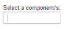
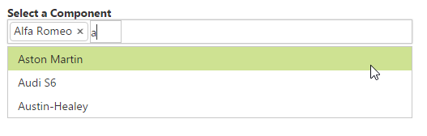
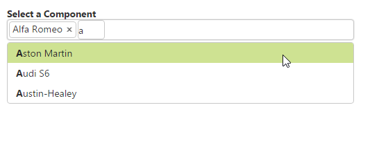

# Getting Started

## Create your first AutoComplete in ASP.NET

This section helps you to configure the AutoComplete control in your application and also to learn how to pass the required data to it and to customize its various options according to your requirements.

In this ASP.NET section use the flat-lime as the default theme.

The following screenshot illustrates the AutoComplete control that searches the list of components available in the database.

 

### Create an AutoComplete

You can create an ASP.NET Project and add necessary Dll’s and Scripts with the help of the given 
[WebForms-Getting Started](http://help.syncfusion.com/aspnetmvc/autocomplete/getting-started) documentation.  
Initialize the corresponding AutoCompletecontrol in the ASPX page.



    Select a component:

<ej:Autocomplete ID="ComponentList" runat="server"/>



Execute the above code to create the AutoComplete textbox as illustrated in the following screenshot.

## Populate Data to AutoComplete

The data provided to the AutoComplete customizes the list of Data either locally or remotely. 

### Remote Data Binding

You can assign the required Data from the remote URL to the DataSource property in codebehind file. You can also generate a query to get the required Data from the remote file by using Queryproperty and define the query to get the remote Data. By using DataTextFieldandDataUniqueKeyField property, you can map the Data fields to the textbox as illustrated in the following code example.



//Map the datasource URL to the DataSource property

protectedvoid Page_Load(object sender, EventArgs e)

{

this.ComponentList.DataSource ="http://mvc.syncfusion.com/UGOdataServices/Northwnd.svc/";

}





<%-- Map the data fields to the corresponding Field items--%>

Select a component/s:

<ej:Autocomplete ID="ComponentList" runat="server" Query="ej.Query().from('ComponentLists').select('ComponentId', 'ComponentName')"

DataTextField="ComponentName" DataUniqueKeyField="ComponentId"Width="500px"></ej:Autocomplete>



Run this code to render the AutoComplete with components list.

You can also set common customization changes to the AutoComplete textbox like enabling multiple-selection, highlight search and add dropdown icon in order to get the desired result.

### Configure Visual Mode with filter option

By default, the AutoComplete is rendered with single-value selection that is set to multiple-value selection by using the property MultiSelectMode as VisualMode that allows you to select multiple data. You can set the FilterType option as StartsWith to sort the suggestion list based on the starting character.



Select a component/s:

<ej:Autocomplete ID="ComponentList" runat="server"DataTextField="ComponentName" DataUniqueKeyField="ComponentId"FilterType="StartsWith" MultiSelectMode="VisualMode" Width="500px"> </ej:Autocomplete>



The following screenshot displays the AutoCompletetextbox with selection visual mode.

 

### Configure Highlight Search and Rounded corners



Select a component/s:

<ej:Autocomplete ID="ComponentList" runat="server"DataTextField="ComponentName" DataUniqueKeyField="ComponentId"

FilterType="StartsWith" MultiSelectMode="VisualMode"HighlightSearch="true" ShowRoundedCorner="true" Width="500px"></ej:Autocomplete>



When you set the HighlightSearch property to ‘true’, the characters typed in textbox gets highlighted in the suggestion list. To display the textbox with rounded ends, you can enable the ShowRoundedCorner property.

The following screenshot displays the AutoCompletetextbox with highlight search enabled.

 

### Configure Popup button

To enable the Popup button, you can set ShowPopupButton property to ‘true’ that displays the PopupButton icon at the end of textbox. By default, search icon replaces other icons and so you need to override the CSS classes and replace the content toDropDown arrow icon available in core CSS file as follows.







Select a component/s:

<ej:Autocomplete ID="ComponentList" runat="server"DataTextField="ComponentName" DataUniqueKeyField="ComponentId" 

FilterType="StartsWith" MultiSelectMode="VisualMode"HighlightSearch="true" ShowRoundedCorner="true" ShowPopupButton="true"Width="500px"> </ej:Autocomplete>



The following screenshot displays the AutoCompletetextbox with dropdown icon.

