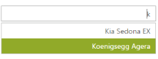
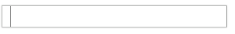

# RTL Support

This feature allows you to change the alignment of the AutoComplete textbox control from left-to-right to right-to-left (RTL). The custom template AutoComplete textbox also supports RTL. 

## Enabling RTL Support

In the design page, define the AutoComplete control and configure the EnableRTL property



<%--Refer the ObjectDataSource binding for DataBinding to this code snippet--%>

<ej:Autocomplete ID="AutoComplete" runat="server" DataSourceID="ObjectDataSource1" DataUniqueKeyField="ID" DataTextField="Text" Width="300px" EnableRTL="true" />



The following screenshot is the output for AutoComplete when EnableRTL is set to true.

## Keyboard interaction

You can use keyboard shortcut keys as an alternative to the mouse while using the AutoComplete control. The AutoComplete control allows you to perform all kinds of actions using keyboard shortcuts.

<table>
<tr>
<th>
Shortcut Key</th><th>
Description</th></tr>
<tr>
<td>
{{ '[Access key](http://en.wikipedia.org/wiki/Access_key)' | markdownify }} + j	</td><td>
Focuses into the autocomplete text box</td></tr>
<tr>
<td>
Up</td><td>
Moves to previous item in pop up</td></tr>
<tr>
<td>
Down</td><td>
Moves to next item in pop up</td></tr>
<tr>
<td>
Enter</td><td>
Selects the focused item</td></tr>
<tr>
<td>
Esc</td><td>
Closes the popup</td></tr>
</table>

### Configure keyboard interaction

In the design page, define the AutoComplete control with corresponding data fields.



<%--Refer the ObjectDataSource binding for DataBinding to this code snippet--%>

   <ej:Autocomplete ID="AutoComplete" runat="server" DataSourceID="ObjectDataSource1" DataUniqueKeyField="ID" DataTextField="Text" Width="300px" />



Define the JavaScript to focus the AutoComplete Textbox on Alt + J key press.



<script type="text/javascript">

           $(function () {

               $(document).on("keydown", function (e) {

                   if (e.altKey && e.keyCode === 74) { // j- key code.

                       $("#<%=AutoComplete.ClientID%>").focus();

                   }

               });

          });



Run the sample, press AccessKey + J to focus in the AutoComplete control, and you can navigate by using the arrow keys. Use the Escape key to close the popup.

 

### Server Side Events

The server side events present in the AutoComplete control are listed as follows.

<table>
<tr>
<th>
Event Name</th><th>
Description</th><th>
Arguments</th></tr>
<tr>
<td>
OnValueSelect                     </td><td>
Triggered when the focus is moved from the text box.</td><td>
e.Key- Defines the key for the items to differentiate two items with same. e.Text- Defines the tag value or display text. e.Value- Defines the default value to be displayed in the autocomplete textbox. e.EventType – Event Name e.Arguments – Contain keys and value of AutoComplete</td></tr>
<tr>
<td>
    OnFocusOut</td><td>
Triggered when the value is selected</td><td>
e.Key- Defines the key for the items to differentiate two items with same. e.EventType – Event Name e.Arguments – Contain keys and value of AutoComplete e.Value- Defines the default value to be displayed in the autocomplete textbox.</td></tr>
</table>

The following steps explain you how to define server side event for a Toolbar control. In an ASPX page, add the AutoComplete control as illustrated in the following code example.



<%--Refer the ObjectDataSource binding for DataBinding to this code snippet--%>

   <ej:Autocomplete ID="AutoComplete" runat="server" OnFocusOut="AutoComplete_FocusOut" OnValueSelect="AutoComplete_ValueSelect" DataSourceID="ObjectDataSource1" DataUniqueKeyField="ID" DataTextField="Text" Width="300px" />



In the code behind, define the actions to be performed.



protected void AutoComplete_FocusOut(object sender,EventArgs e)

        {

            Response.Write("Server side event has been triggered");

        }

        protected void AutoComplete_ValueSelect(object sender,EventArgs e)

        {

            Response.Write("Server side event has been triggered");

        } 



