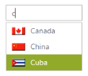

# State Persistence

AutoComplete control can store the model value in the browser’s cookies. Every time after initial rendering, the control gets the model from the cookie only. By using EnablePersistence property, you can store the model value in cookies. So when any changes are made dynamically, the values are updated in the cookie. On refreshing the page, the previous state of the AutoComplete control is maintained in the cookie and the control is rendered from it.

## Configure state persistence of AutoComplete	

The following steps explain how to enable state maintenance for AutoComplete.

In the design page, add an AutoComplete element from ToolBox and set EnablePersistence value as true.



<%--Refer the ObjectDataSource binding for DataBinding to this code snippet--%>

<ej:Autocomplete ID="AutoComplete" runat="server" DataSourceID="ObjectDataSource1" DataTextField="Text" DataUniqueKeyField="ID" EnablePersistence="true" /> 



The following screenshot is the output for AutoComplete when EnablePersistence is set to true.

## Templates

You can provide a template for customizing the appearance of the AutoComplete textbox suggestions. This is achieved by assigning a string template to the Template property.

### Configuring Templates

The following steps explain how to define a template to display a text and image for an AutoComplete textbox.

Define an ObjectDataSource in the web page and configure the data source elements with text and sprite fields. Add the class file to App_Data folder in your web application.



namespace ASPWeb

{

    public class ObjectData

    {

        public ObjectData(string _text, string _sprite)

        {

            this.Text = _text;

            this.Sprite = _sprite;

        }

        public ObjectData() { }

        public string Text

        {

            get;

            set;

        }

        public string Sprite

        {

            get;

            set;

        }

        public List<ObjectData> GetTemplateData()

        {

            List<ObjectData> data = new List<ObjectData>();

            data.Add(new ObjectData(Text = "Algeria", Sprite = "flag-dz"));

            data.Add(new ObjectData(Text = "Argentina", Sprite = "flag-ar"));

            data.Add(new ObjectData(Text = "Armenia", Sprite = "flag-am"));

            data.Add(new ObjectData(Text = "Brazil", Sprite = "flag-br"));

            data.Add(new ObjectData(Text = "Bangladesh", Sprite = "flag-bd"));

            data.Add(new ObjectData(Text = "Canada", Sprite = "flag-ca"));

            data.Add(new ObjectData(Text = "Cuba", Sprite = "flag-cu"));

            data.Add(new ObjectData(Text = "China", Sprite = "flag-cn"));

            data.Add(new ObjectData(Text = "Denmark", Sprite = "flag-dk"));

            data.Add(new ObjectData(Text = "Estonia", Sprite = "flag-ea"));

            data.Add(new ObjectData(Text = "Egypt", Sprite = "flag-eg"));

            data.Add(new ObjectData(Text = "France", Sprite = "flag-fr"));

            data.Add(new ObjectData(Text = "Finland", Sprite = "flag-fi"));

            data.Add(new ObjectData(Text = "Greenland", Sprite = "flag-gl"));

            data.Add(new ObjectData(Text = "India", Sprite = "flag-in"));

            data.Add(new ObjectData(Text = "Indonesia", Sprite = "flag-id"));

            data.Add(new ObjectData(Text = "Malaysia", Sprite = "flag-my"));

            data.Add(new ObjectData(Text = "Mexico", Sprite = "flag-mx"));

            data.Add(new ObjectData(Text = "New Zealand", Sprite = "flag-nz"));

            data.Add(new ObjectData(Text = "Netherlands", Sprite = "flag-nl"));

            data.Add(new ObjectData(Text = "Norway", Sprite = "flag-no"));

            data.Add(new ObjectData(Text = "Portugal", Sprite = "flag-pt"));

            data.Add(new ObjectData(Text = "Poland", Sprite = "flag-pl"));

            data.Add(new ObjectData(Text = "Qatar", Sprite = "flag-qr"));

            return data;

        }

    }

}



Define the CSS classes for the sprite images, you can find the images in the following location

[Installed Drive]:\Users\[user name]\AppData\Local\Syncfusion\EssentialStudio\ {{site.releaseversion}}\JS \Samples\ web \images\autocomplete\flags.png





Configure the template structure for AutoComplete control by including a &lt;div&gt; element with an image and text in every row of the popup panel. Assign the corresponding variable name within ${<field name>} to map them into the list.



<ej:Autocomplete ID="AutoComplete" runat="server" DataSourceID="ObjectDataSource1" Template="
 
 
${Text}
" DataTextField="Text" />

        <asp:ObjectDataSource ID="ObjectDataSource1" runat="server" SelectMethod="GetTemplateData" TypeName="ASPWeb.ObjectData"></asp:ObjectDataSource>



The following image is the output for AutoComplete control with template support.

