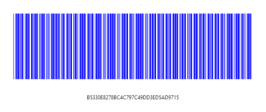
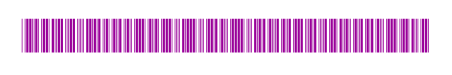

# Customizing the appearance

A page or printed media with Barcode often appears colorful in the background and surrounding region with other contents. In such cases the Barcode can also be customized to suit the needs. You can achieve this by changing the darkBarColor property.

N> This color customization is possible only for one dimensional barcodes and it is not supported for two dimensional barcodes.



    

<ej:Barcode ID="Barcode1"  runat=server Text= "B5330E8278BC4C797C49DD3ED5AD9715" SymbologyType="Code39" DarkBarColor="blue"></ej:Barcode>

    

</code>
</pre>



Execute the above code to render the following output.

 

The height of the barcode can be changed using the BarHeight property. The equivalent property to change the block size for two dimensional barcode is XDimension.



    

<ej:Barcode ID="Barcode1"  runat=server Text="B5330E8278BC4C797C49DD3ED5AD9715" SymbologyType="Code39" DarkBarColor="#990099" BarHeight="45" DisplayText="false"></ej:Barcode>

    



Execute the above code to render the following output.

 

