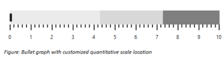
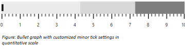
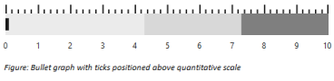
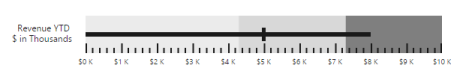
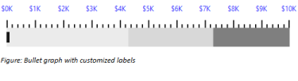
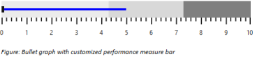

# Quantitative Scale

The Quantitative Scale appearance is customized using QuantitativeScaleSettings property. It has properties to customize labels, major ticks, minor ticks, comparative measure and performance measure of the bullet graph

## Range for Quantitative Scale

Quantitative Scale range is set using the properties Minimum, Maximum and Interval of QuantitativeScaleSettings property. Minimum specifies the start range of the scale, Maximum specifies the end range of scale and Interval specifies the number of intervals between start and end range. Default values of Minimum, Maximum and Interval are 0, 10 and 1 respectively. The number of minor ticks (ticks between intervals) are specified using MinorTicksPerInterval property.



        <ej:BulletGraph ID="BulletGraph1" Width="600px" Height="120px" runat="server">                        

           <QuantitativeScaleSettings Minimum="0" Maximum="10" MinorTicksPerInterval="4" Interval="1"></QuantitativeScaleSettings>

        </ej:BulletGraph>


The following screenshot displays a Bullet Graph with start range 0, end range 10 and interval 1 with 4 minor ticks per interval

 

## Quantitative scale location

Bullet Graph does not position quantitative scale automatically based on its size or space required for caption text, etc. By default quantitative scale is positioned at 10 pixels from left and 10 pixels from top. Quantitative scale location is customized as per the requirement using the Location property available in QuantitativeScaleSettings.



<ej:BulletGraph ID="BulletGraph1" Width="600px" Height="120px" runat="server">                        

           <QuantitativeScaleSettings>

               <Location X="20" Y="20" />

           </QuantitativeScaleSettings>

        </ej:BulletGraph>



The following screenshot displays Bullet Graph with Quantitative scale at 20 pixels from left and 20 pixels from top

 

## Major ticks

Color, size and width of Major tick lines are customized using MajorTickSettings property in QuantitativeScaleSettings. Default value of Size and Width properties are 13 and 2 respectively. Ticks are drawn in black color by default. The property Size represents the height of tick lines and Width represents the width of tick lines and ticks color are customized using Stroke property.



        <ej:BulletGraph ID="BulletGraph1" Width="600px" Height="120px" runat="server">                        

           <QuantitativeScaleSettings>

               <MajorTickSettings Size="13" Width="3" Stroke="gray" />

           </QuantitativeScaleSettings>

        </ej:BulletGraph>



The following screenshot displays Major ticks in gray color with a width of 3 pixels and height 15 pixels

## Minor ticks

Minor ticks can also be customized similar to major ticks. The properties Stroke, Width and Size of MinorTickSettings are used to customize Minor ticks in quantitative scale. Stroke specifies the color of ticks, Width specifies the width of ticks and Size specifies the height of the ticks. 


        <ej:BulletGraph ID="BulletGraph1" Width="600px" Height="120px" runat="server">                        

           <QuantitativeScaleSettings>

               <MinorTickSettings Size="7" Width="3" Stroke="gray" />

           </QuantitativeScaleSettings>

        </ej:BulletGraph>



The following screenshot displays Bullet Graph with customized Minor ticks in quantitative scale

 

## Tick position

Ticks are positioned below, above or inside the quantitative scale. By default ticks are positioned below the quantitative scale. The TickPosition property is used to customize the position of ticks in quantitative scale. Ticks can be placed inside the quantitative scale by setting TickPosition to Cross. 


        <ej:BulletGraph ID="BulletGraph1" Width="600px" Height="120px" runat="server">                        

           <QuantitativeScaleSettings TickPosition="Above">               

           </QuantitativeScaleSettings>

        </ej:BulletGraph>


The following screenshot displays Bullet Graph with ticks positioned above quantitative scale

## Tick Placement

Quantitative scale ticks can be placed either inside or outside the scale using “TickPlacement” property. By default ticks are placed outside the scale.


        <ej:BulletGraph ID="BulletGraph1" runat="server" Value="8" ComparativeMeasureValue="5" QualitativeRangeSize="50">

        <QuantitativeScaleSettings TickPlacement="Inside">

            <Location X="108" Y="10" />

            <LabelSettings Offset="5" LabelPrefix="$" LabelSuffix="K" Size="10"></LabelSettings>            

        </QuantitativeScaleSettings>

        <CaptionSettings Text="Revenue YTD">

            <Location X="17" Y="28" />

            <SubTitle Text="$ in Thousands">

                <Location X="10" Y="42" />

            </SubTitle>

        </CaptionSettings>

    </ej:BulletGraph>


The following screenshot displays Bullet Graph ticks inside Quantitative Scale

## Quantitative scale labels

Quantitative scale labels are customized with prefix, suffix, font, color and size using LabelSettings property. By default, label text is displayed in black color with 12 pixel ‘Segoe UI’ font and there is a padding of 20 pixels space between quantitative scale and labels.



        <ej:BulletGraph ID="BulletGraph1" Width="600px" Height="120px" runat="server">                        

           <QuantitativeScaleSettings>

               <LabelSettings LabelPrefix="$" LabelSuffix="K"  Stroke="blue" Offset="15" Size="12">

                   

               </LabelSettings>

           </QuantitativeScaleSettings>

        </ej:BulletGraph>



The following screenshot displays Bullet Graph labels in blue color

 

Bullet Graph quantitative scale with customized labels

## Label Placement

Quantitative scale labels can be placed either inside or outside the scale using “LabelPlacement” property. By default labels are placed 15 pixels outside the scale. 


        <ej:BulletGraph ID="BulletGraph1" runat="server" Value="8" Width="620" ComparativeMeasureValue="5" QualitativeRangeSize="50">

        <QuantitativeScaleSettings>

            <Location X="108" Y="10" />

            <LabelSettings Offset="5" LabelPrefix="$" LabelSuffix="K" LabelPlacement="Inside" Size="10">

                

            </LabelSettings>            

        </QuantitativeScaleSettings>

        <CaptionSettings Text="Revenue YTD">

            <Location X="17" Y="28" />

            <SubTitle Text="$ in Thousands">

                <Location X="10" Y="42" />

            </SubTitle>

        </CaptionSettings>

    </ej:BulletGraph>



The following screenshot displays Bullet Graph labels inside Quantitative Scale

 

## Performance measure bar

Performance measure bar is customized using FeaturedMeasureSettings in QuantitativeScaleSettings property. Color of the bar is customized using Stroke property and width using Width property. By default bar is drawn in black color with 6 pixels of width. 


<ej:BulletGraph ID="BulletGraph1" Width="600px" Height="120px" runat="server">                        

           <QuantitativeScaleSettings>

              <FeaturedMeasureSettings Stroke="blue" Width="4" />

           </QuantitativeScaleSettings>

        </ej:BulletGraph>



The following screenshot displays Bullet Graph with customized Performance measure bar.

 

## Comparative measure symbol

Comparative symbol color and width are customized using ComparativeMeasureSettings through QuantitativeScaleSettings property. Color of the symbol is customized using Stroke property and width using Width property. By default Comparative measure symbol is displayed in black color with a width of 5 pixels. 


<ej:BulletGraph ID="BulletGraph1" Width="600px" Height="120px" runat="server">                        

           <QuantitativeScaleSettings>

              <ComparativeMeasureSettings Width="4" Stroke="blue" />

           </QuantitativeScaleSettings>

        </ej:BulletGraph>


The following screenshot displays Bullet Graph with customized Comparative measure value.

## Multiple performance measures comparison

Bullet Graph supports comparing more than one performance at a time, given that all the comparisons are related using FeatureMeasure in QuantitativeScaleSettings property. 


        <ej:BulletGraph ID="BulletGraph1" Width="600px" Height="120px" runat="server">                        

            <QuantitativeScaleSettings>

                <Location X="50" Y="10" />

                <FeatureMeasures>

                    <ej:FeatureMeasures Category="2010" ComparativeMeasure="3" Value="6" />

                    <ej:FeatureMeasures Category="2011" ComparativeMeasure="6" Value="9" />

                    <ej:FeatureMeasures Category="2012" ComparativeMeasure="5" Value="5" />

                </FeatureMeasures>

            </QuantitativeScaleSettings>

        </ej:BulletGraph>



The following screenshot displays Bullet Graph that compares 3 related performance measures.

 

