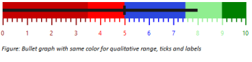
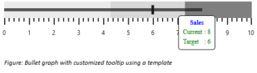

# User Interaction

## Animation

Bullet Graph supports animation that makes the performance measure bar to animate when rendering the Bullet Graph. Animation is enabled or disabled using EnableAnimation property. By default, Animation is enabled in Bullet Graph. 



        <ej:BulletGraph ID="BulletGraph1" EnableAnimation="true" Width="600px" Height="120px" runat="server">                        

        </ej:BulletGraph>


## Responsiveness during browser resize

Bullet Graph is made responsive when resizing the browser by using IsResponsive property. By default the value of this property is true in Bullet Graph. 


        <ej:BulletGraph ID="BulletGraph1" IsResponsive="false" Width="600px" Height="120px" runat="server">                        

        </ej:BulletGraph>


## Applying same color to all ticks and labels in a range

Background color for qualitative range is applied to major ticks and minor ticks of the Bullet Graph using ApplyRangeStrokeToTicks property. The range colors are applied to labels using ApplyRangeStrokeToLabels property. By default same colors are not applied to a qualitative range and its corresponding ticks or labels. 


<ej:BulletGraph ID="BulletGraph1" ApplyRangeStrokeToLabels="true" ApplyRangeStrokeToTicks="true" Value="8" ComparativeMeasureValue="5" Width="600px" Height="120px" runat="server">                        

            <QualitativeRanges>

                <ej:QualitativeRanges RangeEnd="3.5" RangeStroke="darkred" RangeOpacity="0.5"></ej:QualitativeRanges>

                <ej:QualitativeRanges RangeEnd="5" RangeStroke="red" RangeOpacity="1"></ej:QualitativeRanges>

                <ej:QualitativeRanges RangeEnd="7.5" RangeStroke="blue" RangeOpacity="0.7"></ej:QualitativeRanges>

                <ej:QualitativeRanges RangeEnd="9" RangeStroke="lightgreen" RangeOpacity="1"></ej:QualitativeRanges>

                <ej:QualitativeRanges RangeEnd="10" RangeStroke="green" RangeOpacity="1"></ej:QualitativeRanges>

            </QualitativeRanges>

        </ej:BulletGraph>


## Tooltip

By default Bullet Graph displays Tooltip when mouse is hovered over feature measure bar. Tooltip is enabled or disabled using Visible property in TooltipSettings.

 

Bullet Graph supports Tooltip template instead of defaultTooltip to customize the appearance and contents of Tooltip. The Tooltip template should be a 
 element with display set to ‘none’, so it is displayed only when mouse is placed on feature measure bar. The id value of the 
 element should be provided as value to the Template property in TooltipSettings of Bullet Graph to display the customized 
 element as Tooltip instead of default Tooltip. The values displayed in default Tooltip such as current value, target value and category are accessed in template 
 element by using {{currentValue}}, {{targetValue}} and {{category}} respectively.


<ej:BulletGraph ID="BulletGraph1" Value="8" ComparativeMeasureValue="6" Width="600px" Height="120px" runat="server">                        

           <TooltipSettings Template="BulletGraphTooltip" />

        </ej:BulletGraph>



The following screenshot displays Bullet Graph with a customized Tooltip including a header and contents such as current value and target value in different colors.

 

