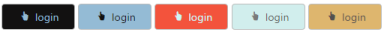

# Appearance and Styling in ASP.NET Webforms Button

You can control the style and appearance of Button control based on CSS classes. In order to apply styles to the Button control, you can refer two files namely, ej.widgets.core.min.css and ej.theme.min.css. When you refer the ej.widgets.all.min.css file, then it is not necessary to include the files ej.widgets.core.min.css and ej.theme.min.css in your project as ej.widgets.all.min.css is the combination of these two. 

By default, there are 13 themes support available for Button control.

* default-theme
* flat-azure-dark
* fat-lime
* flat-lime-dark
* flat-saffron
* flat-saffron-dark
* gradient-azure
* gradient-azure-dark
* gradient-lime
* gradient-lime-dark
* gradient-saffron
* gradient-saffron-dark
* bootstrap-theme

## Custom CSS

You can customize the appearance of Button control by using the CSS class. Define a CSS class as per requirement and assign the class name to CssClass property.

In the ASPX page, add the CssClass property in button elements for get the customized design



<%--Set Custom CSS class for button control as follows--%>

<ej:Button ID="Button_CustomCss1" runat="server" Type="Button" Text="login" Size="Small" ShowRoundedCorner="true" ContentType="TextAndImage" PrefixIcon="e-icon  e-handup" CssClass="customCss1">

</ej:Button>

<ej:Button ID="Button_CustomCss2" runat="server" Type="Button" Text="login" Size="Small" ShowRoundedCorner="true" ContentType="TextAndImage" PrefixIcon="e-icon e-handup" CssClass="customCss2">

</ej:Button>

<ej:Button ID="Button_CustomCss3" runat="server" Type="Button" Text="login" Size="Small" ShowRoundedCorner="true" ContentType="TextAndImage" PrefixIcon="e-icon e-handup" CssClass="customCss3">

</ej:Button>

<ej:Button ID="Button_CustomCss4" runat="server" Type="Button" Text="login" Size="Small" ShowRoundedCorner="true" ContentType="TextAndImage" PrefixIcon="e-icon e-handup" CssClass="customCss4">

</ej:Button>

<ej:Button ID="Button_CustomCss5" runat="server" Type="Button" Text="login" Size="Small" ShowRoundedCorner="true" ContentType="TextAndImage" PrefixIcon="e-icon e-handup" CssClass="customCss5">

</ej:Button>



Configure the CSS styles to apply on buttons.





