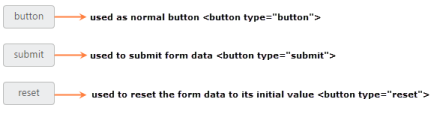

# Button Type

Button is used as normal click button, submitting form data, resetting the form data to its initial value. According to the usage of button, you can render the button in three types. By using the Type property, you can easily render the button in following types.

<table>
<tr>
<td>
{{ '**Button**' | markdownify }}</td><td>
The button is a click able button </td></tr>
<tr>
<td>
{{ '**Submit**' | markdownify }}</td><td>
The button is a submit button (submits form-data) </td></tr>
<tr>
<td>
{{ '**Reset**' | markdownify }}</td><td>
The button is a reset button (resets the form-data to its initial values)</td></tr>
</table>
In the ASPX page, add the following button elements to configure Button with various types.



<%--Set the different types for button control as follows--%>

<ej:Button ID="Button" runat="server" Type="Button" Text="button" Size="Mini" ShowRoundedCorner="true">

</ej:Button>

 

 

<ej:Button ID="SubmitButton" runat="server" Type="Submit" Text="submit" Size="Mini"

    ShowRoundedCorner="true">

</ej:Button>

 

 

<ej:Button ID="ResetButton" runat="server" Type="Reset" Text="reset" Size="Mini"

    ShowRoundedCorner="true">

</ej:Button>



