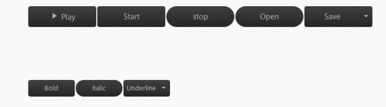
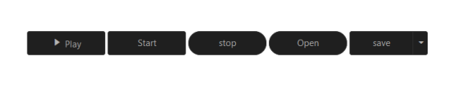
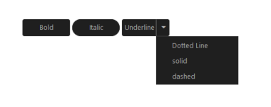
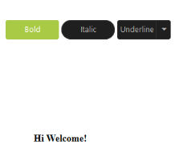

# Getting Started

This section explains you briefly on how to create a **Button** in your application with ASP.NET

## Create your first Button in ASP.NET

**Essential ASP.NET Button** helps to display a Button widget within a web page and allows you to Click, Toggle Click, Reset, and Submit. The following example illustrates how to customize Button control in a Media Player and Office Ribbon Application. 

The following screenshot illustrates the functionality of a Button control in Media Player and Office Ribbon Application.

## Create Button control

ASP.NET Button control has different functionalities such as Display as Only Image Content or Image Content with Text.

You can create an ASP.NETProject and add necessary Dll’s and Scripts with the help of the given [ ASP.NET -Getting Started](https://help.syncfusion.com/aspnet/getting-started) Documentation.

 Add the following code example in the corresponding ASPX page to render Button. Refer the following links to know details on ToggleButton and SplitButton.

ToggleButton : <http://help.syncfusion.com/js/togglebutton/getting-started>

SplitButton :  <http://help.syncfusion.com/js/splitbutton/getting-started>



    

        <table>
            <tr>
                <td>
                    <ej:togglebutton ID="Play" runat="server" ShowRoundedCorner="true" DefaultText="Play"
                                     ActiveText="Pause" Size="Large" ClientSideOnClick="playPause" ContentType="TextAndImage"
                                     ActivePrefixIcon="e-icon e-mediapause" DefaultPrefixIcon="e-icon e-mediaplay">
                    </ej:togglebutton>
                </td>
                <td>
                    <ej:button ID="Start" runat="server" Text="Start" Size="Large" ShowRoundedCorner="true"
                               ClientSideOnClick="stop"></ej:button>
                </td>
                <td>
                    <ej:button ID="Stop" runat="server" Text="stop" Size="Large" ShowRoundedCorner="true"
                               ClientSideOnClick="start"></ej:button>
                </td>
                <td>
                    <ej:button ID="Open" runat="server" Text="Open" Size="Large" ShowRoundedCorner="true"></ej:button>
                </td>
                <td>
                    <ej:splitbutton ID="Save" runat="server" Size="Large" ShowRoundedCorner="true" Text="save">
                        <Items>
                            <ej:SplitItem Text="Open...">
                            </ej:SplitItem>
                            <ej:SplitItem Text="Save">
                            </ej:SplitItem>
                            <ej:SplitItem Text="Delete">
                            </ej:SplitItem>
                        </Items>
                    </ej:splitbutton>
                </td>
            </tr>
        </table>
        

            Hi Welcome!
        

    



Add the following styles to show the Button control in the center of a web page. 





## Create Office Ribbon Control

In a real-time scenario, MS Office Bold and Italic options work as a Toggle Button and Underline option works as a Split Button. Here, you can learn how to use Button control feature by using the Office Ribbon options.

Add Button controls by using the following code example. 



 <td>
        <ej:togglebutton ID="Bold" runat="server" DefaultText="Bold" ActiveText="Bold" ShowRoundedCorner="true"
                         Size="Small" ClientSideOnClick="boldSetUnset">
        </ej:togglebutton>
    </td>
    <td>
        <ej:togglebutton ID="Italic" runat="server" DefaultText="Italic" ShowRoundedCorner="true"
                         Size="Small" ClientSideOnClick="italicSetUnset">
        </ej:togglebutton>
    </td>
    <td>
        <ej:splitbutton ID="Underline" runat="server" Text="Underline" Size="Small" ShowRoundedCorner="true"
                        ClientSideOnClick="underlineSetUnset" ClientSideOnItemSelected="select">
            <Items>
                <ej:SplitItem Text="Dotted Line">
                </ej:SplitItem>
                <ej:SplitItem Text="solid">
                </ej:SplitItem>
                <ej:SplitItem Text="dashed">
                </ej:SplitItem>
            </Items>
        </ej:splitbutton>
</td>



Add Function Definition from click event to Button function. 





<table>
<tr>
<td>
{{ '' | markdownify }}
</td></tr>
<tr>
<td>
{{ '' | markdownify }}
</td></tr>
</table>

