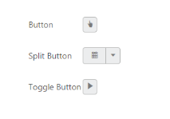

# Icons

The Essential Studio provide icons library that contains the number of in-built icons that can be applied for CSS class names to elements and refer **“ej.widgets.all.core.min.css”** file. Use the following syntax to apply class names.



Syntax: .e-icon .e-[icon description]

.e-icon .e-search



## Adding icon in Button

For example, you can render the desired icon in the button by using the following table that contains the listed icons’ CSS class names in the **“PrefixIcon”** property of button component. Also, use **“ContentType”** property to display the icon in the button. In the following code example, specify the “ContentType” of the button as ImageOnly.    

Refer to the following link to know what are the values passed in the “ContentType” property

<http://help.syncfusion.com/js/api/global>

Also in the button sample, you can use the icon class names as follows,



<ej:Button ID="buttonid" runat="server" Type="Button" ContentType="ImageOnly" PrefixIcon="e-icon e-handup">

</ej:Button>

<ej:SplitButton ID="SplitButton" runat="server" ContentType="ImageOnly" PrefixIcon="e-icon e-calender">

</ej:SplitButton>

<ej:ToggleButton ID="ToggleButton" runat="server" ContentType="ImageOnly" DefaultPrefixIcon="e-icon e-mediaplay"

ActivePrefixIcon="e-icon e-mediapause">

</ej:ToggleButton>



## List of Icons

The complete list of icons is listed in the following table.

<table>
<tr>
<td>
e-unpin</td><td>
{{ '' | markdownify }}
</td></tr>
<tr>
<td>
e-pin</td><td>
{{ '' | markdownify }}
</td></tr>
<tr>
<td>
e-upload</td><td>
{{ '' | markdownify }}
</td></tr>
<tr>
<td>
e-reload</td><td>
{{ '' | markdownify }}
</td></tr>
<tr>
<td>
e-collaps</td><td>
{{ '' | markdownify }}
</td></tr>
<tr>
<td>
e-cancel</td><td>
{{ '' | markdownify }}
</td></tr>
<tr>
<td>
e-expand</td><td>
{{ '' | markdownify }}
</td></tr>
<tr>
<td>
e-minimize</td><td>
{{ '' | markdownify }}
</td></tr>
<tr>
<td>
e-login</td><td>
{{ '' | markdownify }}
</td></tr>
<tr>
<td>
e-orientationlanscape</td><td>
{{ '' | markdownify }}
</td></tr>
<tr>
<td>
e-alignleft</td><td>
{{ '' | markdownify }}
</td></tr>
<tr>
<td>
e-aligncenter</td><td>
{{ '' | markdownify }}
</td></tr>
<tr>
<td>
e-alignright</td><td>
{{ '' | markdownify }}
</td></tr>
<tr>
<td>
e-alignjustify</td><td>
{{ '' | markdownify }}
</td></tr>
<tr>
<td>
e-alignnone</td><td>
{{ '' | markdownify }}
</td></tr>
<tr>
<td>
e-filterset</td><td>
{{ '' | markdownify }}
</td></tr>
<tr>
<td>
e-filternone</td><td>
{{ '' | markdownify }}
</td></tr>
<tr>
<td>
e-arrowheadup-2x</td><td>
{{ '' | markdownify }}
</td></tr>
<tr>
<td>
e-arrowheaddown-2x</td><td>
{{ '' | markdownify }}
</td></tr>
<tr>
<td>
e-arrowheadleft-2x</td><td>
{{ '' | markdownify }}
</td></tr>
<tr>
<td>
e-arrowheadright-2x</td><td>
{{ '' | markdownify }}
</td></tr>
<tr>
<td>
e-numbering</td><td>
{{ '' | markdownify }}
</td></tr>
<tr>
<td>
e-bullets</td><td>
{{ '' | markdownify }}
</td></tr>
<tr>
<td>
e-maximize</td><td>
{{ '' | markdownify }}
</td></tr>
<tr>
<td>
e-delete</td><td>
{{ '' | markdownify }}
</td></tr>
<tr>
<td>
e-scroll</td><td>
{{ '' | markdownify }}
</td></tr>
<tr>
<td>
e-right-scroll</td><td>
{{ '' | markdownify }}
</td></tr>
<tr>
<td>
e-search</td><td>
{{ '' | markdownify }}
</td></tr>
<tr>
<td>
e-mediaback</td><td>
{{ '' | markdownify }}
</td></tr>
<tr>
<td>
e-mediaforward</td><td>
{{ '' | markdownify }}
</td></tr>
<tr>
<td>
e-medianext</td><td>
{{ '' | markdownify }}
</td></tr>
<tr>
<td>
e-mediaprev</td><td>
{{ '' | markdownify }}
</td></tr>
<tr>
<td>
e-mediaeject</td><td>
{{ '' | markdownify }}
</td></tr>
<tr>
<td>
e-mediaclose</td><td>
{{ '' | markdownify }}
</td></tr>
<tr>
<td>
e-mediapause</td><td>
{{ '' | markdownify }}
</td></tr>
<tr>
<td>
e-mediaplay</td><td>
{{ '' | markdownify }}
</td></tr>
<tr>
<td>
e-righttick</td><td>
{{ '' | markdownify }}
</td></tr>
<tr>
<td>
e-smile</td><td>
{{ '' | markdownify }}
</td></tr>
<tr>
<td>
e-information</td><td>
{{ '' | markdownify }}
</td></tr>
<tr>
<td>
e-left-arrow</td><td>
{{ '' | markdownify }}
</td></tr>
<tr>
<td>
e-right-arrow</td><td>
{{ '' | markdownify }}
</td></tr>
<tr>
<td>
e-file-delete</td><td>
{{ '' | markdownify }}
</td></tr>
<tr>
<td>
e-file-percentage-success</td><td>
{{ '' | markdownify }}
</td></tr>
<tr>
<td>
e-file-cancel</td><td>
{{ '' | markdownify }}
</td></tr>
<tr>
<td>
e-file-percentage-failed</td><td>
{{ '' | markdownify }}
</td></tr>
<tr>
<td>
e-file-retry</td><td>
{{ '' | markdownify }}
</td></tr>
<tr>
<td>
e-resize-handle</td><td>
{{ '' | markdownify }}
</td></tr>
<tr>
<td>
e-down-arrow</td><td>
{{ '' | markdownify }}
</td></tr>
<tr>
<td>
e-time</td><td>
{{ '' | markdownify }}
</td></tr>
<tr>
<td>
e-up-arrow</td><td>
{{ '' | markdownify }}
</td></tr>
<tr>
<td>
e-date</td><td>
{{ '' | markdownify }}
</td></tr>
<tr>
<td>
e-datetime</td><td>
{{ '' | markdownify }}
</td></tr>
<tr>
<td>
e-collapse-arrow</td><td>
{{ '' | markdownify }}
</td></tr>
<tr>
<td>
e-expand-arrow</td><td>
{{ '' | markdownify }}
</td></tr>
<tr>
<td>
e-restore</td><td>
{{ '' | markdownify }}
</td></tr>
<tr>
<td>
e-plus</td><td>
{{ '' | markdownify }}
</td></tr>
<tr>
<td>
e-minus</td><td>
{{ '' | markdownify }}
</td></tr>
<tr>
<td>
e-handup</td><td>
{{ '' | markdownify }}
</td></tr>
<tr>
<td>
e-clock</td><td>
{{ '' | markdownify }}
</td></tr>
<tr>
<td>
e-cursor</td><td>
{{ '' | markdownify }}
</td></tr>
<tr>
<td>
e-hyperlink</td><td>
{{ '' | markdownify }}
</td></tr>
<tr>
<td>
e-hyperlinkbreak</td><td>
{{ '' | markdownify }}
</td></tr>
<tr>
<td>
e-settings</td><td>
{{ '' | markdownify }}
</td></tr>
<tr>
<td>
e-shoppingcart</td><td>
{{ '' | markdownify }}
</td></tr>
<tr>
<td>
e-palette</td><td>
{{ '' | markdownify }}
</td></tr>
<tr>
<td>
e-warningmessage</td><td>
{{ '' | markdownify }}
</td></tr>
<tr>
<td>
e-cut</td><td>
{{ '' | markdownify }}
</td></tr>
<tr>
<td>
e-copy</td><td>
{{ '' | markdownify }}
</td></tr>
<tr>
<td>
e-paste</td><td>
{{ '' | markdownify }}
</td></tr>
<tr>
<td>
e-edit</td><td>
{{ '' | markdownify }}
</td></tr>
<tr>
<td>
e-swapleft</td><td>
{{ '' | markdownify }}
</td></tr>
<tr>
<td>
e-swapright</td><td>
{{ '' | markdownify }}
</td></tr>
<tr>
<td>
e-swapup</td><td>
{{ '' | markdownify }}
</td></tr>
<tr>
<td>
e-swapdown</td><td>
{{ '' | markdownify }}
</td></tr>
<tr>
<td>
e-zoomin</td><td>
{{ '' | markdownify }}
</td></tr>
<tr>
<td>
e-zoomout</td><td>
{{ '' | markdownify }}
</td></tr>
<tr>
<td>
e-star</td><td>
{{ '' | markdownify }}
</td></tr>
<tr>
<td>
e-home</td><td>
{{ '' | markdownify }}
</td></tr>
<tr>
<td>
e-clipboard</td><td>
{{ '' | markdownify }}
</td></tr>
<tr>
<td>
e-userlogin</td><td>
{{ '' | markdownify }}
</td></tr>
<tr>
<td>
e-dataexport</td><td>
{{ '' | markdownify }}
</td></tr>
<tr>
<td>
e-arrowheadright</td><td>
{{ '' | markdownify }}
</td></tr>
<tr>
<td>
e-arrowheaddown</td><td>
{{ '' | markdownify }}
</td></tr>
<tr>
<td>
e-undo</td><td>
{{ '' | markdownify }}
</td></tr>
<tr>
<td>
e-redo</td><td>
{{ '' | markdownify }}
</td></tr>
<tr>
<td>
e-bold</td><td>
{{ '' | markdownify }}
</td></tr>
<tr>
<td>
e-italic</td><td>
{{ '' | markdownify }}
</td></tr>
<tr>
<td>
e-underline</td><td>
{{ '' | markdownify }}
</td></tr>
<tr>
<td>
e-strikethrough</td><td>
{{ '' | markdownify }}
</td></tr>
<tr>
<td>
e-font</td><td>
{{ '' | markdownify }}
</td></tr>
<tr>
<td>
e-rarrowdown</td><td>
{{ '' | markdownify }}
</td></tr>
<tr>
<td>
e-rarrowleft</td><td>
{{ '' | markdownify }}
</td></tr>
<tr>
<td>
e-rarrowup</td><td>
{{ '' | markdownify }}
</td></tr>
<tr>
<td>
e-rarrowright</td><td>
{{ '' | markdownify }}
</td></tr>
<tr>
<td>
e-calender</td><td>
{{ '' | markdownify }}
</td></tr>
<tr>
<td>
e-save</td><td>
{{ '' | markdownify }}
</td></tr>
</table>

