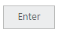
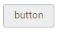

# Miscellaneous

## Text

You can display your own text for Button. By using the **Text property**, you can easily set text content for button. This text property overwrites the text that is provided on input button element.

In the ASPX page, add the following button elements to configure Button with text



<%--Set the text for button control as follows--%>

<ej:Button ID="Button_RTL" runat="server" Type="Button" Text="Enter" Size="Mini">

</ej:Button>



In the above code, the content of button “button” is replaced by the text value “Enter” that is given using the text property.

## Show Rounded Corner

Specifies the corner of button in round shape. By default button doesn’t have rounded corner. To set rounded corner, you can enable the **ShowRoundedCorner** property.

In the ASPX page, add the following button elements to get rounded Button



<%--Enable the rounded corner for button control as follows--%>

<ej:Button ID="Button_RTL" runat="server" Type="Button" Text="button" Size="Mini"

ShowRoundedCorner="true">

</ej:Button>



