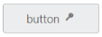

## RTL Support

In some cases, you can use right to left alignment. Here, RTL support is provided by using the **EnableRTL property**. In RTL mode, when you have more than one content (image/text, image/image) in button, then these content are aligned in right to left format. For example, when text is in left and image is in right position, after applying right to left alignment these position are interchanged.

In the ASPX page, add the following button elements to configure button to render the button with Right to left alignment



<%--Enable the alignment format for button control as follows--%>

<ej:Button ID="Button_RTL" runat="server" Type="Button" Text="button" Size="Large"

    ShowRoundedCorner="true" ContentType="TextAndImage" PrefixIcon="e-icon e-login"

EnableRTL="true">

</ej:Button>



In above mentioned code example PrefixIcon property is used and the icon that is to be on left side, (before text) is rendered on right side as EnableRTL property is used with the PrefixIcon.  Consequently, the alignment is changed in right to left order.

