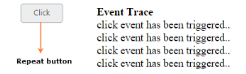

# Repeat Button

When you press button continuously, click event is raised at each specific time interval. This type of button is called Repeat Button. This functionality repeatedly raises the click event of button in both button click and from button in pressed state to the released state. **TimeInterval property** is used to specify the time Interval for triggering click event, when the button is in pressed state. **RepeatButton property** is used to set the button in repeat mode.

In the ASPX page, add the following button elements to configure Button to render the Repeat Button.



<%--Enable the button in repeat action mode and specifies time interval--%>

    

        <ej:Button ID="RepeatButton" runat="server" Type="Button" Text="click" Size="Mini" ShowRoundedCorner="true" RepeatButton="true" TimeInterval="200" ClientSideOnClick="btnClick">

        </ej:Button>

    

    

        

            <b>Event Trace</b>

        

        

    







Configure the CSS styles to apply on button





