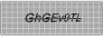
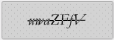
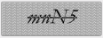
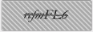
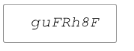
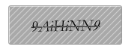
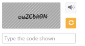
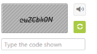

# Appearance and Styling

## Hatch Styles

You can customize the Captcha background styles by HatchStyle property. 

The following code example is used to render the Captcha with customized Hatch style.

In the ASPX page, include the following Captcha control code example.



<ej:Captcha ID="captcha" HatchStyle="Cross" runat="server"></ej:Captcha>



The following screenshot illustrates the Captcha with some of the customized Hatch styles. 

<table>
	<tr>
		<th>Hatch Style</th>
		<th>Hatch OutCome Image</th>
	</tr>
	<tr>
		<td>Cross</td>
		<td>
			{{ '' | markdownify }}
		</td>
	</tr>
	<tr>
		<td>Percent90</td>
		<td>
			{{ '' | markdownify }}
		</td>
	</tr>
	<tr>
		<td>Wave</td>
		<td>
			{{ '' | markdownify }}
		</td>
	</tr>
	<tr>
		<td>WideDownwardDiagonal</td>
		<td>
			{{ '' | markdownify }}
		</td>
	</tr>
	<tr>
		<td>HorizontalBrick</td>
		<td>
			{{ '' | markdownify }}
		</td>
	</tr>
	<tr>
		<td>None (No strike , No background)</td>
		<td>
			{{ '' | markdownify }}
		</td>
	</tr>
</table>

## Background and Font color 

You can customize the appearance of Captcha control by using the following property. PatternForeColor is used to set background pattern color. PatternBackColor is used to set background color for Captcha. ForeColor is used to set Captcha text color.

In the ASPX page, include the following Captcha control code example for customized appearance.



<ej:Captcha ID="captcha" PatternForeColor="LightGray" PatternBackColor="Snow" ForeColor="LightSeaGreen" runat="server"></ej:Captcha>



The following screenshot illustrates the Captcha with customized appearance. 

## Adjusting Captcha Size

### Height and width Customization

The height of the Captcha control can be customized by using Height property that accepts only integer values. The width of the Captcha control can be customized by using Width property that also accepts only integer values.

In the ASPX page, include the following Captcha control code example for customized height and width.



<ej:Captcha ID="captcha" Height="50" Width="150" runat="server"></ej:Captcha>



The following screenshot illustrates the Captcha with the customized Height and Width. 

## Theme

You can control the appearance of border color, refresh and audio button styles of the Captcha control based on CSS classes. In order to apply these styles, you can refer to the 2 files, ej.widgets.core.min.css and ej.theme.min.css. When ej.widgets.all.min.css file is referred, it is not necessary to include the files ej.widgets.core.min.css and ej.theme.min.css in your project, as ej.widgets.all.min.css is the combination of these two. 

By default, there are 13- themes support available for Captcha control.

* default-theme
* flat-azure-dark
* fat-lime
* flat-lime-dark
* flat-saffron
* flat-saffron-dark
* gradient-azure
* gradient-azure-dark
* gradient-lime
* gradient-lime-dark
* gradient-saffron
* gradient-saffron-dark
* bootstrap-theme

Appearance for gradient-azure,

Appearance for flat-lime,

