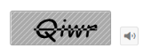

# Behavior Settings 

## Regenerate Captcha

Captcha control supports regeneration of captcha image without full page refresh. You can achieve this by clicking the refresh button. By default, Captcha renders without refresh button. You can add the refresh button by setting the ShowRefreshButton property to true. 

The following code example is used to render the Captcha with Refresh support.



 <ej:Captcha ID="captcha" ShowRefreshButton="true" Mapper="Refresh"  runat="server"></ej:Captcha>



Add the following Refresh mapper code example to the corresponding CS page.


	public static string Refresh(Dictionary<object, object> captchaModel)    {	        
		return Syncfusion.JavaScript.Web.Captcha.GetModel(captchaModel).ExecuteResult();    
	}


The following screenshot illustrates the Captcha with Refresh button. 

## Audio Accessibility

Sometimes, Captcha characters are too hard to identify. In this case, Captcha with audio helps understand the Captcha character.  Captcha supports captcha with audio. You can achieve this by enabling the ShowAudioButton property to true. When this property is set to true, captcha renders with audio button and when you click the audio button, it readouts the captcha characters. By default, Captcha renders without audio button.

In the ASPX page, include the following Captcha control code example to render Audio.



  <ej:Captcha ID="captcha" ShowAudioButton="true"  runat="server"></ej:Captcha>



The following screenshot illustrates the Captcha with audio button. 

