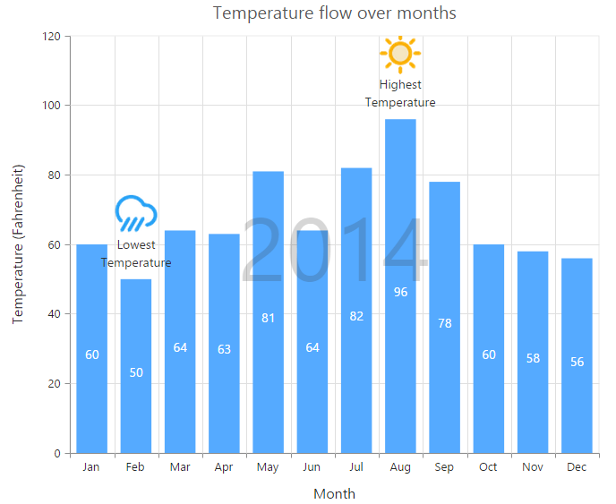
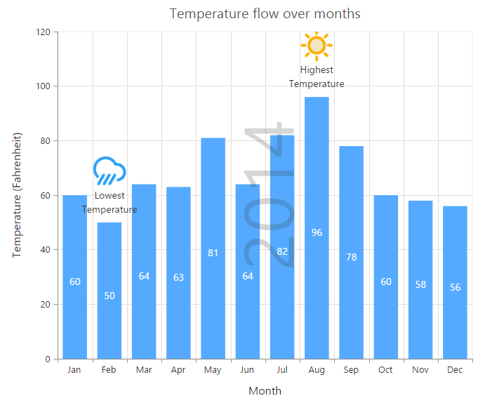
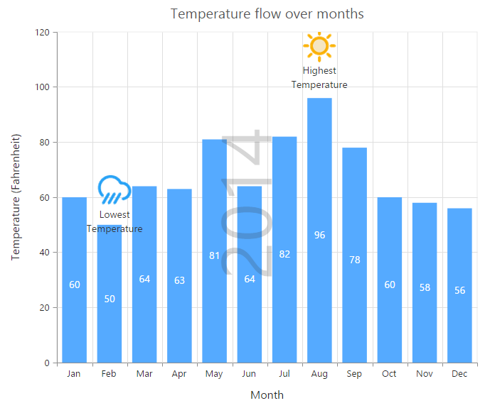

# Annotations

annotations are used to mark the specific area of interest in the chart area with texts, shapes or images. 

You can add annotations to the chart by using the **Annotations** option. By using the **Content** option of annotation object, you can specify the id of the element that needs to be displayed in the chart area.



2014

<ej:Chart ID="Chart1" runat="server">
   <Annotations>
       <ej:Annotations Visible="true" Content="watermark" Opacity="0.2" Region="Series">
       </ej:Annotations>
   </Annotations>
</ej:Chart>  



[Click](http://asp.syncfusion.com/demos/web/chart/annotations.aspx) here to view the Annotations online demo sample.

N> Annotations are not supported in 3D chart types.

## Rotate the annotation template

To rotate the annotation template, you can use the **Angle** property of the annotations. 



<ej:Chart ID="Chart1" runat="server">
   <Annotations>
       <%--Rotate the Annotation template--%>
       <ej:Annotations Visible="true" Angle="270">
       </ej:Annotations>
   </Annotations>
</ej:Chart>



## Positioning Annotation

You can position annotations either by using the coordinates (**X** and **Y**) options or by using the alignment options **HorizontalAlignment** and **VerticalAlignment**.

By using the **CoordinateUnit** option, you can specify whether the value provided in the X and Y options are relative to the chart or axis.

* If the CoordinateUnit is set to None, the annotations are placed relative to the chart/plot area by using the HorizontalAlignment and VerticalAlignment options.

* If the coordinateUnit is set to points, the x and y values of the annotation are the coordinates relative to the axis and annotation is positioned relative to the axis. By default, the x and y values are associated with the **PrimaryXAxis** and **PrimaryYAxis**. In case, when the chart contains multiple axis and you want to associate the annotation with a particular axis, you can specify the **XAxisName** and **YAxisName** options of the annotation object.

* If the coordinateUnit is set to Pixels, the X and Y values are coordinates relative to the top-left corner of the chart/plot area.   

N> By using the **Region** option, you can specify whether the annotation is placed relative to the entire chart or plot area.



<ej:Chart ID="Chart1" runat="server">
   <Annotations>
       <%--Change coordinateUnit type to pixels--%>
       <ej:Annotations Visible="true" CoordinateUnit="Pixels" X="170" Y="350">
       </ej:Annotations>
   </Annotations>
</ej:Chart>



## Annotation alignments

When the coordinateUnit is set to pixels or points, you can align the annotation relative to the coordinates by using the **HorizontalAlignment** and **VerticalAlignment** options. 



<ej:Chart ID="Chart1" runat="server">
   <Annotations>
       <%--Change alignment of annotation template--%>
       <ej:Annotations Visible="true" VerticalAlignment="Middle" HorizontalAlignment="Left">
           <Margin Right="40" />
       </ej:Annotations>
   </Annotations>
</ej:Chart>



