# Axis

Charts typically have two axes that are used to measure and categorize data: a vertical (y) axis, and a horizontal (x) axis. To make a Chart easier to understand, you can add axis titles, tick marks, and labels. You can also change the alignment of axis title and format the labels that are displayed on axes. By default horizontal (x) axis and vertical (y) axis gets added to the Chart with axis labels, gridlines, and tick lines. You can also customize these axis explicitly by adding axis title or removing gridlines, tick lines that are added to the axis by default.

Chart Axis supports the following types:

* Double
* DateTime
* Category
* Logarithmic

You can choose any of the Chart axis type using the” ValueType” property in axis. Axis calculates the range and interval automatically based on the series data points.

[ASP.NET]

&lt;ej:Chart ID="Chart1" runat="server"&gt;

        &lt;PrimaryXAxis MajorTickLines-Visible="false" Title-Text="Country" /&gt;

        &lt;PrimaryYAxis Title-Text="Production" /&gt;

 &lt;/ej:Chart&gt;



 
{:.image }

## Double 

By default the ValueType of the axis is double and it represents the numerical data.


[ASP.NET]

&lt;ej:Chart ID="Chart1" runat="server"&gt;

        &lt;PrimaryXAxis MajorTickLines-Visible="false" Title-Text="Year" ValueType="Double"/&gt;

          &lt;series&gt;

                &lt;ej:Series&gt;

                     &lt;Points&gt;

                        &lt;ej:Points  X="200" Y="10"/&gt;

                        &lt;ej:Points  X="210" Y="13"/&gt;

                        &lt;ej:Points  X="220" Y="18"/&gt;

                        &lt;ej:Points  X="230" Y="13"/&gt;

                        &lt;ej:Points  X="240" Y="15"/&gt;

                        &lt;ej:Points  X="250" Y="13"/&gt;

                        &lt;ej:Points  X="260" Y="16"/&gt;

                        &lt;ej:Points  X="270" Y="10"/&gt;

                        &lt;ej:Points  X="280" Y="18"/&gt;

                    &lt;/Points&gt;

                &lt;/ej:Series&gt;

            &lt;/series&gt;

 &lt;/ej:Chart&gt;



With the default auto range calculation, the range padding properties allows you to customize the automatic range calculation.

Range Padding:

None:

By default, the RangePadding for Numerical Axis is none.

The following screenshot displays a Chart’s x-axis with RangePadding set to None.

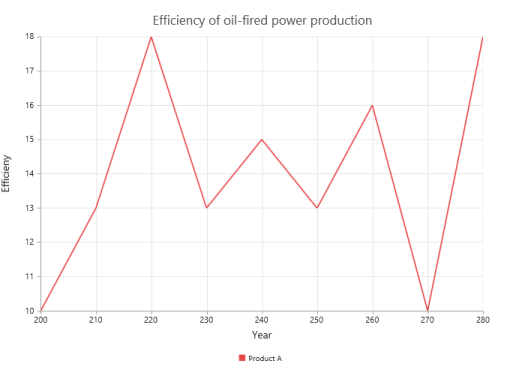
{:.image }

Additional:

If RangePadding for Numerical Axis is set to Additional, the interval of the axis is added as padding.

The following screenshot illustrates a Chart’s x-axis with RangePadding set to Additional.

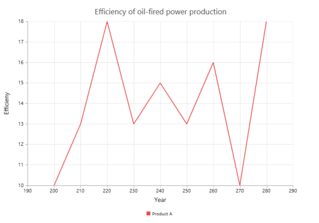
{:.image }

Normal:

Normal RangePadding for a Numerical Axis is used mostly for the y-axis to have padding based on the Range calculation.

The following screenshot illustrates a Chart’s y-axis with RangePadding set to Normal.

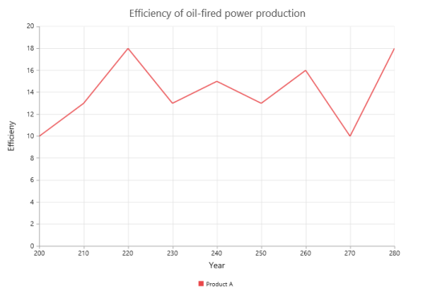
{:.image }

Round:

Round RangePadding for a Numerical Axis rounds the range of the Chart axis to the nearest possible value divisible by the interval.

The following screenshot illustrates a Chart’s x-axis with RangePadding set to Round.

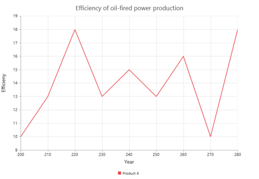
{:.image }

## DateTime Axis

The DateTime Axis has a property IntervalType that sets the DateTime interval to one of the following:

* Days
* Hours
* Milliseconds
* Minutes 
* Months
* Seconds
* Years

The Interval property of DateTime Axis can be any double value based on the IntervalType.

[ASP.NET]

&lt;ej:Chart ID="Chart1" runat="server" Width="970" Height="600" CanResize="true"&gt;

            &lt;PrimaryXAxis ValueType="Datetime" Title-Text="Years" /&gt; 

             &lt;Series&gt;

               &lt;ej:Series EnableAnimation="True" Type="Line" Name="Sales" XName="Xvalue" YName="YValue1"&gt;   

               &lt;/ej:Series&gt;

              &lt;/Series&gt;

        &lt;/ej:Chart&gt;




[CS]

     this.Chart1.PrimaryXAxis.Range.Min = new DateTime(2000, 6, 1);

      this.Chart1.PrimaryXAxis.Range.Max = new DateTime(2010, 6, 1);

      this.Chart1.PrimaryXAxis.Range.Interval = 1;

      List<DatetimeData> data = new List<DatetimeData>();

      data.Add(new DatetimeData(new DateTime(2000, 06, 11), 10));

      data.Add(new DatetimeData(new DateTime(2002, 03, 07), 30));

      data.Add(new DatetimeData(new DateTime(2004, 03, 06), 15));

      data.Add(new DatetimeData(new DateTime(2006, 03, 30), 65));

      data.Add(new DatetimeData(new DateTime(2008, 03, 08), 90));

      data.Add(new DatetimeData(new DateTime(2010, 03, 08), 85));

      this.Chart1.DataSource = data;

      this.Chart1.DataBind();

[Serializable]

    public class DatetimeData

    {

        public DatetimeData(DateTime xval, double yvalue1)

        {

            this.Xvalue = xval;

            this.YValue1 = yvalue1;

        }

        public DateTime Xvalue

        {

            get;

            set;

        }

        public double YValue1

        {

            get;

            set;

        }

    }



{:.image }

With the default auto range calculation, the RangePadding properties for date-time axis allow you to customize the automatic range calculation.

Range Padding:

None:

By default, the RangePadding for a DateTime Axis is None.

The following screenshot illustrates a Chart’s x-axis with RangePadding set to None. 

{:.image }

Additional:

If RangePadding for DateTime Axis is set to Additional, the DateTime interval of the axis is added as padding.

The following screenshot illustrates a Chart’s x-axis with RangePadding set to Additional.

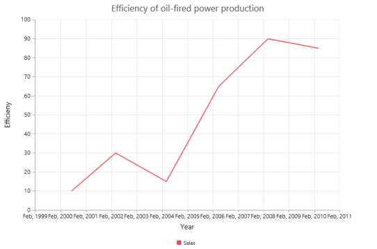
{:.image }

Round:

Round RangePadding for a DateTime Axis rounds the range of the Chart axis to the nearest possible Date Time value.

The following screenshot illustrates a Chart’s x-axis with RangePadding set to Round.

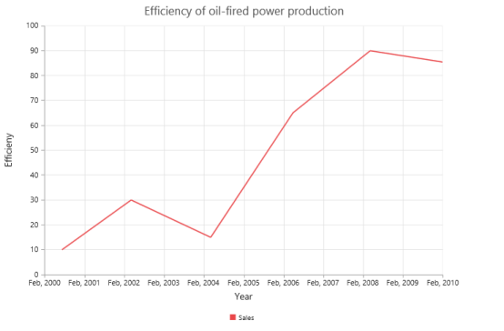
{:.image }

## Category Axis

Category (x) axis displays text labels instead of numerical intervals. By default, the interval is 1 for which all the labels are displayed. To display every nth label, you can set that in Interval property. For example, to display every 2nd label, you can set Interval as 2

[ASP.NET]

&lt;ej:Chart ID="Chart1" runat="server" &gt;

    &lt;PrimaryYAxis Title-Text="Medals"/&gt;       

           &lt;Series&gt;

             &lt;ej:Series Name="Gold"&gt;

                   &lt;Points&gt;

                        &lt;ej:Points  X="USA" Y="50"/&gt;

                        &lt;ej:Points  X="China" Y="40"/&gt;

                        &lt;ej:Points  X="Japan" Y="70"/&gt;

                        &lt;ej:Points  X="Australia" Y="60"/&gt;

                        &lt;ej:Points  X="France" Y="50"/&gt;

                        &lt;ej:Points  X="Germany" Y="40"/&gt;

                        &lt;ej:Points  X="Italy" Y="40"/&gt;

                        &lt;ej:Points  X="Sweden" Y="30"/&gt;

                    &lt;/Points&gt;

             &lt;/ej:Series&gt;

           &lt;/Series&gt;

      &lt;/ej:Chart&gt;




[CS]

      this.Chart1.PrimaryYAxis.Range.Min =0;

      this.Chart1.PrimaryYAxis.Range.Max = 80;

      this.Chart1.PrimaryYAxis.Range.Interval = 20; 



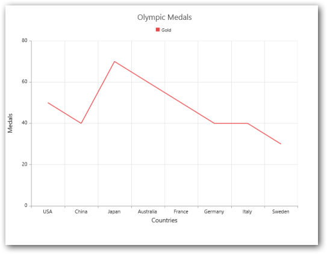 
{:.image }

## Logarithmic Axis

An axis displaying a logarithmic scale is very useful when your data values span orders of magnitude. Log axis is enabled using ValueType property.

[ASP.NET]

&lt;ej:Chart ID="Chart1" runat="server"&gt;

         &lt;PrimaryYAxis Title-Text="Medals" ValueType="Logarithmic"/&gt;

           &lt;Series&gt;

             &lt;ej:Series Name="India"&gt;

                   &lt;Points&gt;

                        &lt;ej:Points  X="1990" Y="80"/&gt;

                        &lt;ej:Points  X="1991" Y="200"/&gt;

                        &lt;ej:Points  X="1992" Y="400"/&gt;

                        &lt;ej:Points  X="1993" Y="600"/&gt;

                        &lt;ej:Points  X="1994" Y="900"/&gt;

                        &lt;ej:Points  X="1995" Y="1400"/&gt;

                        &lt;ej:Points  X="1996" Y="2000"/&gt;

                        &lt;ej:Points  X="1997" Y="4000"/&gt;

                        &lt;ej:Points  X="1998" Y="6000"/&gt;

                        &lt;ej:Points  X="1999" Y="8000"/&gt;

                        &lt;ej:Points  X="2000" Y="9000"/&gt;

                    &lt;/Points&gt;

             &lt;/ej:Series&gt;

         &lt;/Series&gt;

      &lt;/ej:Chart&gt;



 
{:.image }

Chart Axis Properties:

_Table1: Chart Axis Properties Table_

<table>
<tr>
<td>
Chart Axis Properties</td><td>
Description</td></tr>
<tr>
<td>
DesiredIntervals</td><td>
An integer property used to indicate the preferred total number of intervals to be displayed for auto range calculation.</td></tr>
<tr>
<td>
MaximumLabels</td><td>
An Integer property used to indicate number of labels per 100 pixels. By default, 3 labels renders for 100 pixels of length.</td></tr>
</table>

## Multiple Axis

In cases of multiple series, a Chart can have multiple x and y axes to represent each series. The axes can be arranged in stacking or side-by-side mode. By default, the axes are arranged in side-by-side mode. In order to arrange the axis in a stacking mode, you can split the Chart into number of rows or columns using RowDefinitions and ColumnDefinitions and then you can place the required axis in the desired row and column. Heights of the vertical axes are customized using the RowHeight property in RowDefinitions and the widths of the horizontal axes are customized using ColumnWidth property in ColumnDefinitions. 

[ASP.NET]

&lt;ej:Chart ID="Chart1" runat="server" Width="970" Height="600" CanResize="true"&gt;

            &lt;RowDefinitions&gt;

                &lt;ej:RowDefinitions Unit="percentage" RowHeight="50" /&gt;

                &lt;ej:RowDefinitions Unit="percentage" RowHeight="50" /&gt;

            &lt;/RowDefinitions&gt;

            &lt;PrimaryXAxis Title-Text="Month" /&gt;

            &lt;PrimaryYAxis Title-Text="Temperature(Fahrenheit)" LabelFormat="{value}F" /&gt;

            &lt;Axes&gt;              

                <ej:Axis RowIndex="1" PlotOffset="20" OpposedPosition="false" Name="yAxis1"      

                       Title-Text="Temperature(Celsius)" />

            &lt;/Axes&gt;            

           &lt;Series&gt;

             &lt;ej:Series Name="Germany"&gt;

                  &lt;Points&gt;

                        &lt;ej:Points  X="Jan" Y="15"/&gt;

                        &lt;ej:Points  X="Feb" Y="20"/&gt;

                        &lt;ej:Points  X="Mar" Y="35"/&gt;

                        &lt;ej:Points  X="Apr" Y="40"/&gt;

                        &lt;ej:Points  X="May" Y="30"/&gt;

                        &lt;ej:Points  X="Jun" Y="40"/&gt;

                        &lt;ej:Points  X="Jul" Y="43"/&gt;

                        &lt;ej:Points  X="Aug" Y="35"/&gt;

                    &lt;/Points&gt;

             &lt;/ej:Series&gt;

             &lt;ej:Series Name="India"  YAxisName="yAxis1"&gt;

                  &lt;Points&gt;

                        &lt;ej:Points  X="Jan" Y="33"/&gt;

                        &lt;ej:Points  X="Feb" Y="31"/&gt;

                        &lt;ej:Points  X="Mar" Y="30"/&gt;

                        &lt;ej:Points  X="Apr" Y="28"/&gt;

                        &lt;ej:Points  X="May" Y="29"/&gt;

                        &lt;ej:Points  X="Jun" Y="30"/&gt;

                        &lt;ej:Points  X="Jul" Y="33"/&gt;

                        &lt;ej:Points  X="Aug" Y="32"/&gt;

                    &lt;/Points&gt;

             &lt;/ej:Series&gt;

           &lt;/Series&gt;

        &lt;/ej:Chart&gt;



{:.image }

In the above code, you can remove the RowDefinition and RowIndex from axis to arrange the axes in the side-by- side mode.

{:.image }

Spanning Axis:

Charts having multiple series have multiple x and y axis to represent each series. By default, the axes are arranged in the corresponding row/column position. Spanning feature allows you to span the axis across multiple panes/rows. 

[ASP.NET]

&lt;ej:Chart ID="Chart1" runat="server" Width="970" Height="600" CanResize="true" &gt;

            &lt;RowDefinitions&gt;

                &lt;ej:RowDefinitions RowHeight="25" Unit="percentage" /&gt;

                &lt;ej:RowDefinitions RowHeight="25" Unit="percentage" /&gt;

                 &lt;ej:RowDefinitions RowHeight="50" Unit="percentage" /&gt;

            &lt;/RowDefinitions&gt;

            &lt;PrimaryXAxis MajorGridLines-Visible="false" /&gt;

            &lt;PrimaryYAxis RowIndex="0" RowSpan="2" Title-Text="Million USD" /&gt;

            &lt;Axes&gt;

                &lt;ej:Axis RowIndex="1" RowSpan="2" Font-FontSize="14px" Name="y1SecondQuater" Title-Text="Million USD" /&gt;

                 &lt;ej:Axis RowIndex="0"  RowSpan="3" Font-FontSize="14px" Name="y2SecondQuater" Title-Text="Million USD" /&gt;

            &lt;/Axes&gt;

            &lt;CommonSeriesOptions EnableAnimation="True"&gt;&lt;/CommonSeriesOptions&gt;

             &lt;Series&gt;

                  &lt;ej:Series Name="Gold" Type="Column"&gt;

                  &lt;Points&gt;

                        &lt;ej:Points  X="USA" Y="50"/&gt;

                        &lt;ej:Points  X="China" Y="40"/&gt;

                        &lt;ej:Points  X="Japan" Y="70"/&gt;

                        &lt;ej:Points  X="Australia" Y="60"/&gt;

                        &lt;ej:Points  X="France" Y="50"/&gt;

                        &lt;ej:Points  X="Germany" Y="40"/&gt;

                        &lt;ej:Points  X="Italy" Y="40"/&gt;

                        &lt;ej:Points  X="Sweden" Y="30"/&gt;

                    &lt;/Points&gt;

             &lt;/ej:Series&gt;

             &lt;ej:Series Name="India" Type="Line" YAxisName="y1SecondQuater" &gt;

                    &lt;Points&gt;

                         &lt;ej:Points  X="USA" Y="70"/&gt;

                        &lt;ej:Points  X="China" Y="60"/&gt;

                        &lt;ej:Points  X="Japan" Y="40"/&gt;

                        &lt;ej:Points  X="Australia" Y="30"/&gt;

                        &lt;ej:Points  X="France" Y="25"/&gt;

                        &lt;ej:Points  X="Germany" Y="40"/&gt;

                        &lt;ej:Points  X="Italy" Y="35"/&gt;

                        &lt;ej:Points  X="Sweden" Y="25"/&gt;

                    &lt;/Points&gt;

             &lt;/ej:Series&gt;

             &lt;ej:Series Name="Canada" Type="Spline" YAxisName="y2SecondQuater"&gt;

                    &lt;Points&gt;

                        &lt;ej:Points  X="USA" Y="10"/&gt;

                        &lt;ej:Points  X="China" Y="19"/&gt;

                        &lt;ej:Points  X="Japan" Y="40"/&gt;

                        &lt;ej:Points  X="Australia" Y="70"/&gt;

                        &lt;ej:Points  X="France" Y="35"/&gt;

                        &lt;ej:Points  X="Germany" Y="82"/&gt;

                        &lt;ej:Points  X="Italy" Y="57"/&gt;

                        &lt;ej:Points  X="Sweden" Y="97"/&gt;

                    &lt;/Points&gt;

             &lt;/ej:Series&gt;

              &lt;/Series&gt;

        &lt;/ej:Chart&gt;



{:.image }

## Axis Title

You can customize the ejChart Axis title text, font styles and color using “Title” property of axis.


[ASP.NET]

&lt;ej:Chart ID="Chart1" runat="server"&gt;

           &lt;PrimaryXAxis Title-Text="Expenditure" Title-Font-Color="#AA3EEF" Title-Font-FontSize="16px" Title-Font-FontStyle="Normal" Title-Font-Opacity="1"  /&gt;

         &lt;PrimaryYAxis Title-Text="Expense" Title-Font-Color="#AA3EEF" Title-Font-FontSize="16px" Title-Font-FontStyle="Normal" Title-Font-Opacity="1"  /&gt;      

      &lt;/ej:Chart&gt;



{:.image }

### Trim Title

Essential Chart supports TrimmingAxisTitles with the properties, EnableTrim and MaximumTitleWidth. These are useful for shortening the lengthy titles. On hovering with the mouse, you can see the full title in the tooltip.

{:.image }

{:.image }



[ASP.NET]

[ASPX]

&lt;ej:Chart  ID="Chart1" runat="server"&gt;

    &lt;PrimaryXAxis Title-Text ="List of countries which are using solar power in the year 2014" /&gt;

    &lt;PrimaryYAxis Title-Text ="Measurements of Solar power used in different countries in the year 2014( in GW)" LabelFormat ="{value}GW"/&gt;

    &lt;CommonSeriesOptions Type="Column" EnableAnimation="true" Tooltip-Visible="true"/&gt;

//.......

&lt;/ ej:Chart&gt;


## Labels

The axis labels are present along the axis showing the value of the data it corresponds to. You can further customize the Chart axis labels using “Font” and “LabelFormat” properties of the axis.  



[ASP.NET]

&lt;ej:Chart ID="Chart1" runat="server"&gt;

      <PrimaryXAxis Title-Text="Expenditure" Font-Color="red" Font-FontSize="16px" 

            Font-FontStyle="Normal" Font-Opacity="1"  />

      <PrimaryYAxis Title-Text="Expense" Font-Color="red" Font-FontSize="16px" 

           Font-FontStyle="Normal" Font-Opacity="1"  />      

   &lt;/ej:Chart&gt;



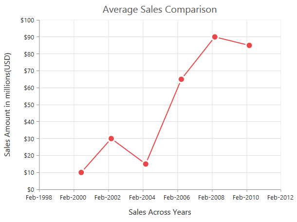
{:.image }

LabelPlacement:

The category axis includes the LabelPlacement property that is used to set the labels of the axis between the tick lines or on the tick lines of the category axis. By default the LabelPlacement value for the category axis is BetweenTicks.

There are two types of LabelPlacement:

* BetweenTicks
* OnTicks



[ASP.NET]

&lt;ej:Chart ID="Chart1" runat="server"&gt;

           <PrimaryXAxis Title-Text="'Countries' " LabelPlacement="onticks" Font-Color="red" 

            Font-FontSize="11px" />           

 &lt;/ej:Chart&gt;



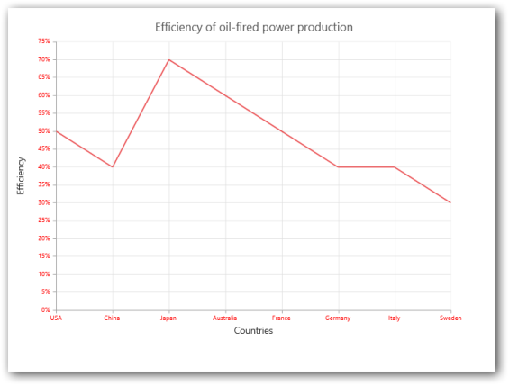
{:.image }

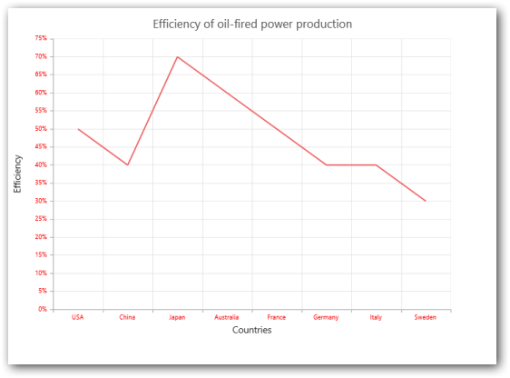
{:.image }

Label Position

Axis labels can further be customized to render inside the chart area using the property LabelPosition. By default, it is set as Outside. This helps to display labels in a proper manner while multiple axes are used in the chart.

[ASP.NET]

&lt;ej:Chart ID="Chart1" runat="server"&gt;

   &lt;PrimaryXAxis AxislabelPosition="Inside" /&gt;

   &lt;PrimaryYAxis AxislabelPosition="Inside"/&gt;

&lt;/ej:Chart&gt;



 
{:.image }

_Figure46: Label inside Chart_

Axis label trimming

Chart provides support for trimming y axis labels and x axis labels by using the properties EnableTrim and MaximumLabelWidth. These are used to show the lengthy labels in a shorter form. On mouse hover, it shows the full label in the tooltip.


[ASP.NET] 

&lt;ej:Chart ID="Chart1" runat="server" &gt;

 &lt;PrimaryXAxis  EnableTrim ="true" MaximumLabelWidth="34" /&gt;

 &lt;PrimaryYAxis  EnableTrim="true" MaximumLabelWidth ="34" /&gt;

&lt;/ej:Chart&gt;



The following screenshot displays the Chart Axis with trimming

{:.image }

## Tick Marks

Tick lines are displayed horizontally and vertically in Chart axis based on the orientation of the axis.

Major Tick Lines
It is rendered in Chart axis for each interval of axis range. By default, it is visible. You can collapse it by setting ‘Visible’ as false. You can customize the major tick lines width, opacity, and color.

Minor Tick Lines

It is rendered between the major tick lines of Chart axis. To display MinorTickLines in Chart axis enable Visible property of “MinorTickLines” and set values to “MinorTicksPerInterval” in the respective axis. By default, it is invisible. You can customize the minor tick lines width, and color.

 [ASP.NET]

&lt;ej:Chart ID="Chart1" runat="server"&gt;

    &lt;PrimaryXAxis  MajorTickLines-Width="1.5" MajorTickLines-Visible="true" MajorTickLines-Size="6" MinorTickLines-Width="1" MinorTickLines-Size="4" MinorTicksPerInterval="5" /&gt;

    &lt;PrimaryYAxis   MajorTickLines-Width="1.5" MajorTickLines-Visible="true"  MajorTickLines-Size="6" MinorTickLines-Width="1" MinorTickLines-Size="4" MinorTicksPerInterval="5" /&gt;                    

 &lt;/ej:Chart&gt;



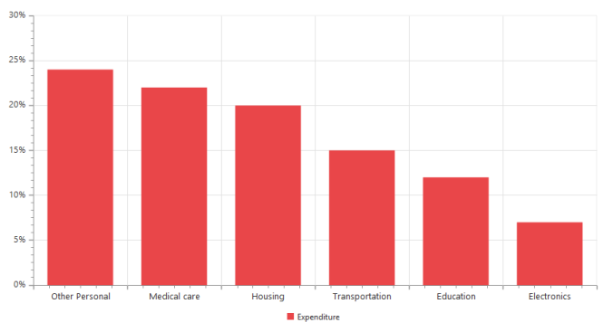
{:.image }

Tick lines placement

You can customize tick lines and render them inside the chart area using the property TickLinesPosition. By default, it is set as outside. This property will be used when labels are inside.



[ASP.NET]

&lt;ej:Chart ID="Chart1" runat="server"&gt;

   &lt;PrimaryXAxis TickLinesPosition ="Inside" /&gt;

   &lt;PrimaryYAxis TickLinesPosition ="Inside"/&gt;

&lt;/ej:Chart&gt;



{:.image }

## Grid Lines	

Grid lines are displayed in horizontal and vertical position in Chart area based on the intervals.

Major Grid Lines

It is rendered in Chart area for each interval of axis range. By default, it is visible. You can collapse it by setting ‘Visible’ property to false. You can customize the major gridlines width, opacity, and dashArray of gridline.

Minor Grid Lines

It is rendered between the major gridlines of Chart area.To display minor grid lines in Chart area enable Visible property of “MinorGridLines” and set values to “MinorTicksPerInterval” in the respective axis. By default, ‘Visibile’ property is set to “false”. You can customize the minor grid lines width, and dashArray of gridline.

 [ASP.NET]

&lt;ej:Chart ID="Chart1" runat="server"&gt;

     <PrimaryXAxis  MajorGridLines-Width="2" MajorGridLines-Visible="true"  

          MajorGridLines-DashArray="" MinorGridLines-Width="1" MinorGridLines-Visible="true" 

          MinorGridLines-DashArray=""/>  

     <PrimaryYAxis   MajorGridLines-Width="2" MajorGridLines-Visible="true" 

       MajorGridLines-DashArray=""  MinorGridLines-Width="1" MinorGridLines-Visible="true"   

       MinorGridLines-DashArray="" />                    

      &lt;/ej:Chart&gt;



 
{:.image }

Alternate Grid Band

Grid Band is the distance between two adjacent major grid lines which are displayed in horizontal and vertical position.

Even Grid Band

Even Grid Band are counted from axes lines, i.e the band which is immediate adjacent for axes lines. By default, the even grid band color is transparent. You can highlight the even grid band by setting Fill property of Even. You can customize the Opacity of the even grid band color.

Odd Grid Band

Immediate adjacent band of every even grid bands are Odd Grid Bands. You can discriminate the odd grid band from even by setting Fill property of Odd. You can customize the Opacity of the odd grid band color.

 [ASP.NET]

&lt;ej:Chart ID="Chart1" runat="server"&gt;

            &lt;PrimaryXAxis&gt;

                &lt;AlternateGridBand Even-Fill="#E896E8" Even-Opacity="0.5" /&gt;

            &lt;/PrimaryXAxis&gt;

            &lt;PrimaryYAxis&gt;

                &lt;AlternateGridBand Odd-Fill="#E6F0E7" Odd-Opacity="0.5" /&gt;

            &lt;/PrimaryYAxis&gt; 

&lt;/ej:Chart&gt;



_Figure48: Chart explaining grid band_

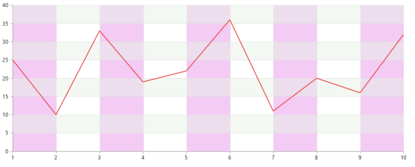
{:.image }

## Inversed Axis

You can display the Chart series in to inversed position using “IsInversed” property of Chart Axis. This is illustrated in the following code. 

[ASP.NET]

&lt;ej:Chart ID="Chart1" runat="server"&gt;          

          &lt;PrimaryYAxis IsInversed="true" /&gt;                    

 &lt;/ej:Chart&gt;



{:.image }

## Opposed Position

By default, the x-axis is arranged horizontally at the bottom of the Chart and the y-axis is arranged vertically at the left side of the Chart. You can change the alignment of the axis by setting OpposedPosition to true, which arranges the x-axis at the top and the y-axis at the right of the Chart.  

[ASP.NET]

  &lt;ej:Chart ID="Chart1" runat="server"&gt;       

        &lt;PrimaryXAxis  OpposedPosition="true" /&gt;    

        &lt;PrimaryYAxis  OpposedPosition="true" /&gt; 

   &lt;/ej:Chart&gt;



{:.image }

## Smart Axis Labels

Sometimes the Chart dimensions could cause the labels to intersect. You can avoid overlapping labels using “LabelIntersectAction” property of char axis. The Chart by default renders the texts one over the other. But, it also has some built-in capabilities to work around this overlap and lets you dictate the technique to follow. Refer to the following properties.

* Rotate45 – Rotate the labels to 45 degree.
* Rotate90 – Rotate the labels to 90 degree
* Trim – Intersecting labels will be trim and mouse over the labels, it displays the trimmed text like tooltip.
* MultipleRows – Split the intersecting labels in to multiple rows and display on the axis
* Wrap – Wrap the intersecting text and display
* Hide – It doesn’t display the intersecting label texts on the axis.

 [ASP.NET] 

  &lt;ej:Chart ID="Chart1" runat="server"&gt;       

        &lt;PrimaryXAxis  LabelIntersectAction="Rotate45" /&gt;    

         &lt;PrimaryYAxis  LabelIntersectAction="None" /&gt;                    

     &lt;/ej:Chart&gt;



{:.image }

