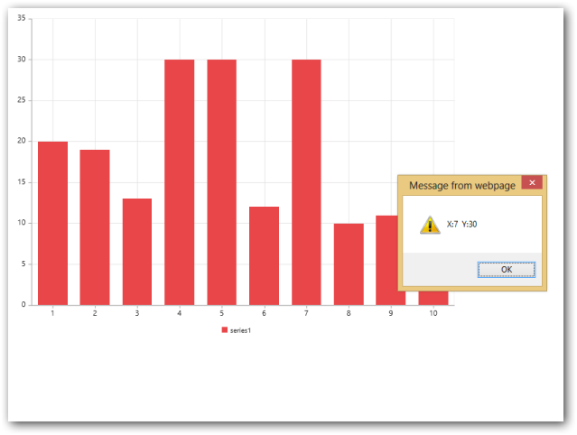

# Behaviour Customization

Essential Chart allows you to customize the Chart through events. For example, you can add custom marker for highest and lowest data point using the events.

## Select a point

You can acquire the information related to a particular data point of series by moving mouse over the point or by clicking the point using PointRegionMouseMove or PointRegionClick event. PointRegionMouseMove event gets triggered when you move the mouse over the point and the PointRegionClick event gets triggered when you click the point. The following code example illustrates that x and y values of a point gets displayed when you move the mouse over the point or click the point.





 <ej:Chart ID="Chart1"  OnClientPointRegionClick="pointDetails" OnClientPointRegionMouseMove="pointDetails" runat="server">

     <CommonSeriesOptions Type="Column"></CommonSeriesOptions>        

 </ej:Chart>
 


  





## Handle Events

### Chart Events:

Load: function

This event is handled when the Chart gets loaded; a parameter sender is passed to the handler. Using sender.model, you can access the Chart properties except series that were passed to the chart. 





  <ej:Chart ID="Chart1" OnClientLoad="onload" runat="server">

  </ej:Chart>



            





PreRender: function

This event is handled before the Chart gets rendered; a parameter sender is passed to the handler. Using sender.model, you can access the Chart properties that were passed to the Chart. 





  <ej:Chart ID="Chart1"  OnClientPreRender="onprerender" runat="server">

    </ej:Chart>



              





TitleRendering: function

This event is handled before the Chart title gets rendered; a parameter sender is passed to the handler. Using sender.data.title, you can change the title of the Chart after the Chart is loaded.





<ej:Chart ID="Chart1" OnClientTitleRendering="ontitleRendering" runat="server">

    </ej:Chart>


 

              





### ChartAxis Events:

AxesLabelsInitialize: function

This event is handled before the Chart axis gets rendered; a parameter sender is passed to the handler. Using sender.data.axes, you can change the axis related properties after the Chart is loaded.





<ej:Chart ID="Chart1 OnClientAxesLabelsInitialize="onaxesLabelsInitialize" runat="server">

    </ej:Chart>



              





AxesRangeCalculate: function

This event is handled after the Chart axis range gets calculated; a parameter sender is passed to the handler. Using sender.data.range, you can change the range calculated for the Chart axis.





<ej:Chart ID="Chart1"  OnClientAxesRangeCalculate="onaxesRangeCalculate"  runat="server">

   </ej:Chart>



              





AxesTitleRendering: function

This event is handled before the Chart axis title gets rendered; a parameter sender is passed to the handler. Using sender.data.Title, you can change the axis title after the Chart is loaded.





  <ej:Chart ID="Chart1" OnClientTitleRendering="onaxesTitleRendering" runat="server">

    </ej:Chart>



              





AxesLabelRendering: function

This event is handled before the Chart axis label gets rendered; a parameter sender is passed to the handler. Using sender.data.label.Text, you can change the axis labels after the Chart is loaded.





<ej:Chart ID="Chart1" OnClientAxesLabelRendering="onaxesLabelRendering"  runat="server">

    </ej:Chart>



     





### Series Events:

SeriesRendering: function

This event is handled before the Chart series gets rendered; a parameter sender is passed to the handler. Using sender.data.series, you can get access to the series properties.





 

  <ej:Chart ID="Chart1"  OnClientSeriesRendering="onseriesRendering" runat="server">

   </ej:Chart>



     





SymbolRendering: function

This event is handled before the marker of each series point gets rendered; a parameter sender is passed to the handler. Using sender.data you can get access style and location of the symbol.





  <ej:Chart ID="Chart1" OnClientSymbolRendering="onsymbolRendering" runat="server">

    </ej:Chart>



     





DisplayTextRendering: function

This event is handled before the dataLabel of each series points gets rendered; a parameter sender is passed to the handler. Using sender.data.text you can change the dataLabel of each point in the series.





<ej:Chart ID="Chart1" OnClientDisplayTextRendering="ondisplayTextRendering" runat="server">

 </ej:Chart>



     





AnimationComplete: function

This event is handled after the series animation is completed; a parameter sender is passed to the handler.  





<ej:Chart ID="Chart1" OnClientAnimationComplete="onanimationComplete" runat="server">

 </ej:Chart>



     





### Legend Events:

LegendItemRendering: function

This event is handled before the legend of each series points gets rendered; a parameter sender is passed to the handler. Using sender.data.legendItem.Text you can change the text of each legend text.





 

<ej:Chart ID="Chart1" OnClientLegendItemRendering=" onlegendItemRendering " runat="server">

    </ej:Chart>



     





LegendItemClick: function

This event is handled when you click the legend item; a parameter sender is passed to the handler.  





<ej:Chart ID="Chart1"  OnClientLegendItemClick="onlegendItemClick" runat="server">

</ej:Chart>



     





LegendItemMouseMove: function

This event is handled when you move the mouse over the legend item; a parameter sender is passed to the handler. Using sender.data.legendItem.Text you can change the text of each legend text.





<ej:Chart ID="Chart1"  OnClientLegendItemMouseMove="onlegendItemMouseMove" runat="server">

    </ej:Chart>



     





LengendBoundsCalculate: function

This event is handled after the bounds for legend is calculated.  A parameter sender is passed to the handler.  Using sender.data.legendBound, you can access the bounds of the Chartlegend.





<ej:Chart ID="Chart1" OnClientLengendBoundsCalculate="onlegendBoundsCalculate" runat="server">

    </ej:Chart>



     





### Tooltip Events:

ToolTipInitialize: function

This event is handled before the tooltip gets rendered.  A parameter sender is passed to the handler.  Using sender.data.currentText, you can change the tooltip text.




 

<ej:Chart ID="Chart1" OnClientToolTipInitialize="ontoolTipInitialize" runat="server">

    </ej:Chart>



     





TrackAxisToolTip: function

This event is handled before the tooltip for axis gets rendered when crosshair is enabled.  A parameter sender is passed to the handler.  Using sender.data.currentTrackText, you can change the tooltip text.





<ej:Chart ID="Chart1" OnClientTrackAxisToolTip="ontrackAxisToolTip" runat="server">

  </ej:Chart>



              





TrackToolTip: function

This event is handled before the tooltip for trackball get rendered when trackball is enabled.  A parameter sender is passed to the handler.  Using sender.data.currentText, you can change the tooltip text.





  <ej:Chart ID="Chart1"  OnClientTrackToolTip="ontrackToolTip" runat="server">

 </ej:Chart>



     





