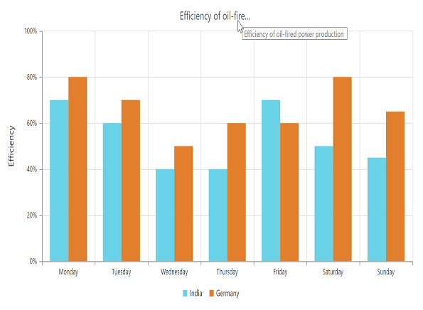
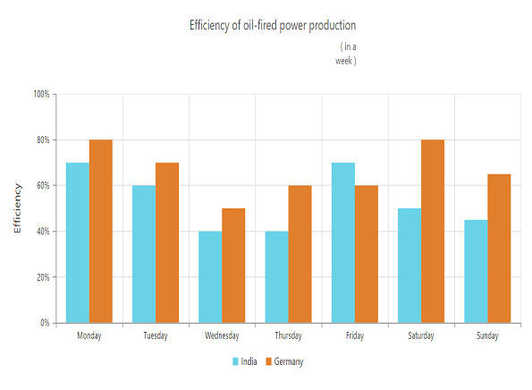

# Chart Title & Subtitle

## Title

By using the **Title** option, you can add the *Text* as well as customize its *Border, Background and Font*.



<ej:Chart ID="Chart" runat="server">
   <%--Adding text to chart title--%>
   <Title Text="'Efficiency of oil-fired power production" Background="lightblue">
       <%--Customizing Chart title border--%>
       <Border Color="blue" Width="2" Opacity="0.5" CornerRadius="4" />
       <%--Customizing Chart title font --%>
       
       
   </Title>
</ej:Chart> 



[Click](http://asp.syncfusion.com/demos/web/chart/subtitle.aspx) here to view the Chart Title online demo sample.

We can trim, wrap and wrapAndTrim to the chart title using textOverflow property. The original text will be displayed as tooltip on mouse hover.



<ej:Chart ID="Chart1" runat="server"> 
       //……
              <Title Text="Efficiency of oil-fired power production " EnableTrim= ”true” 
                              MaximumWidth=150 TextOverflow="trim" >
               </Title>             
 
      //….…
</ej:Chart>



### Title Alignment

You can change the title alignment to *Center*, *Far* and *Near* by using the **TextAlignment** property of the chart title. 



<ej:Chart ID="Chart1" runat="server">  
    <%--Change title text alignment --%>
    <Title TextAlignment="Near">     
    </Title>
</ej:Chart>

 

## Add Subtitle to the chart

By using the **SubTitle** option, you can add the SubTitle to the chart title and customize its *Border, Background and Font*.



<ej:Chart ID="Chart" runat="server">
   <Title>
    <%--Adding text to chart title--%>
       <SubTitle Text="( in a week )" Background="lightblue">
           <%--Customizing Chart subtitle border--%>
           <Border Color="blue" Width="2" Opacity="0.2" CornerRadius="4" />
           <%--Customizing Chart subtitle font --%>
           
           
       </SubTitle>
   </Title>
</ej:Chart> 



We can trim, wrap and wrapAndTrim to the chart sub title using textOverflow property. The original text will be displayed as tooltip on mouse hover.



<ej:Chart ID="Chart1" runat="server"> 
       //……
              <Title>
                     <SubTitle Text="( in a week ) " EnableTrim= ”true”   MaximumWidth=150                                       
                                   TextOverflow="wrap"> 
                     </SubTitle >
              </Title>             
 
      //….…
</ej:Chart>



### Subtitle Alignment

You can change the SubTitle alignment to *Center*, *Far* and *Near* by using the **TextAlignment** property of the SubTitle.



<ej:Chart ID="Chart1" runat="server">  

    <Title>     
        <%--Change sub title text alignment--%>
        <SubTitle TextAlignment="Center">
        </SubTitle>
    </Title>
</ej:Chart>



