# ChartTypes

## Line Chart

To render a Line Chart, set the series **Type** as **Line** in the chart series. To change the line segment color, you can use the **Fill** property of the series.



<ej:Chart ID="Chart1" runat="server"> 
    <%--Change type and color of the series.--%>
    <Series>
        <ej:Series Type="Line" Fill="#E94649"></ej:Series>
    </Series>
</ej:Chart>



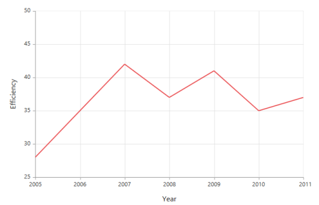

[Click](http://asp.syncfusion.com/demos/web/chart/defaultfunctionalities.aspx) here to view the Line Chart online demo sample.

### Change the line width

To change the width of the line segment, you can use the **Width** property in the series.



<ej:Chart ID="Chart1" runat="server"> 
    <%--Change the width of line series--%>
    <Series>
        <ej:Series Width="3"></ej:Series>
    </Series>
</ej:Chart>



### Dashed lines

To render the line series with dotted lines, you can use the **DashArray** option of the series.



<ej:Chart ID="Chart1" runat="server"> 
    <%--Change dash array to display dotted or dashed lines--%>
    <Series>
        <ej:Series DashArray="5,5"></ej:Series>
    </Series>
</ej:Chart>



### Changing the line cap

For customizing the start and end caps of the line segment, you can use the **LineCap** property.  



<ej:Chart ID="Chart1" runat="server"> 
    <%--Change line cap--%>
    <Series>
        <ej:Series LineCap="Square"></ej:Series>
    </Series>
</ej:Chart>



### Changing the line join

You can use the **LineJoin** property to specify how two intersecting line segments should be joined.



<ej:Chart ID="Chart1" runat="server"> 
    <%--Change line join--%>
    <Series>
        <ej:Series LineJoin="Round"></ej:Series>
    </Series>
</ej:Chart>



### MultiColor Line

You can change the color of the line segments by using the **Fill** property of the each Points in the series.



       $("#container").ejChart({
            //   ...
            series: [{
               //  Change the color of a line 
                points:[{ fill: 'red' },
                       //  ...         
                ],
               //  ...         
            }],
            
            //    ...

        });



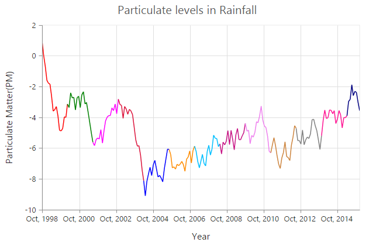

[Click](http://asp.syncfusion.com/demos/web/chart/multicolor.aspx) here to view the MultiColor Line Chart online demo sample.

 
## Step Line Chart

To render a Step Line Chart, set the series Type as **StepLine"** in the chart series. To change the StepLine segment color, you can use the Fill property of the series.



<ej:Chart ID="Chart1" runat="server"> 
    <%--Change type and color of the series.--%>
    <Series>
        <ej:Series Type="StepLine" Fill="#E94649"></ej:Series>
    </Series>
</ej:Chart>



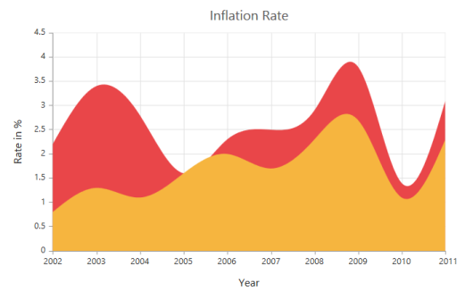

[Click](http://asp.syncfusion.com/demos/web/chart/stepline.aspx) here to view the Step Line Chart online demo sample.

### Changing the line width

To change the line width, you can use the **Width** property.  



<ej:Chart ID="Chart1" runat="server"> 
    <%--Change the width of step line series--%>
    <Series>
        <ej:Series Width="3"></ej:Series>
    </Series>
</ej:Chart>



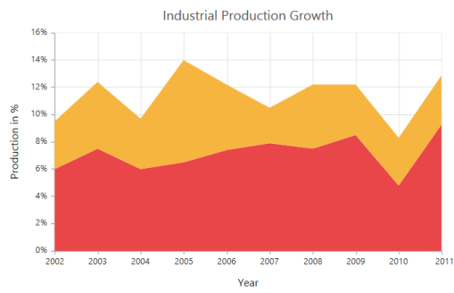

### Dashed lines

To render the step line series with dotted lines, you can use the DashArray option of the series.



<ej:Chart ID="Chart1" runat="server"> 
    <%--Change dash array to display dotted or dashed lines--%>
    <Series>
        <ej:Series DashArray="5,5"></ej:Series>
    </Series>
</ej:Chart>



### Changing the line cap

For customizing the start and end caps of the line segment, you can use the LineCap property.  



<ej:Chart ID="Chart1" runat="server"> 
    <%--Change line cap--%>
    <Series>
        <ej:Series LineCap="Square"></ej:Series>
    </Series>
</ej:Chart>



### Changing the line join

You can use the LineJoin property to specify how two intersecting line segments should be joined.



<ej:Chart ID="Chart1" runat="server"> 
    <%--Change line join--%>
    <Series>
        <ej:Series LineJoin="Round"></ej:Series>
    </Series>
</ej:Chart>



## Area Chart

To render an Area chart, you can specify the series Type as **Area** in the chart series. To change the Area color, you can use the Fill property of the series.



<ej:Chart ID="Chart1" runat="server"> 
    <%--Change type and color of the series--%>
    <Series>
        <ej:Series Type="Area" Fill="#69D2E7"></ej:Series>
    </Series>
</ej:Chart>



[Click](http://asp.syncfusion.com/demos/web/chart/area.aspx) here to view the Area Chart online demo.

## Range Area Chart

To render a Range Area Chart, set the Type as **RangeArea** in the chart series. To change the RangeArea color, you can use the Fill property of the series.

Since the RangeArea series requires two y values for a point, you have to add the *High* and *Low* value. High and Low value specifies the maximum and minimum range of the points.

* When you are using the Points option, specify the high and low values by using the High and Low option of the point.

* When you are using the DataSource option to assign the data, map the fields from the dataSource that contain High and Low values by using the Series.High and Series.Low options. 



<ej:Chart ID="Chart1" runat="server"> 
    <%--Change type and color of the series--%>
    <Series>
        <ej:Series Type="RangeArea" Fill="Indigo">
            <Points>
                <%--Use High and Low values instead of Y--%>
                <ej:Points X="1935" High="80" Low="70"></ej:Points>
                <%--...--%>
            </Points>
        </ej:Series>
    </Series>
</ej:Chart>



[Click](http://asp.syncfusion.com/demos/web/chart/rangearea.aspx) here to view Range Area Chart online demo.

## Step Area Chart

To render a Step Area Chart, set the Type as **StepArea** in the chart series. To change the StepArea color, you can use the Fill property of the series.



<ej:Chart ID="Chart1" runat="server"> 
    <%--Change type and color of the series--%>
    <Series>
        <ej:Series Type="StepArea" Fill="#69D2E7">
        </ej:Series>
    </Series>
</ej:Chart>



[Click](http://asp.syncfusion.com/demos/web/chart/steparea.aspx) here to view Step Area Chart online demo.

## Spline Area Chart

To render a Spline Area Chart, set the Type as **SplineArea** in the chart series. To change the SplineArea color, you can use the Fill property of the series.



 
<ej:Chart ID="Chart1" runat="server"> 
    <%--Change type and color of the series--%>
    <Series>
        <ej:Series Type="SplineArea" Fill="#C4C24A">
        </ej:Series>
    </Series>
</ej:Chart>



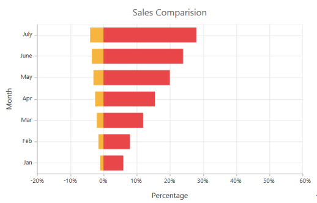

[Click](http://asp.syncfusion.com/demos/web/chart/splinearea.aspx) here to view Spline Area Chart online demo.

## Stacked Area Chart

To render a Stacked Area Chart, set the Type as **StackingArea** in the chart series. To change the StackingArea color, you can use the Fill property of the series.



<ej:Chart ID="Chart1" runat="server"> 
    <%--Change type and color of the series--%>
    <Series>
        <ej:Series Type="StackingArea" Fill="#69D2E7">
        </ej:Series>
    </Series>
</ej:Chart>



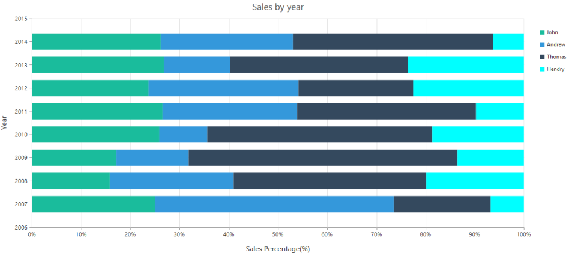

[Click](http://asp.syncfusion.com/demos/web/chart/stackingarea.aspx) here to view Stacked Area Chart online demo.

## 100% Stacked Area Chart  

To render a 100% Stacked Area Chart, set the Type as **StackingArea100** in the chart series. To change the StackingArea100 color, you can use the Fill property of the series.   



<ej:Chart ID="Chart1" runat="server"> 
    <%--Change type and color of the series--%>
    <Series>
        <ej:Series Type="StackingArea100" Fill="#C4C24A">
        </ej:Series>
    </Series>
</ej:Chart>



[Click](http://asp.syncfusion.com/demos/web/chart/stackingarea100.aspx) here to view 100% Stacked Area Chart online demo.

## Column Chart

To render a Column Chart, set the Type as **Column** in the chart series. To change the color of the column series, you can use the Fill property.  



<ej:Chart ID="Chart1" runat="server"> 
    <%--Change type and color of the series--%>
    <Series>
        <ej:Series Type="Column" Fill="#E94649">
        </ej:Series>
    </Series>
</ej:Chart>



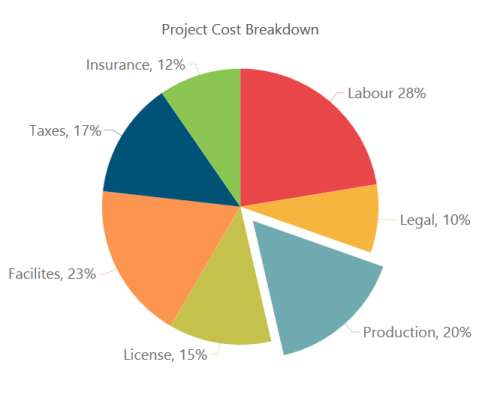

[Click](http://asp.syncfusion.com/demos/web/chart/column.aspx) here to view Column Chart demo.

### Change a point color

You can change the color of a column by using the Fill property of the point.



<ej:Chart ID="Chart1" runat="server"> 
    <Series>
        <ej:Series>
            <Points>
                <ej:Points Fill="skyblue"></ej:Points>
            </Points>
        </ej:Series>
    </Series>
</ej:Chart>



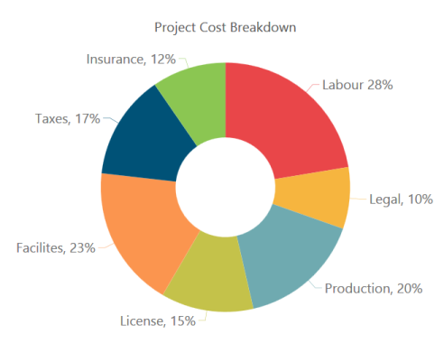

### Column width customization

Width of any column type series can be customized by using the **ColumnWidth** property. Default value of *ColumnWidth* is 0.7. Value ranges from 0 to 1. Here 1 corresponds to 100% of available width and 0 corresponds to 0% of available width.

N> Width of a column also depends upon the *ColumnSpacing* property, because *ColumnSpacing* will reduce the space available for drawing a column. This is also applicable for StackingColumn, StackingColumn100, Bar, StackingBar, StackingBar100, RangeColumn, HiLo, HiLoOpenClose, Candle and Waterfall charts.



	<ej:Chart ID="Chart1" runat="server">
		<Series>
			<ej:Series ColumnWidth = "0.8">            
			</ej:Series>
		</Series>
	</ej:Chart>	



### Column with rounded corners
Corners of the column chart can be customized by setting value to the **CornerRadius** property.



   <ej:Chart ID="Chart1" runat="server">
     <CommonSeriesOptions CornerRadius="20" />
    </ej:Chart>



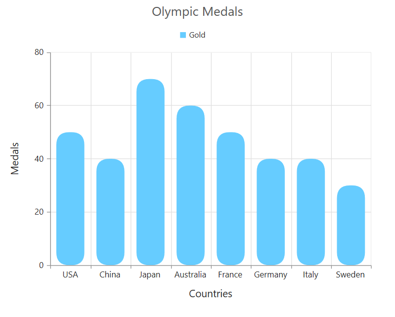  

### Spacing between column series

Spacing between column type series can be customized using the **ColumnSpacing** property. Default value of *ColumnSpacing* is 0. Value ranges from 0 to 1. Here 1 corresponds to 100% available space and 0 corresponds to 0% available space.

N> Space between columns will also affect the width of the column. For example, setting 20% spacing and 100% width will render columns with 80% of total width. This is also applicable for StackingColumn, StackingColumn100, Bar, StackingBar, StackingBar100, RangeColumn, HiLo, HiLoOpenClose, Candle and Waterfall charts.



	<ej:Chart ID="Chart1" runat="server">
		<Series>
			<ej:Series ColumnWidth = "0.2">            
			</ej:Series>
		</Series>
	</ej:Chart>	



### Cylindrical Chart

To render a cylindrical chart, set the **ColumnFacet** property as "Cylinder" in the chart series along with the series type. 

The following chart types can be rendered as cylinder in both 2D and in 3D view.

* Column Chart, Bar Chart, Stacked Column Chart, Stacked Bar Chart, 100% Stacked Column Chart, 100% Stacked Bar Chart.



    <ej:Chart ID="Chart2" runat="server"> 
      <%-- To change the shape of the series--%>
      <Series>
          <ej:Series Type="Column" ColumnFacet="Cylinder">
          </ej:Series>
      </Series>
   </ej:Chart>



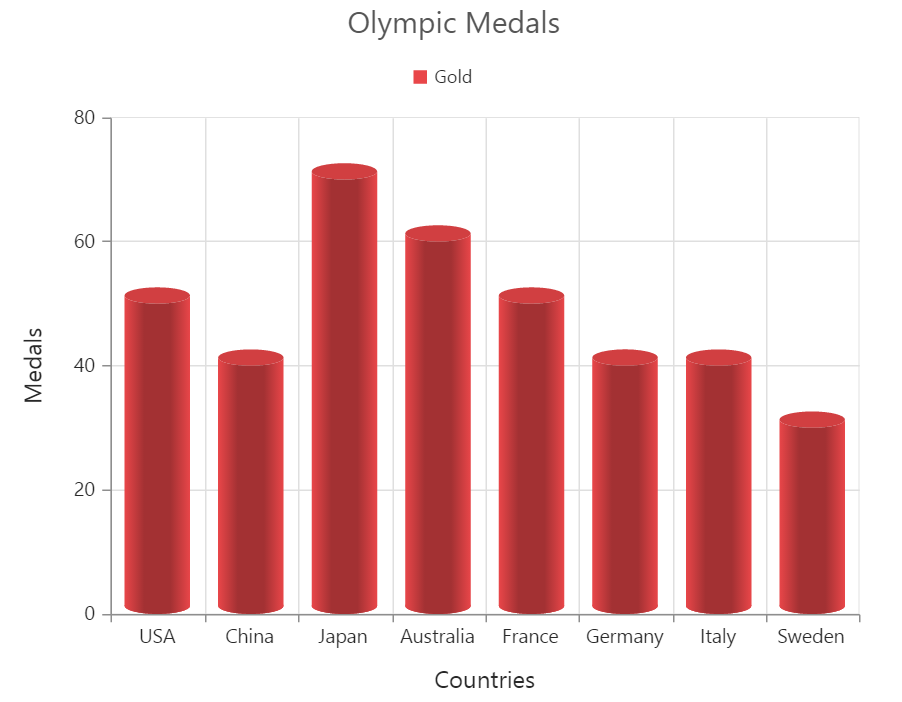

## RangeColumn Chart

To render a Range Column Chart, set the Type as **RangeColumn** in the chart series. To change the RangeColumn color, use the Fill property of the series.

Since, the RangeColumn series requires two y values for a point, add the High and Low value. High and Low value specifies the maximum and minimum range of the points.

* When you are using the Points option, specify the high and low values by using the High and Low option of the point.

* When you are using the DataSource option to assign the data, you have to map the fields from the dataSource that contains high and low values by using the Series.High and Series.Low) options.  



<ej:Chart ID="Chart1" runat="server"> 
    <%--Change type and color of the series--%>
    <Series>
        <ej:Series Type="RangeColumn" Fill="#E94649">
            <Points>
                <%--Use high and low values instead of y--%>
                <ej:Points High="6.1" Low="0.7"></ej:Points>
            </Points>
        </ej:Series>
    </Series>
</ej:Chart>



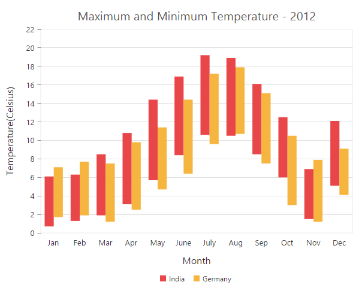

[Click](http://asp.syncfusion.com/demos/web/chart/rangecolumn.aspx) here to view Range Column Chart online demo.

### Change a point color 

To change the color of a range column, you can use the Fill property of point. 



<ej:Chart ID="Chart1" runat="server"> 
    <Series>
        <ej:Series>
            <Points>
                <%--change a point color of Range column--%>
                <ej:Points Fill="skyblue"></ej:Points>
            </Points>
        </ej:Series>
    </Series>
</ej:Chart>



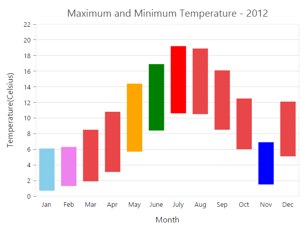

## Stacked Column Chart

To render a Stacked Column Chart, set the Type as **StackingColumn** in the chart series. To change the StackingColumn color, you can use the Fill property of the series.



<ej:Chart ID="Chart1" runat="server"> 
    <%--Change type and color of the series--%>
    <Series>
        <ej:Series Type="StackingColumn" Fill="#E94649">
        </ej:Series>
    </Series>
</ej:Chart>



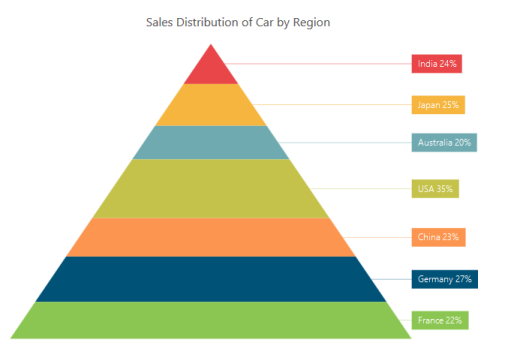

[Click](http://asp.syncfusion.com/demos/web/chart/stackingcolumn.aspx) here to view Stacked Column Chart online demo.

### Cluster / Group stacked columns

You can use the **StackingGroup** property to group the stacked columns. Columns with same group name are stacked on top of each other.



<ej:Chart ID="Chart1" runat="server">
    <Series>
        <%--For grouping stacked columns--%>
        <ej:Series StackingGroup="GroupOne">
        </ej:Series>
        <%--For grouping stacked columns--%>
        <ej:Series StackingGroup="GroupOne">
        </ej:Series>
    </Series>
</ej:Chart>



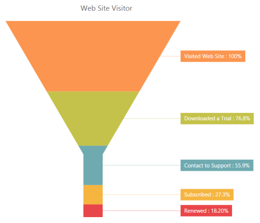

### Change a point color

To change the color of a stacking column, you can use the Fill property of the point. 



<ej:Chart ID="Chart1" runat="server"> 
    <Series>
        <ej:Series>
            <%--change a point color of Stacking column--%>
            <Points>
                <ej:Points Fill="skyBlue"></ej:Points>
            </Points>
        </ej:Series>
    </Series>
</ej:Chart>



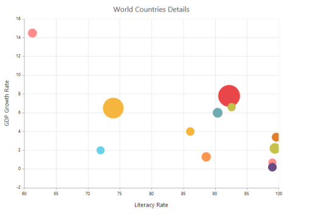

## 100% Stacked Column Chart    

To render a 100% Stacked Column Chart, set the Type as **StackingColumn100** in the chart series. To change the StackingColumn100 color, you can use the Fill property of the series.



<ej:Chart ID="Chart1" runat="server"> 
    <Series>
        <%--Change type and color of the series--%>
        <ej:Series Type="StackingColumn100" Fill="#E94649">
        </ej:Series>
    </Series>
</ej:Chart>



[Click](http://asp.syncfusion.com/demos/web/chart/stackingcolumn100.aspx) here to view 100% Stacked Column Chart online demo.

### Cluster / Group 100% stacked columns

By using the **StackingGroup** property, you can group the 100% stacking columns. Columns with same group name are stacked on top of each other. 



<ej:Chart ID="Chart1" runat="server"> 
    <Series>
        <%--For grouping 100% stacked columns--%>
        <ej:Series StackingGroup="GroupOne">
        </ej:Series>
          <%--For grouping 100% stacked columns--%>
        <ej:Series StackingGroup="GroupOne">
        </ej:Series>
    </Series>
</ej:Chart>



### Change a point color

To change the color of a 100% stacking column, you can use the Fill property of the point. 



<ej:Chart ID="Chart1" runat="server"> 
    <Series>
        <ej:Series>
            <Points>
             <%--change a point color of 100% Stacking column--%>
                <ej:Points Fill="skyBlue"></ej:Points>
            </Points>
        </ej:Series>
    </Series>
</ej:Chart>



## Bar Chart

To render a bar Chart, set the Type as **Bar** in the chart series. To change the bar color, you can use the Fill property of the series.



<ej:Chart ID="Chart1" runat="server"> 
    <Series>
        <%--Change type and color of the series--%>
        <ej:Series Type="Bar" Fill="#E94649">
        </ej:Series>
    </Series>
</ej:Chart>



[Click](http://asp.syncfusion.com/demos/web/chart/bar.aspx) here to view Bar Chart demo.

### Change the color of a bar

By using the Fill property of the point, you can change the specific point of the series. 



<ej:Chart ID="Chart1" runat="server"> 
    <Series>
        <ej:Series>
            <Points>
                <%--change a point color of bar--%>
                <ej:Points Fill="skyblue"></ej:Points>
            </Points>
        </ej:Series>
    </Series>
</ej:Chart>



## Stacked Bar Chart

To render a Stacked Bar Chart, set the Type as **StackingBar** in the chart series. To change the StackingBar color, you can use the Fill property of the series.



<ej:Chart ID="Chart1" runat="server"> 
    <Series>
        <%--Change type and color of the series--%>
        <ej:Series Type="StackingBar" Fill="#E94649">
        </ej:Series>
    </Series>
</ej:Chart>



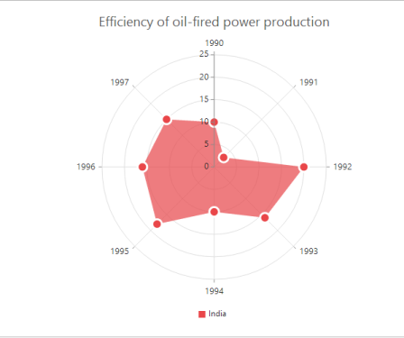

[Click](http://asp.syncfusion.com/demos/web/chart/stackingbar.aspx) here to view Stacked Bar Chart online demo.

### Cluster / Group stacked bars

You can use the **StackingGroup** property to group the stacking bars with the same group name. 



<ej:Chart ID="Chart1" runat="server"> 
    <Series>
        <%--For grouping stacking bar--%>
        <ej:Series StackingGroup="GroupOne">
        </ej:Series>
        <%--For grouping stacking bar--%>
        <ej:Series StackingGroup="GroupOne">
        </ej:Series>
    </Series>
</ej:Chart>



### Change a point color

You can change the color of a stacking bar by using the Fill property of the point.



<ej:Chart ID="Chart1" runat="server"> 
    <Series>
        <ej:Series>
            <Points>
                <%--change a point color of stacking bar--%>
                <ej:Points Fill="skyblue"></ej:Points>
            </Points>
        </ej:Series>
    </Series>
</ej:Chart>



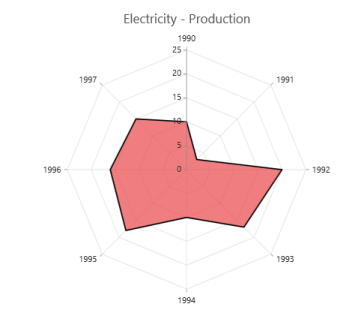

## 100% Stacked Bar Chart

To render a 100% Stacked Bar Chart, set the Type as **StackingBar100** in the chart series. To change the StackingBar100 color, you can use the Fill property of the series.



<ej:Chart ID="Chart1" runat="server"> 
    <Series>
        <%--Change type and color of the series--%>
        <ej:Series Type="StackingBar100" Fill="#E94649">
        </ej:Series>
    </Series>
</ej:Chart>



[Click](http://asp.syncfusion.com/demos/web/chart/stackingbar100.aspx) here to view 100% Stacked Bar Chart online demo.

By using the StackingGroup property, you can group the 100% stacking bars with the same group name. 



<ej:Chart ID="Chart1" runat="server"> 
    <Series>
        <%--For grouping 100% stacking bar--%>
        <ej:Series StackingGroup="GroupOne">
        </ej:Series>
        <%--For grouping 100% stacking bar--%>
        <ej:Series StackingGroup="GroupOne">
        </ej:Series>
    </Series>
</ej:Chart>



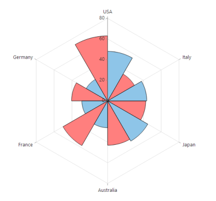

### Change a point color

To change the color of a 100% stacking bar, you can use the Fill property of the point. 



<ej:Chart ID="Chart1" runat="server"> 
    <Series>
        <ej:Series>
            <Points>
                <%--change a point color of 100% stacking bar--%>
                <ej:Points Fill="skyblue"></ej:Points>
            </Points>
        </ej:Series>
    </Series>
</ej:Chart>



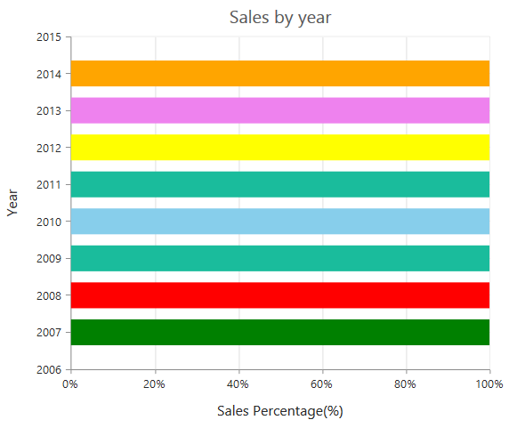

## Spline Chart

To render a Spline Chart, set the Type as **Spline** in the chart series. To change the Spline segment color, you can use the Fill property of the series.



<ej:Chart ID="Chart1" runat="server"> 
    <Series>
        <%--Change type and color of the series--%>
        <ej:Series Type="Spline" Fill="#6ADCB0">
        </ej:Series>
    </Series>
</ej:Chart>



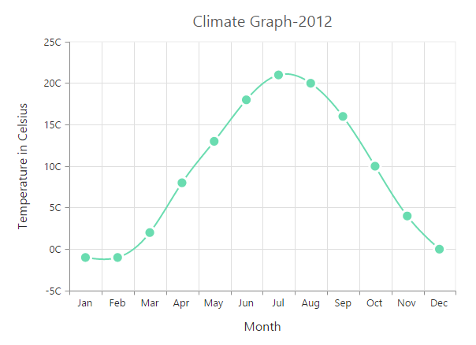

[Click](http://asp.syncfusion.com/demos/web/chart/spline.aspx) here to view the Spline Chart online demo sample.

### Change the spline width

To change the spline segment width, you can use the Width property of the series.



<ej:Chart ID="Chart1" runat="server"> 
    <Series>
        <%--Change the width of spline series--%>
        <ej:Series Width="3">
        </ej:Series>
    </Series>
</ej:Chart>



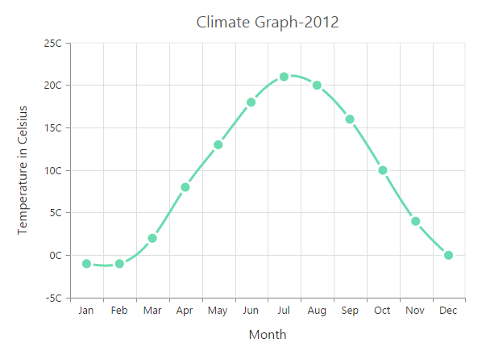

### Dashed lines

To render the spline series with dotted lines, you can use the DashArray option of the series.



<ej:Chart ID="Chart1" runat="server"> 
    <Series>
        <%--Change dash array to display dotted or dashed splines--%>
        <ej:Series DashArray="5,5">
        </ej:Series>
    </Series>
</ej:Chart>



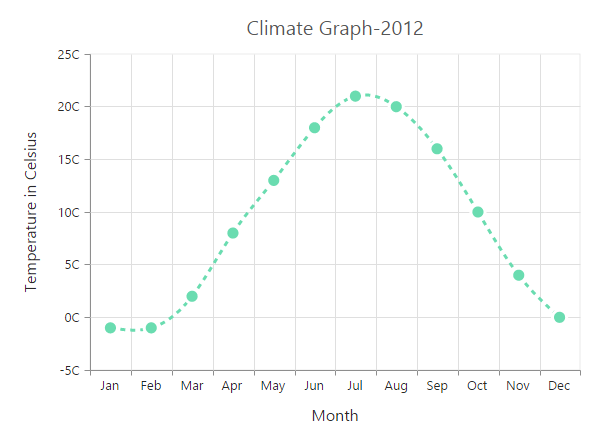

## Pie Chart

You can create a pie chart by setting the series Type as **Pie** in the chart series.



<ej:Chart ID="Chart1" runat="server"> 
    <Series>
        <%--Set chart type to series--%>
        <ej:Series Type="Pie">
        </ej:Series>
    </Series>
</ej:Chart>



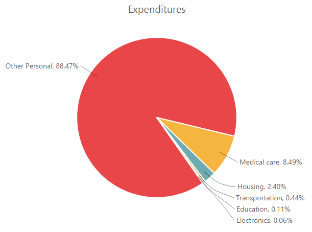

[Click](http://asp.syncfusion.com/demos/web/chart/pie.aspx) here to view the Pie chart online demo sample.

### Change the pie size

You can use the **PieCoefficient** property to change the diameter of the Pie chart with respect to the plot area. It ranges from 0 to 1 and the default value is **0.8**.



<ej:Chart ID="Chart1" runat="server"> 
    <Series>
        <%--Change pie chart coefficient value--%>
        <ej:Series PieCoefficient="0.4f">
        </ej:Series>
    </Series>
</ej:Chart>



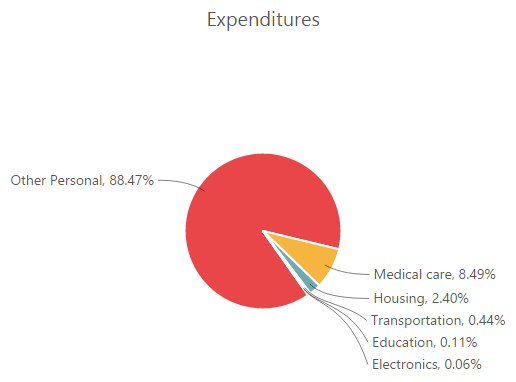

### Explode a pie segment

You can explode a pie segment on the chart load by using the **ExplodeIndex** of the series.



<ej:Chart ID="Chart1" runat="server"> 
    <Series>
        <%--Set point index value to explode the pie segment--%>
        <ej:Series ExplodeIndex="1">
        </ej:Series>
    </Series>
</ej:Chart>



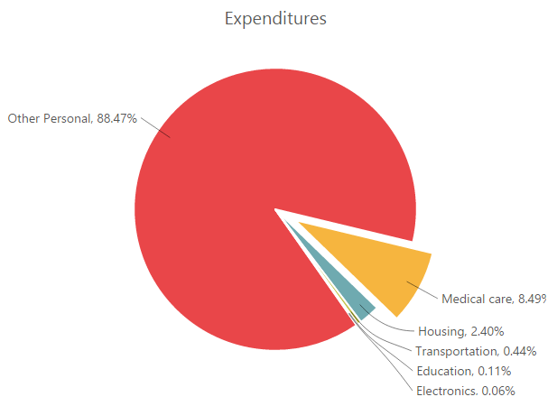

### Explode all the segments

To explode all the segments of the Pie chart, you can enable the **ExplodeAll** property.



<ej:Chart ID="Chart1" runat="server"> 
    <Series>
        <%--Enable explodeAll property for pie chart--%>
        <ej:Series ExplodeAll="true">
        </ej:Series>
    </Series>
</ej:Chart>



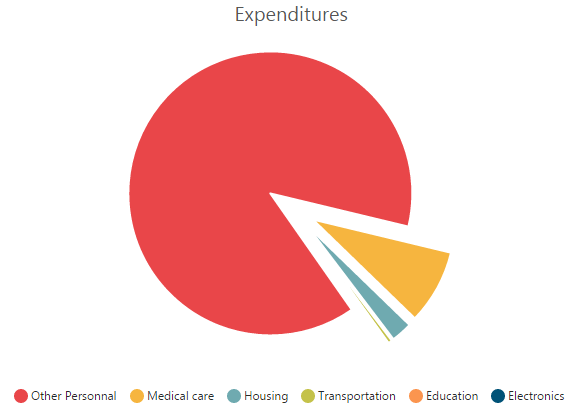

### Explode a pie segment on mouse over

To explode a pie segment on a mouse over, you can enable the **Explode** property of the series.



<ej:Chart ID="Chart1" runat="server"> 
    <Series>
        <%--Enable pie explode option on mouse over the chart --%>
        <ej:Series Explode="true">
        </ej:Series>
    </Series>
</ej:Chart>



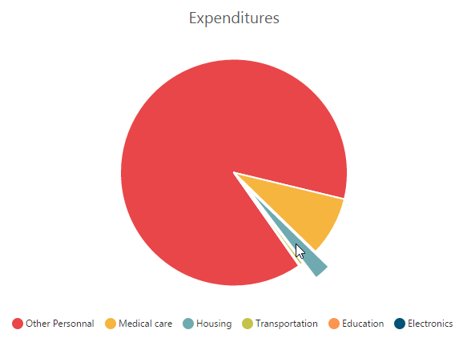

### Sector of Pie

EjChart allows you to render all the data points/segments in the semi-pie, quarter-pie or in any sector by using the **StartAngle** and **EndAngle** options.



<ej:Chart ID="Chart1" runat="server"> 
    <Series>
        <%--Set startAngle and endAngle to draw the semi pie chart--%>
        <ej:Series Type="Pie" StartAngle="-90" EndAngle="90">
        </ej:Series>
    </Series>
</ej:Chart>



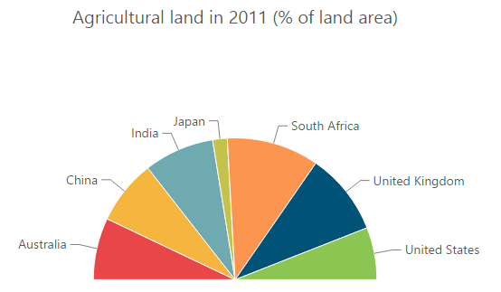

[Click](http://asp.syncfusion.com/demos/web/chart/semipie.aspx) here to view the Semi Pie Chart online demo sample.

## Doughnut Chart

To create a Doughnut chart, you can specify the series Type as **Doughnut** in the chart series.



<ej:Chart ID="Chart1" runat="server"> 
    <Series>
        <%--Set chart type to series--%>
        <ej:Series Type="Doughnut">
        </ej:Series>
    </Series>
</ej:Chart>



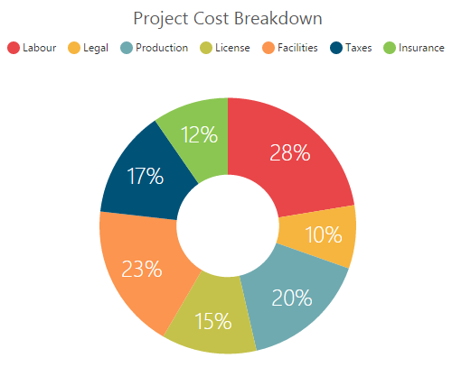

[Click](http://asp.syncfusion.com/demos/web/chart/doughnut.aspx) here to view the Doughnut Chart online demo sample.

### Change Doughnut inner radius

You can change the doughnut chart inner radius by using the **DoughnutCoefficient** with respect to the plot area. It ranges from 0 to 1 and the default value is **0.4**.



<ej:Chart ID="Chart1" runat="server"> 
    <Series>
        <%--Change doughnut chart coefficient value--%>
        <ej:Series DoughnutCoefficient="0.6f">
        </ej:Series>
    </Series>
</ej:Chart>



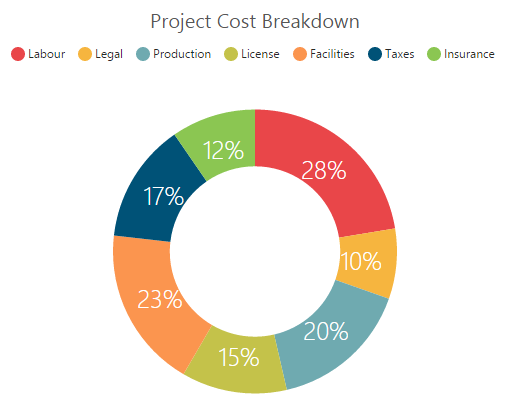

### Change the doughnut size

You can use the **DoughnutSize** property to change the diameter of the Doughnut chart with respect to the plot area. It ranges from 0 to 1 and the default value is **0.8**.



<ej:Chart ID="Chart1" runat="server"> 
    <Series>
        <%--Change doughnut chart coefficient value--%>
        <ej:Series DoughnutSize="0.4f">
        </ej:Series>
    </Series>
</ej:Chart>



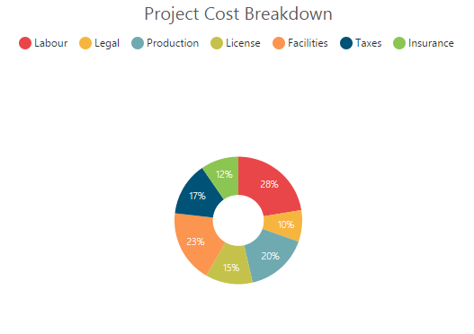

### Explode a doughnut segment

To explode a specific doughnut segment, set the index to be exploded by using the **ExplodeIndex** option of the series.



<ej:Chart ID="Chart1" runat="server"> 
    <Series>
        <%--Set point index value to explode the doughnut segment--%>
        <ej:Series ExplodeIndex="1">
        </ej:Series>
    </Series>
</ej:Chart>



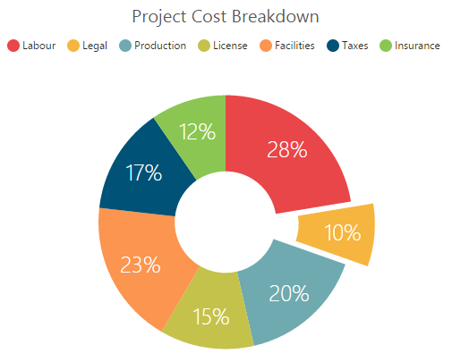

### Explode all the segments

To explode all the segments, you can enable the **ExplodeAll** property of the series.



<ej:Chart ID="Chart1" runat="server"> 
    <Series>
        <%--Enable explodeAll property of doughnut chart--%>
        <ej:Series ExplodeAll="true">
        </ej:Series>
    </Series>
</ej:Chart>



### Explode a doughnut segment on mouse over

To explode a doughnut segment on a mouse over, you can enable the **Explode** property of the series.



<ej:Chart ID="Chart1" runat="server"> 
    <Series>
        <%--Enable doughnut explode option on mouse over the chart--%>
        <ej:Series Explode="true">
        </ej:Series>
    </Series>
</ej:Chart>



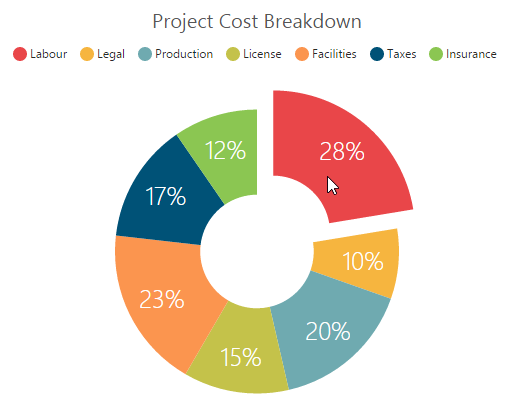

### Sector of Doughnut

EjChart allows you to render all the data points/segments in the semi-doughnut, quarter- doughnut or in any sector by using the **StartAngle** and **EndAngle** options.



<ej:Chart ID="Chart1" runat="server"> 
    <Series>
        <%--Set startAngle and endAngle to draw the semi doughnut chart--%>
        <ej:Series Type="Doughnut" StartAngle="-90" EndAngle="90">
        </ej:Series>
    </Series>
</ej:Chart>



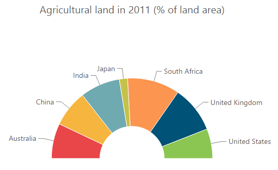

[Click](http://asp.syncfusion.com/demos/web/chart/semipie.aspx) here to view the Semi Doughnut Chart online demo sample.

## Multiple Pie Chart

EjChart provides support to render more than one series in pie and in doughnut chart. Radius of each series is calculated based on the radius of the previous series. And in addition legend is displayed according to the list of chart series.



        <ej:Chart ID="Chart1" runat="server">
            <Series>
                <%--Adding multiple pie series--%>
                <ej:Series Type="Pie">
                    <%--....--%>
                </ej:Series>                
                <ej:Series Type="Pie">
                    <%--....--%>
                </ej:Series>
            </Series>            
        </ej:Chart>



**Multiple Pie** 

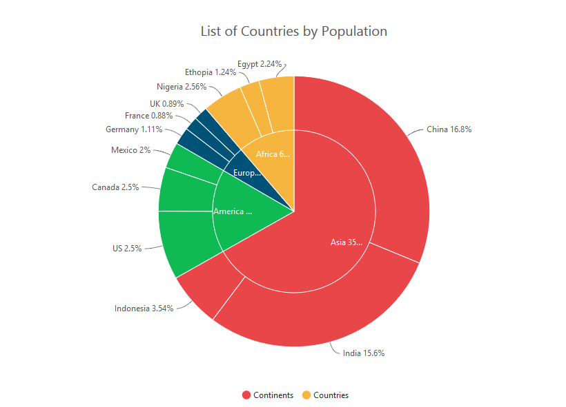

**Multiple Doughnut** 

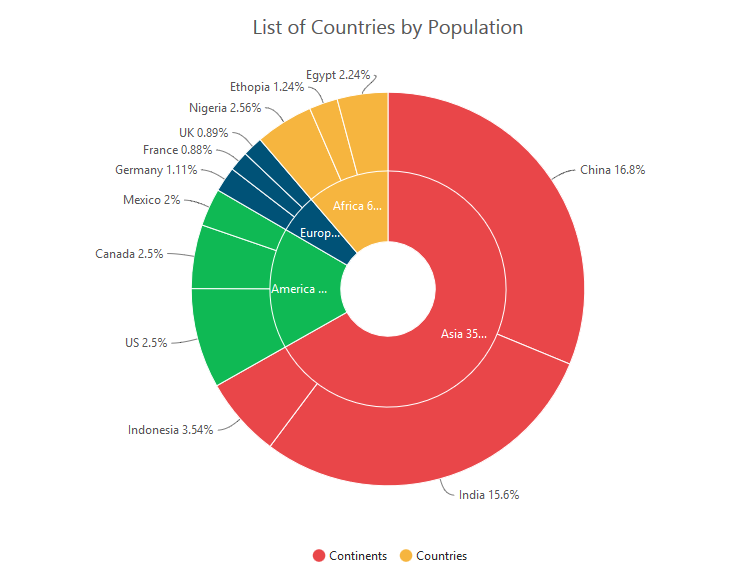

[Click](http://asp.syncfusion.com/demos/web/chart/multiplepie.aspx) here to view the Multiple Pie chart online demo sample.

### Start and End Angle Support

In the Multiple Pie chart, the start and end angle property is also supported.

**Sector of Multiple Pie**

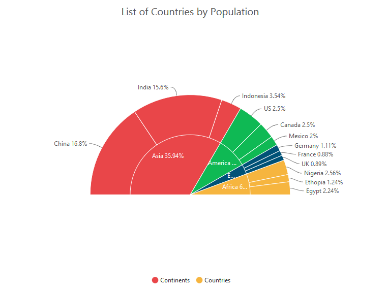

**Sector of Multiple Doughnut**

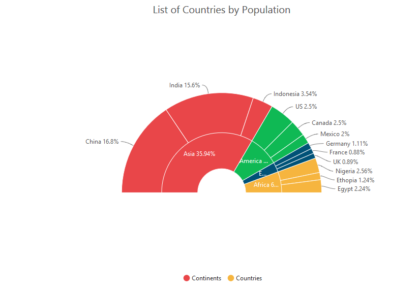

## Pyramid Chart

To create a Pyramid chart, you can specify the series Type as **Pyramid** in the chart series.  



<ej:Chart ID="Chart1" runat="server"> 
    <Series>
        <%--Set chart type to series--%>
        <ej:Series Type="Pyramid">
        </ej:Series>
    </Series>
</ej:Chart>



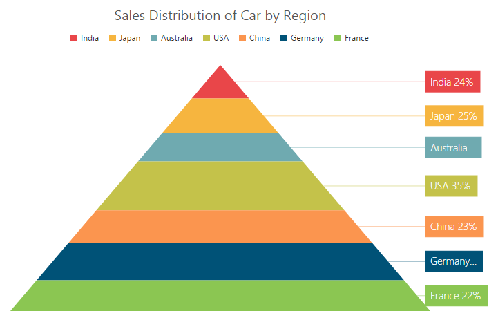

[Click](http://asp.syncfusion.com/demos/web/chart/pyramid.aspx) here to view the Pyramid Chart online demo sample.

### Pyramid Mode

Pyramid mode has two types, *Linear* and *Surface* respectively. The default **PyramidMode** type is "Linear".



<ej:Chart ID="Chart1" runat="server"> 
    <Series>
        <%--Change pyramid mode--%>
        <ej:Series PyramidMode="Surface">
        </ej:Series>
    </Series>
</ej:Chart>



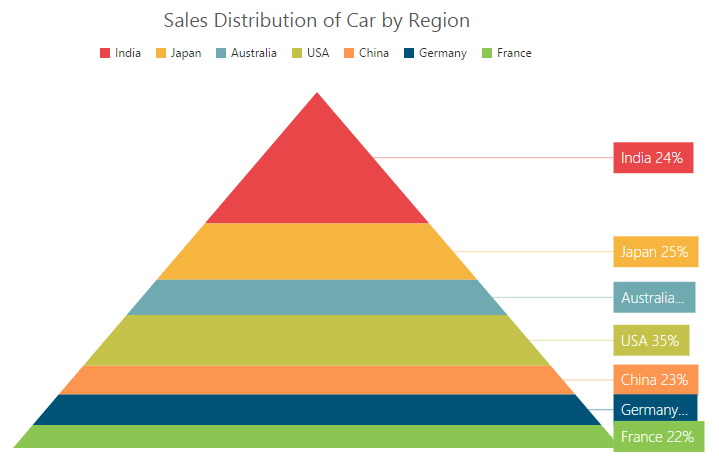

### Gap between the segments

You can control the gap between the segments by using the **GapRatio** option of the series. Its ranges from 0 to 1.



<ej:Chart ID="Chart1" runat="server"> 
    <Series>
        <%--Set gapRatio value to pyramid chart--%>
        <ej:Series GapRatio="0.1f">
        </ej:Series>
    </Series>
</ej:Chart>



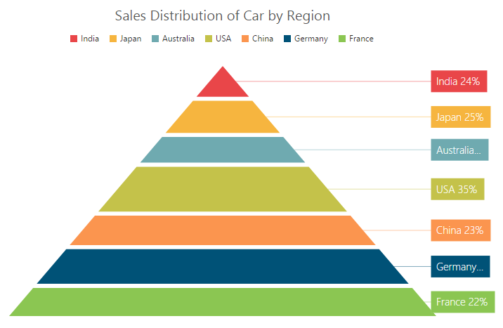

### Explode a pyramid segment

You can explode a pyramid segment on the chart load by using the **ExplodeIndex** of the series.



<ej:Chart ID="Chart1" runat="server"> 
    <Series>
        <%--Set point index value to explode the pyramid segment--%>
        <ej:Series ExplodeIndex="4">
        </ej:Series>
    </Series>
</ej:Chart>



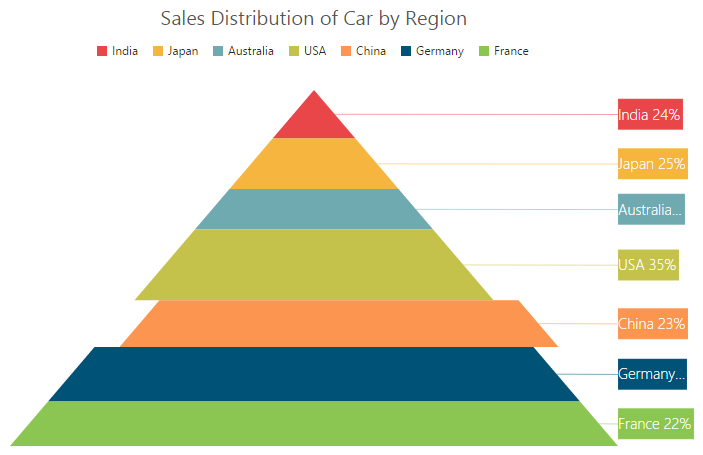

## Funnel Chart

You can create a funnel chart by setting the series Type as **Funnel** in the chart series.  



<ej:Chart ID="Chart1" runat="server"> 
    <Series>
        <%--Set chart type to series--%>
        <ej:Series Type="Funnel">
        </ej:Series>
    </Series>
</ej:Chart>



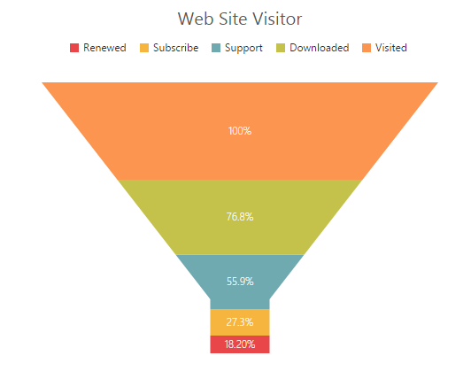

[Click](http://asp.syncfusion.com/demos/web/chart/funnel.aspx) here to view the Funnel Chart online demo sample.

### Change the funnel width and height

Funnel segments height and width is calculated from the chart size, by default. You can change this height and width directly without changing the chart size by using the **FunnelHeight** and **FunnelWidth** property of the series.



<ej:Chart ID="Chart1" runat="server"> 
    <Series>
        <%--Change funnel height and width--%>
        <ej:Series FunnelHeight="22%" FunnelWidth="25%">
        </ej:Series>
    </Series>
</ej:Chart>



### Explode a funnel segment

You can explode a funnel segment on the chart load by using the **ExplodeIndex** of the series.



<ej:Chart ID="Chart1" runat="server"> 
    <Series>
        <%--Set point index value to explode the funnel segment--%>
        <ej:Series ExplodeIndex="3">
        </ej:Series>
    </Series>
</ej:Chart>



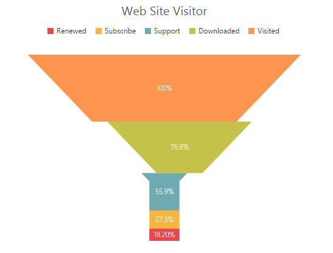

## Bubble Chart

To create a Bubble chart, you can set the series Type as **Bubble** in the chart series. Bubble chart requires 3 fields (*X, Y and Size*) to plot a point. Here, **Size** is used to specify the size of each bubble segment. 



      public partial class _Default : Page
    {
        protected void Page_Load(object sender, EventArgs e)
        {
            List<ChartData> data = new List<ChartData>();
            data.Add(new ChartData("Jan", 35, 1.34));
            data.Add(new ChartData("Feb", 28, 1.05));
            data.Add(new ChartData("Mar", 34, 0.45));
            data.Add(new ChartData("Apr", 32, 1.10));            

            //Binding DataSource to Chart
            this.Chart1.DataSource = data;
            this.Chart1.DataBind();
           
        }
    }

    [Serializable]
    public class ChartData
    {
        public string Month;
        public double Sales;
        public double Profit;
        public ChartData(string month, double sales, double profit)
        {
            this.Month = month;
            this.Sales = sales;
            this.Profit = profit;
        }
    }



           


<ej:Chart ID="Chart1" runat="server"> 
    <%--Set chart type to series--%>
    <Series>        
        <%--Add datasource and set xName, yName and size to bubble chart--%>
        <ej:Series Type="Bubble" XName="Month" YName="Sales" Size="Profit">
        </ej:Series>
    </Series>
</ej:Chart>



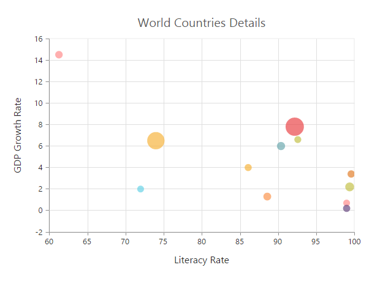

[Click](http://asp.syncfusion.com/demos/web/chart/bubble.aspx) here to view the Bubble Chart online demo sample.

## Scatter

To create a Scatter chart, you can set the series Type as **Scatter** in the chart series. 



<ej:Chart ID="Chart1" runat="server"> 
    <%--Set chart type to series--%>
    <Series>
        <ej:Series Type="Scatter" XName="Month" YName="Sales" Size="Profit">
        </ej:Series>
    </Series>
</ej:Chart>



[Click](http://asp.syncfusion.com/demos/web/chart/scatter.aspx) here to view the Scatter Chart online demo sample.

### Customize the scatter chart

You can change the scatter size by using the **Size** property of the series marker. And you can change the scatter color by using the series Fill property. 



<ej:Chart ID="Chart1" runat="server"> 
    <Series>
        <%--Set fill color to scatter series--%>
        <ej:Series Fill="#41F282">
            <%--Change scatter size--%>
            <Marker>
                <Size Width="15" Height="15" />
            </Marker>
        </ej:Series>
    </Series>
</ej:Chart>



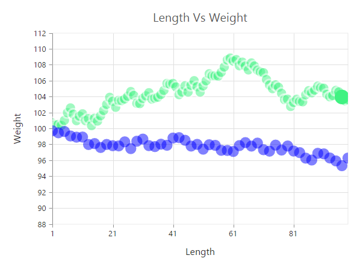

## HiLoOpenClose Chart 

To create a HiLoOpenClose chart, you can set the series Type as **HiloOpenClose** in the chart series. HiLoOpenClose chart requires 5 fields *(X, High, Low, Open and Close)* to plot a segment.  



    public partial class _Default : Page
    {
        protected void Page_Load(object sender, EventArgs e)
        {
            List<ChartData> data = new List<ChartData>();
            data.Add(new ChartData("Jan", 38, 10, 38, 29));
            data.Add(new ChartData("Feb", 28, 15, 18, 27));
            data.Add(new ChartData("Mar", 54, 35, 38, 49));
            data.Add(new ChartData("Apr", 52, 21, 35, 29));            

            //Binding DataSource to Chart
            this.Chart1.DataSource = data;
            this.Chart1.DataBind();
           
        }
    }

    [Serializable]
    public class ChartData
    {
        public string Month;
        public double High;
        public double Low;
        public double Open;
        public double Close;
        public ChartData(string month, double high, double low, double open, double close)
        {
            this.Month = month;
            this.High = high;
            this.Low = low;
            this.Open = open;
            this.Close = close;
        }
    }
    




<ej:Chart ID="Chart1" runat="server"> 
    <Series>
        <%--Set chart type and map dataSource field to series--%>
        <ej:Series Type="HiloOpenClose" XName="Month" High="High" Low="Low" Open="Open" Close="Close">
        </ej:Series>
    </Series>
</ej:Chart>



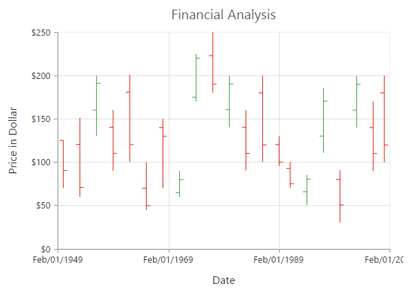

[Click](http://asp.syncfusion.com/demos/web/chart/hiloopenclose.aspx) here to view the HiLoOpenClose Chart online demo sample.

### DrawMode

You can change the HiLoOpenClose chart **DrawMode** to *Open, Close* or *Both*. The default value of DrawMode is **Both**. 



<ej:Chart ID="Chart1" runat="server"> 
    <Series>
        <%--Change the OHLC drawMode type--%>
        <ej:Series DrawMode="Open">
        </ej:Series>
    </Series>
</ej:Chart>



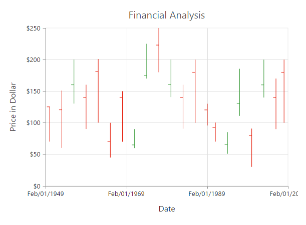

### Bull and Bear Color	

HiLoOpenClose chart **BullFillColor** is used to specify a fill color for the segments that indicates an increase in stock price in the measured time interval and **BearFillColor** is used to specify a fill color for the segments that indicates a decrease in the stock price in the measured time interval. 



<ej:Chart ID="Chart1" runat="server"> 
    <Series>
        <%--Change bullFill and bearFill color of hiloopenclose chart--%>
        <ej:Series BearFillColor="#FF6600" BullFillColor="#336600">
        </ej:Series>
    </Series>
</ej:Chart>



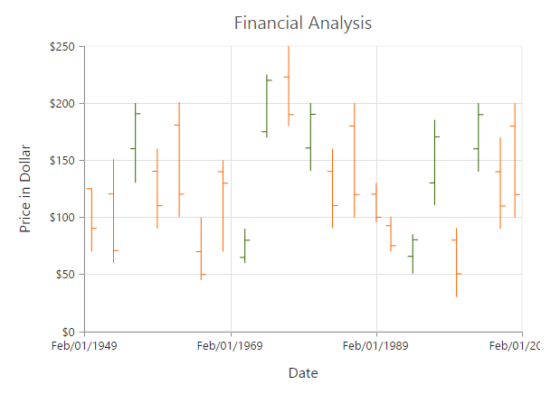

## Candle

You can create a Candle chart by specifying the series Type as **Candle** in the chart series. Candle chart requires 5 fields *(X, High, Low, Open and Close)* to plot a segment.



        public partial class _Default : Page
    {
        protected void Page_Load(object sender, EventArgs e)
        {
            List<ChartData> data = new List<ChartData>();
            data.Add(new ChartData("Jan", 38, 10, 38, 29));
            data.Add(new ChartData("Feb", 28, 15, 18, 27));
            data.Add(new ChartData("Mar", 54, 35, 38, 49));
            data.Add(new ChartData("Apr", 52, 21, 35, 29));            

            //Binding DataSource to Chart
            this.Chart1.DataSource = data;
            this.Chart1.DataBind();
           
        }
    }

    [Serializable]
    public class ChartData
    {
        public string Month;
        public double High;
        public double Low;
        public double Open;
        public double Close;
        public ChartData(string month, double high, double low, double open, double close)
        {
            this.Month = month;
            this.High = high;
            this.Low = low;
            this.Open = open;
            this.Close = close;
        }
    }





<ej:Chart ID="Chart1" runat="server"> 
    <Series>
        <%--Set chart type and map dataSource field to series--%>
        <ej:Series Type="Candle" XName="Month" High="High" Low="Low" Open="Open" Close="Close">
        </ej:Series>
    </Series>
</ej:Chart>



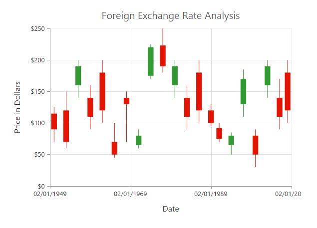

[Click](http://asp.syncfusion.com/demos/web/chart/candle.aspx) here to view the Candle Chart online demo sample.

### Bull and Bear Color

Candle chart **BullFillColor** is used to specify a fill color for the segments that indicates an increase in the stock price in the measured time interval and **BearFillColor** is used to specify a fill color for the segments that indicates a decrease in the stock price in the measured time interval.



<ej:Chart ID="Chart1" runat="server"> 
    <Series>
        <%--Change bullFill and bearFill color of candle chart--%>
        <ej:Series BearFillColor="#FF6600" BullFillColor="#336600">
        </ej:Series>
    </Series>
</ej:Chart>



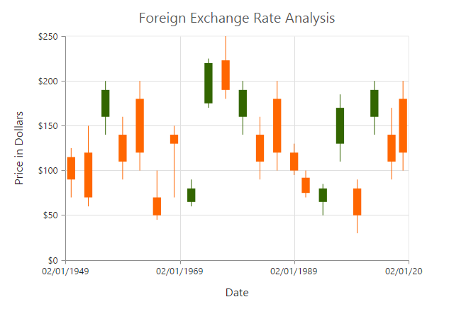

## HiLo

HiLo chart is created by setting the series Type as **Hilo** in the chart series. HiLo chart requires 3 fields *(X, High and Low)* to plot a segment.  



    public partial class _Default : Page
    {
        protected void Page_Load(object sender, EventArgs e)
        {
            List<ChartData> data = new List<ChartData>();
            data.Add(new ChartData("Jan", 38, 10));
            data.Add(new ChartData("Feb", 28, 15));
            data.Add(new ChartData("Mar", 54, 35));
            data.Add(new ChartData("Apr", 52, 21));            

            //Binding DataSource to Chart
            this.Chart1.DataSource = data;
            this.Chart1.DataBind();
           
        }
    }

    [Serializable]
    public class ChartData
    {
        public string Month;
        public double High;
        public double Low;
        public double Open;
        public double Close;
        public ChartData(string month, double high, double low)
        {
            this.Month = month;
            this.High = high;
            this.Low = low;
        }
    }



            

 
<ej:Chart ID="Chart1" runat="server"> 
    <Series>
        <%--Set chart type and map dataSource field high, low to series--%>
        <ej:Series Type="Hilo" XName="Month" High="High" Low="Low">
        </ej:Series>
    </Series>
</ej:Chart>



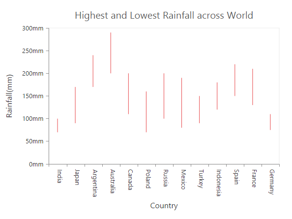

[Click](http://asp.syncfusion.com/demos/web/chart/hilo.aspx) here to view the HiLo Chart online demo sample.

## Polar

Polar chart is created by setting the series Type as **Polar** in the chart series. 



<ej:Chart ID="Chart1" runat="server"> 
    <Series>
        <%--Set chart type to series--%>
        <ej:Series Type="Polar">
        </ej:Series>
    </Series>
</ej:Chart>



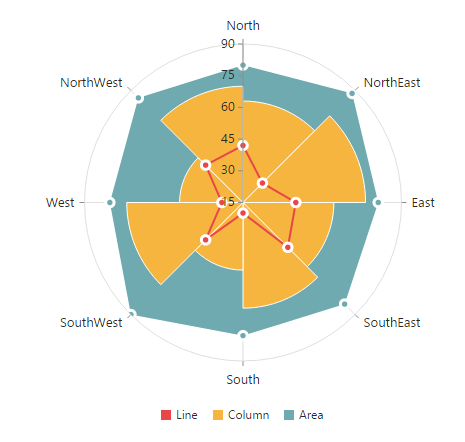

[Click](http://asp.syncfusion.com/demos/web/chart/polar.aspx) here to view the Polar Chart online demo sample.

### DrawType

Polar **DrawType** property is used to change the series plotting type to *Line*, *Column* or *Area*. The default value of DrawType is **Line**.  



<ej:Chart ID="Chart1" runat="server"> 
    <Series>
        <%--Change polar series drawType--%>
        <ej:Series DrawType="Column">
        </ej:Series>
    </Series>
</ej:Chart>



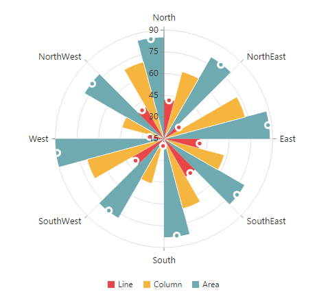

### Stack columns in Polar chart

By using the **IsStacking** property, you can specify whether the column has to be stacked when the DrawType is column. Its default value is **false**.



<ej:Chart ID="Chart1" runat="server"> 
    <Series>
        <%--Enable isStacking property for stacked column polar chart--%>
        <ej:Series IsStacking="true">
        </ej:Series>
    </Series>
</ej:Chart>



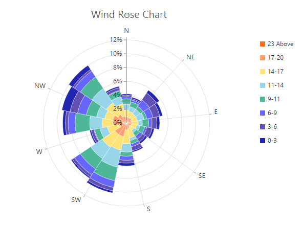

[Click](http://asp.syncfusion.com/demos/web/chart/windrose.aspx) here to view the Polar Wind Rose Chart online demo sample.

## Radar Chart  

To create a Radar chart, you can specify the series Type as **Radar** in the chart series.



<ej:Chart ID="Chart1" runat="server"> 
    <Series>
        <%--Set chart type to series--%>
        <ej:Series Type="Radar">
        </ej:Series>
    </Series>
</ej:Chart>



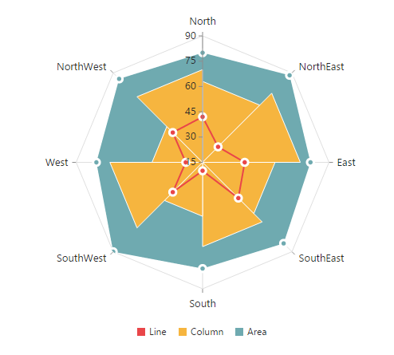

[Click](http://asp.syncfusion.com/demos/web/chart/radar.aspx) here to view the Radar Chart online demo sample.

### DrawType

Radar **DrawType** property is used to change the series plotting type to *Line*, *Column* or *Area*. The default value of DrawType is **Line**.



<ej:Chart ID="Chart1" runat="server"> 
    <Series>
        <%--Change radar series drawType--%>
        <ej:Series DrawType="Column">
        </ej:Series>
    </Series>
</ej:Chart>



### Stack columns in Radar chart

By using the **IsStacking** property, you can specify whether the column has to be stacked when the DrawType is set as Column. Its default value is set to *false*.



<ej:Chart ID="Chart1" runat="server"> 
    <Series>
        <%--Enable isStacking property for stacked column radar chart--%>
        <ej:Series IsStacking="true">
        </ej:Series>
    </Series>
</ej:Chart>



## Waterfall Chart 

For rendering a Waterfall chart, set series *Type* as **Waterfall** in the chart series. To change the waterfall series segment color use *Fill* option of series and use *PositiveFill* property to differentiate the positive segments.

N> The inline property of the **Series.PositiveFill** has the first priority and override the **Series.Fill**.



<ej:Chart ID="Chart1" runat="server"> 
    <Series>
        <%--Change series type--%>
        <ej:Series Type="Waterfall" Fill="#C64E4A" PositiveFill="#93C952">
        </ej:Series>
    </Series>
</ej:Chart>
  


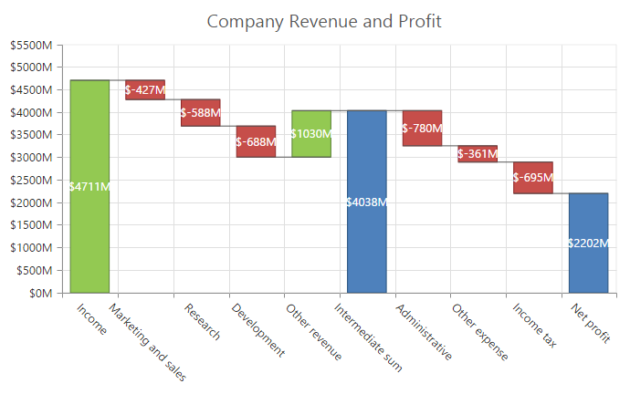

[Click](http://asp.syncfusion.com/demos/web/chart/waterfall.aspx) here to view the Waterfall Chart online demo sample.

**ShowIntermediateSum**

To display the summary of values since the last intermediate point of the waterfall series, set **ShowIntermediateSum** property as true in the specific point.



<ej:Chart ID="Chart1" runat="server"> 
    <Series>
        <ej:Series Type="Waterfall">
            <Points>
                <%--Enable showIntermediateSum in to a point--%>
                <ej:Points X="Intermediate sum" ShowIntermediateSum="true"></ej:Points>
            </Points>
        </ej:Series>
    </Series>
</ej:Chart>



**ShowTotalSum**

The sum of all previous point in the waterfall series is displayed on enabling the **ShowTotalSum** property for a specific point.



<ej:Chart ID="Chart1" runat="server"> 
    <Series>
        <ej:Series Type="Waterfall">
            <Points>
                <%--Enable showTotalSum in to a point--%>
                <ej:Points X="Total sum" ShowTotalSum="true"></ej:Points>
            </Points>
        </ej:Series>
    </Series>
</ej:Chart>



### ConnectorLine

To customize the connector line color, width, opacity and dashArray of the waterfall series, you can use **ConnectorLine** option of series.



<ej:Chart ID="Chart1" runat="server"> 
    <Series>
        <ej:Series Type="Waterfall">
            <ConnectorLine Color="#333000" DashArray="2,3" Width="1" Opacity="1" />
        </ej:Series>
    </Series>
</ej:Chart>



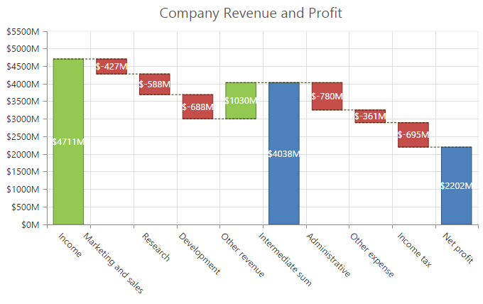

## ErrorBar Chart 

EjChart can generate Error bar for Cartesian type series *(Line, Column, Bar, Scatter, Area, Candle, HiLo, etc.)*. To render the Error bar for the series, set *Visibility* as *“Visible”* to **ErrorBar** in the series.



<ej:Chart ID="Chart1" runat="server">  
      <Series>
                <ej:Series>
                     <%-- To toggle the error bar visibility --%>
                    <ErrorBar Visible="visible"></ErrorBar>
                </ej:Series>
            </Series>
</ej:Chart>      



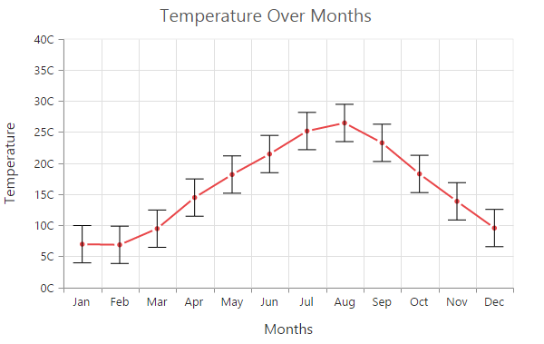

[Click](http://asp.syncfusion.com/demos/web/chart/errorbar.aspx) here to view the ErrorBar Chart online demo sample.

### Changing Error Bar Type

You can change the error bar rendering type using **Type** *(like FixedValue, Percentage, StandardDeviation, StandardError and Custom)* option of errorBar. To change the error bar line length you can use **VerticalErrorValue** property.



<ej:Chart ID="Chart1" runat="server">  
      <Series>
                <ej:Series>
                     <%-- To change the error bar type --%>
                    <ErrorBar Type="Percentage VerticalErrorValue="3" ></ErrorBar>
                </ej:Series>
            </Series>
</ej:Chart>      



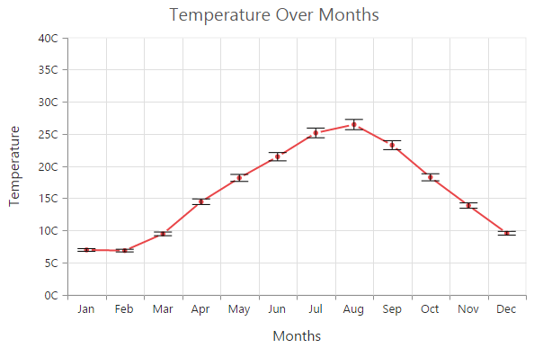

#### Customizing error bar type

To customize the error bar type, set error bar *Type* as **Custom** and then change the horizontal/vertical positive and negative value of error bar.



<ej:Chart ID="Chart1" runat="server">  
    <Series>
          <ej:Series>
              <%-- To change the error bar type --%>
              <ErrorBar Type="Custom” VerticalPositiveErrorValue="5" 
                      HorizontalPositiveErrorValue="1" VerticalNegativeErrorValue="5" 
                           HorizontalNegativeErrorValue="1" ></ErrorBar>
          </ej:Series>
     </Series>
</ej:Chart>      



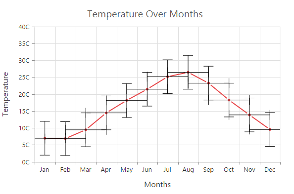

### Changing Error Bar Mode

Error bar mode is used to define whether the error bar line has to be drawn *Horizontally, Vertically* or in *Both* side.  To change the error bar mode use **ErrorBar.Mode** option.



<ej:Chart ID="Chart1" runat="server">  
      <Series>
          <ej:Series>
             <%-- To change the error bar mode --%>
             <ErrorBar Type="FixedValue” Mode="Vertical" ></ErrorBar>
          </ej:Series>
      </Series>
</ej:Chart>      



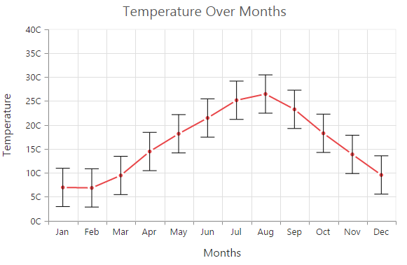

### Changing Error Bar Direction

You can change the error bar direction to *Plus, Minus or Both* side using **ErrorBar.Directions** option.



<ej:Chart ID="Chart1" runat="server">  
    <Series>
        <ej:Series>
           <%-- To change the error bar direction --%>
           <ErrorBar Type="FixedValue” Mode="Vertical" Direction=”Minus”> </ErrorBar>
        </ej:Series>
     </Series>
</ej:Chart>  



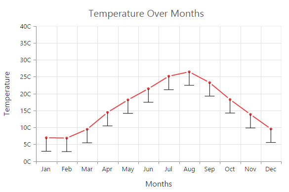

### Customizing Error bar cap

To customize the errorBar cap visibility, length, width and fill color, you can use **Cap** option in the **Series.ErrorBar**.



<ej:Chart ID="Chart1" runat="server">  
      <Series>
         <ej:Series>
              <%-- To customize the error bar cap --%>
              <ErrorBar>
                  <Cap Visible="true" Length="20" Width="1" Fill="#000000" />    
                  </ErrorBar>
         </ej:Series>
      </Series>
</ej:Chart>      



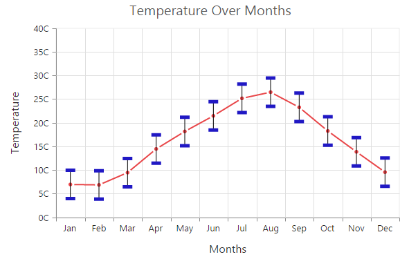

## Box and Whisker Chart 

To render a Box and Whisker Chart, set the series type as **BoxAndWhisker** .Box and Whisker chart requires2 fields (x and y) to plot a segment. The field y requires n number of data or it  should contain minimum of five values to plot a segment.



        public partial class _Default : Page
   {
        protected void Page_Load(object sender, EventArgs e)
        {
            List<BoxPlotData> data = new List<BoxPlotData>();
            Double[] y1 = {22,22,23,25,25,25,26,27,27,28,28,29,30,32,34,32,34,36,35,38};
            Double[] y2 = {22,33,23,25,26,28,29,30,34,33,32,31,50};
            Double[] y3 = {22,24,25,30,32,34,36,38,39,41,35,36,40,56};
            Double[] y4 = {26,27,28,30,32,34,35,37,35,37,45};
            Double[] y5 = {26,27,29,32,34,35,36,37,38,39,41,43,58 };
            data.Add(new BoxPlotData("Development", y1));
            data.Add(new BoxPlotData("Testing", y2));
            data.Add(new BoxPlotData("HR", y3));
            data.Add(new BoxPlotData("Finance", y4));
            data.Add(new BoxPlotData("R&D", y5));

            //Binding Datasource to Chart
            this.Chart1.DataSource = data;
            this.Chart1.DataBind();          

        }
       }
    [Serializable]
    public class BoxPlotData
    {
        public BoxPlotData(string xVal,Double[] yValue)
        {
            this.XValue = xVal;
            this.YValue1 = yValue;
            
        }
        public string XValue
        {
            get;
            set;
        }
        public Double[] YValue1
        {
            get;
            set;
        }
       
    }





<ej:Chart ID="Chart2" runat="server"> 
    <Series>
        <%--Set chart type and map dataSource to series--%>
        <ej:Series Type="BoxAndWhisker" XName="XValue" YName="YValue1">
        </ej:Series>
    </Series>
</ej:Chart>



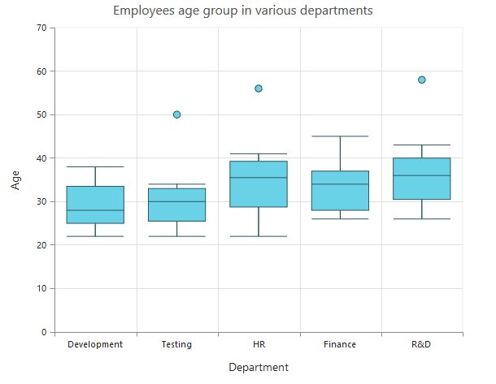

### BoxPlotMode
You can change the rendering mode of the  Box and Whisker series using the *BoxPlotMode* property. The default value of `BoxPlotMode` is **"exclusive"**.The other BoxPlotModes available are `inclusive` and `normal`. 



<Series>
    <ej:Series BoxPlotMode="Inclusive">            
       </ej:Series>
</Series> 



### ShowMedian

Box and Whisker *showMedian* property is used to show the box and whisker average value. The default value of showMedian is **false**.  



<Series>
      <ej:Series ShowMedian="true">            
       </ej:Series>
</Series>



###  Customize the Outlier

Outlier symbol, width and height can be customized using outlierSettings through **outlierSettings** property. By default Outlier symbol is displayed as circle with a height and width of 6 pixels.



<Series>
      <ej:Series>
            <OutlierSettings Shape = “Triangle”>
                <Size Height="10" Width="10" />
            </OutlierSettings>            
       </ej:Series>
</Series>



[Click](http://asp.syncfusion.com/demos/web/chart/boxplot.aspx) here to view the Box and Whisker Chart online demo sample.

## Pie Of Pie Chart
To render the pie of pie chart, set the series `type` as **PieOfPie**. Pie of pie chart is used for displaying the data of a pie slice as another pie chart. The values in the second pie is displayed based on the **splitMode**  property.



<Series>
<ej:Series  SplitValue="10" GapWidth="100" Type="PieOfPie">
<Points>
<ej:points Text="58%" X="Saudi Arabia" Y="58" />
<ej:points Text="15%" X="Persian Gulf" Y="15"/>
<ej:points Text="13%" X="Canada" Y="13"/>
<ej:points Text="8%" X="Venezuela" Y="8"/>
<ej:points Text="3%" X="Mexico" Y="3"/>
<ej:points Text="2%" X="Russia" Y="2"/>
<ej:points Text="1%" X="Russia" Y="1"/>
</Points>
</ej:Series>
</Series>
            


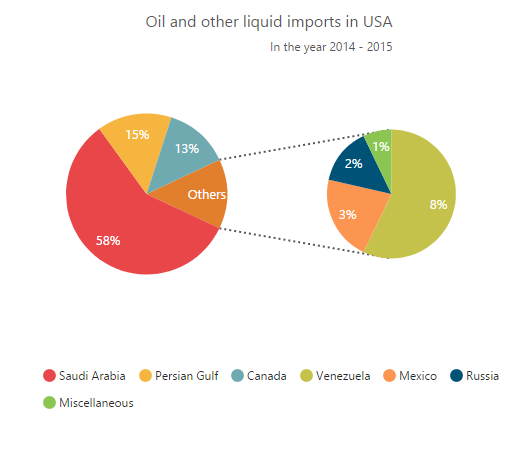

[Click](http://asp.syncfusion.com/demos/web/chart/pieofpie.aspx) here to view the Pie Of Pie Chart online demo sample.

### Split Mode and Split Value 

The points to be displayed in the second pie is decided based on the `SplitMode` property.**SplitMode** property takes the following values. 
* Position – Have to split the data points based on its position
* Value – Have to split the data points based on its Y value
* Percentage – Have to split the points based on the percentage value
* Indexes – The data points with the specified indexes are split separately 
 By default, the splitMode is set to  **Value**. 



<Series>
<ej:Series  SplitValue="3" SplitMode="Position">
</ej:Series>
</Series>



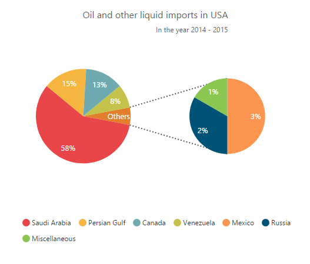

### Changing Pie Of Pie Size
The size of the second Pie can be customized by using the `PieOfPieCoefficient` property. The default value of pieOfPieCoefficient is **0.6**.Its value ranges from 0 to 1.



<Series>
<ej:Series PieOfPieCoefficient="1">
</ej:Series>
</Series>



The following screenshot represents the pie of pie series with pieOfPieCoefficient as 1

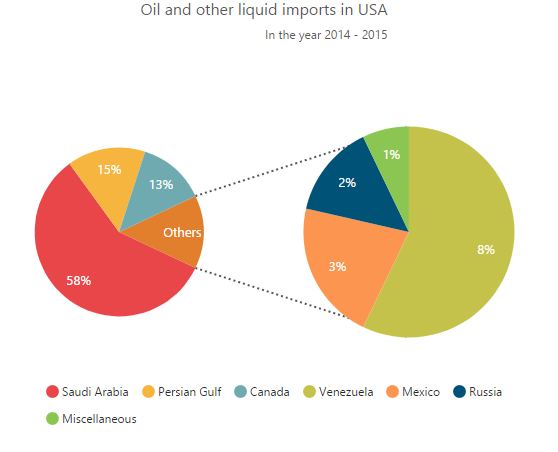

#### Customizing the Gap

The distance between the two pies in the pie of pie chart can be controlled by using the `GapWidth` property. The default value is **50**.

 

<Series>
      <ej:Series GapWidth="150">
                 
       </ej:Series>
</Series>



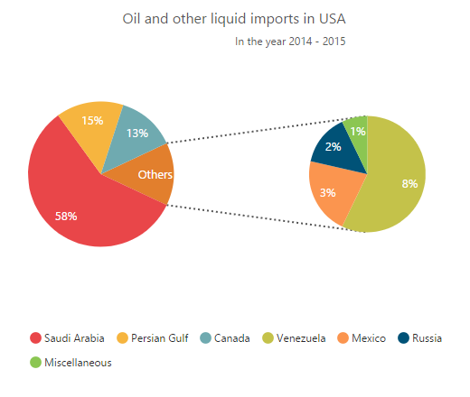

