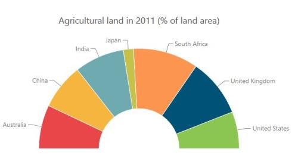
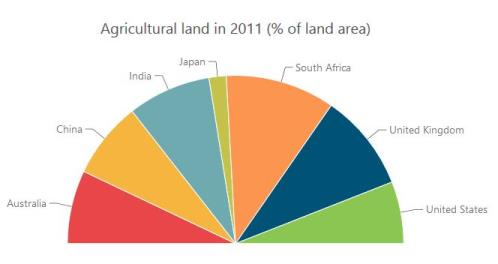

# Chart Types

Essential ASP.NET Chart control supports more than 20 types of Chart for your business requirements. Each one is highly and easily configurable with built-in support for creating stunning visual effects.

Chart types are specified on each series through the Type property. All the Chart types are required to have at least one x and one y value. Certain Chart types require more than one y value.

You can combine several Chart types in one Chart using the Type property on series to set different Chart types for each series.



  <ej:Chart ID="Chart1" runat="server">       

    <Series>

             <ej:Series Name="lineSeries" Type="Line"></ej:Series>

              <ej:Series Name="ColumnSeries" Type="Column"></ej:Series>

    </Series>

  </ej:Chart>



In multiple series case, you can use CommonSeriesOptions property to specify the properties that are common for all series in Chart. 


  <ej:Chart ID="Chart1" runat="server">       

   <CommonSeriesOptions EnableAnimation="true" Type="Line" Marker-Shape="Circle"    

             Marker-Visible="true" Marker-Size-Width="12" Marker-Size-Height="12">

   </CommonSeriesOptions> 

 </ej:Chart>



## Line Chart

Line Charts join points on a plot using straight lines showing trends in data at equal intervals. Line Charts treats the input as non-numeric, categorical information, equally spaced along the x-axis.

You can configure the appearance of the lines and the points with options Fill used and Width of line.


 

  <ej:Chart ID="Chart1" runat="server" Width="970" Height="600" CanResize="true">

           <Series>

             <ej:Series Name="India" Type="Line" Fill="#8CC640">

                    <Points >

                        <ej:Points X="2005" Y="28"/> 

                        <ej:Points X="2006" Y="35"/>  

                        <ej:Points X="2007" Y="32"/>  

                        <ej:Points X="2008" Y="47"/>  

                        <ej:Points X="2009" Y="41"/>

                        <ej:Points X="2010" Y="35"/> 

                        <ej:Points X="2011" Y="37"  />  

                    </Points>

             </ej:Series>                        

         </Series>

 </ej:Chart>



## StepLine Chart

Step Line Charts use horizontal and vertical lines to connect data points resulting in a step like progression. You can configure the appearance of line using Fill and Width property in series.



  <ej:Chart ID="Chart1" runat="server" Width="970" Height="600" CanResize="true">

        <Series>

             <ej:Series Name="India" Type="StepLine">

                    <Points >

                        <ej:Points X="2005" Y="430"/> 

                        <ej:Points X="2006" Y="416"/>  

                        <ej:Points X="2007" Y="404"/>  

                        <ej:Points X="2008" Y="390"/>  

                        <ej:Points X="2009" Y="376"/>

                        <ej:Points X="2010" Y="362"/> 

                        <ej:Points X="2011" Y="351"  />  

                    </Points>

             </ej:Series>

         </Series>

 </ej:Chart>



## Area Chart

Area Chart is rendered using a collection of line segments connected to form a closed-loop area filled with a specified color.You can plot multiple series on the same Chart. You can use Fill in series to customize the series color and the Border to customize the series border color and width.

 



  <ej:Chart ID="Chart1" runat="server" Width="970" Height="600" CanResize="true">

   <Series>

             <ej:Series Name="Product A" Type="Area">

                    <Points >

                        <ej:Points X="1900" Y="2.6"/> 

                        <ej:Points X="1920" Y="2.8"/>  

                        <ej:Points X="1940" Y="2.6"/>  

                        <ej:Points X="1960" Y="3"/>  

                        <ej:Points X="1980" Y="3.6"/>

                        <ej:Points X="2000" Y="3"/> 

                    </Points>

             </ej:Series>

                   <ej:Series Name="Product B" Type="Area">

                    <Points >

                        <ej:Points X="1900" Y="2.8"/> 

                        <ej:Points X="1920" Y="2.5"/>  

                        <ej:Points X="1940" Y="2.8"/>  

                        <ej:Points X="1960" Y="3.2"/>  

                        <ej:Points X="1980" Y="2.9"/>

                        <ej:Points X="2000" Y="2"/> 

                    </Points>

             </ej:Series>

     </Series>

 </ej:Chart>



## Range Area Chart

Range Area Charts are similar to regular area Charts except that, each area is rendered over a range.  Specify the y-axis high and low values for each point for the Range Area Chart. You can customize the series color and borderusing Fill and Border properties in series.



  <ej:Chart ID="Chart1" runat="server" Width="970" Height="600" CanResize="true">

   <Series>

             <ej:Series Name="Product A" Type="RangeArea">

                    <Points >

                        <ej:Points X="1900" High="4" Low ="2"   /> 

                        <ej:Points X="1920" High ="4.5" Low ="2.5"   />  

                        <ej:Points X="1940" High ="5" Low ="3"   />  

                        <ej:Points X="1960" High ="5.3" Low ="3.3"   />  

                        <ej:Points X="1980" High ="5" Low ="3"   />

                        <ej:Points X="2000" High ="4.5" Low ="2.5"   /> 

                        <ej:Points X="2020" High ="4" Low ="2"   /> 

                    </Points>

             </ej:Series>

                   <ej:Series Name="Product B" Type="RangeArea">

                    <Points >

                        <ej:Points X="1900" High ="2"   Low ="0"   /> 

                        <ej:Points X="1920" High ="2.5" Low ="0.5"   />  

                        <ej:Points X="1940" High ="3"   Low ="1"   />  

                        <ej:Points X="1960" High ="3.3" Low ="1.3"   />  

                        <ej:Points X="1980" High ="3"   Low ="1"   />

                        <ej:Points X="2000" High ="2.5" Low ="0.5"   /> 

                        <ej:Points X="2020" High ="2"   Low ="0"   />                         

                    </Points>

             </ej:Series>

     </Series>

 </ej:Chart>



## StepArea Chart

Step Area Charts are similar to regular area Charts except that, instead of a straight line tracing the shortest path between points, the values are connected by continuous vertical and horizontal lines forming a step like progression. You can use the Fill and Border properties in series to customize the series color and border.



  <ej:Chart ID="Chart1" runat="server">

     <Series>

             <ej:Series Name="India" Type="StepArea">

                    <Points >

                        <ej:Points X="2000" Y="416"/> 

                        <ej:Points X="2001" Y="490"/> 

                        <ej:Points X="2002" Y="470"/> 

                        <ej:Points X="2003" Y="500"/> 

                        <ej:Points X="2004" Y="449"/> 

                        <ej:Points X="2005" Y="470"/> 

                        <ej:Points X="2006" Y="416"/>  

                        <ej:Points X="2007" Y="404"/>  

                        <ej:Points X="2008" Y="390"/>  

                        <ej:Points X="2009" Y="376"/>

                        <ej:Points X="2010" Y="520"/> 

                        <ej:Points X="2011" Y="509"  />  

                    </Points>

             </ej:Series>

     </Series>

 </ej:Chart>


## SplineArea Chart

Spline Area Chart is similar to an Area Chart except the difference in the way the points of a series are connected. It connects each series of points by a smooth spline curve. You can plot multiple series on the same Chart. To customize the series color and border, use the Fill and Border properties in series.



  <ej:Chart ID="Chart1" runat="server" >

  <Series>

             <ej:Series Name="India" Type="SplineArea">

                    <Points >

                        <ej:Points X="2002" Y="2.2"/> 

                        <ej:Points X="2003" Y="3.4"/> 

                        <ej:Points X="2004" Y="2.8"/> 

                        <ej:Points X="2005" Y="1.6"/> 

                        <ej:Points X="2006" Y="2.3"/>  

                        <ej:Points X="2007" Y="2.5"/>  

                        <ej:Points X="2008" Y="2.9"/>  

                        <ej:Points X="2009" Y="3.8"/>

                        <ej:Points X="2010" Y="1.4"/> 

                        <ej:Points X="2011" Y="3.1"  />  

                    </Points>

             </ej:Series>

                    <ej:Series Name="India" Type="SplineArea">

                    <Points >

                        <ej:Points X="2002" Y="0.8"/> 

                        <ej:Points X="2003" Y="1.3"/> 

                        <ej:Points X="2004" Y="1.1"/> 

                        <ej:Points X="2005" Y="1"/> 

                        <ej:Points X="2006" Y="1.2"/>  

                        <ej:Points X="2007" Y="1.7"/>  

                        <ej:Points X="2008" Y="2.3"/>  

                        <ej:Points X="2009" Y="2.7"/>

                        <ej:Points X="2010" Y="1.1"/> 

                        <ej:Points X="2011" Y="2.3"  />  

                    </Points>

             </ej:Series>

     </Series>

 </ej:Chart>



## StackingArea Chart

Stacking Area Charts are similar to regular area Charts except that the Y values stack on top of each other in the specified series order. This enables you to visualize the relationship of parts to the whole. You can customize the series color and border using Fill and Border properties in series.

 



  <ej:Chart ID="Chart1" runat="server">

   <Series>

         <ej:Series Name="India" Type="StackingArea">

                    <Points >

                        <ej:Points X="2002" Y="6"/> 

                        <ej:Points X="2003" Y="7.5"/> 

                        <ej:Points X="2004" Y="6"/> 

                        <ej:Points X="2005" Y="6.5"/> 

                        <ej:Points X="2006" Y="7.4"/>  

                        <ej:Points X="2007" Y="7.9"/>  

                        <ej:Points X="2008" Y="7.5"/>  

                        <ej:Points X="2009" Y="8.8"/>

                        <ej:Points X="2010" Y="4.8"/> 

                        <ej:Points X="2011" Y="9.3"  />  

                    </Points>

             </ej:Series>

        <ej:Series Name="India" Type="StackingArea">

                    <Points >

                        <ej:Points X="2002" Y="3.5"/> 

                        <ej:Points X="2003" Y="4.9"/> 

                        <ej:Points X="2004" Y="3.7"/> 

                        <ej:Points X="2005" Y="7.5"/> 

                        <ej:Points X="2006" Y="4.8"/>  

                        <ej:Points X="2007" Y="2.6"/>  

                        <ej:Points X="2008" Y="4.7"/>  

                        <ej:Points X="2009" Y="3.7"/>

                        <ej:Points X="2010" Y="3.5"/> 

                        <ej:Points X="2011" Y="3.6"  />  

                    </Points>

             </ej:Series>

     </Series>

 </ej:Chart>



## 100% Stacking area chart  

100% Stacking area is similar to the stacking area chart. But here, the series display multiple data series as stacked areas and the cumulative portion of each stacked element is summed to 100%. 



<ej:Chart ID="Chart1" runat="server" >   

      <ej:Series Type="StackingArea100">

          <Points > 

              <ej:Points X=”2006” Y="34"/>

              <ej:Points X="2007" Y="20"/> 

              <ej:Points X="2008" Y="40"/> 

              <ej:Points X="2009" Y="51"/> 

              <ej:Points X="2010" Y="26"/>

              <ej:Points X="2011" Y="37"/>

              <ej:Points X="2012" Y="54"/>

              <ej:Points X="2013" Y="44"/>

              <ej:Points X="2014" Y="48"/>  

          </Points>

      </ej:Series>

      <ej:Series Type="StackingArea100">

          <Points > 

              <ej:Points X=”2006” Y="51"/>

              <ej:Points X="2007" Y="26"/> 

              <ej:Points X="2008" Y="37"/> 

              <ej:Points X="2009" Y="51"/> 

              <ej:Points X="2010" Y="26"/>

              <ej:Points X="2011" Y="37"/>

              <ej:Points X="2012" Y="43"/>

              <ej:Points X="2013" Y="23"/>

              <ej:Points X="2014" Y="55"/>  

          </Points>

       </ej:Series>

</ej:Chart>



The following screenshot displays the 100% Stacking area chart.

## Column Chart

Column Charts are among the most common Chart types that are used. It uses vertical bars (columns) to display different values of one or more items. It is similar to a bar Chart except that the bars are vertical and not horizontal as in bar Chart. Points from adjacent series are drawn as bars next to each other. You can customize the series color and borderusing Fill and Border properties in series and each segment of series using Fill and Border properties in point.

 


 

<ej:Chart ID="Chart1" runat="server">

           <Series>

             <ej:Series Type="Column">

                   <Points>

                        <ej:Points  X="USA" Y="50"/>

                        <ej:Points  X="China" Y="40"/>

                        <ej:Points  X="Japan" Y="70"/>

                        <ej:Points  X="Australia" Y="60"/>

                        <ej:Points  X="France" Y="50"/>

                        <ej:Points  X="Germany" Y="40"/>

                        <ej:Points  X="Italy" Y="40"/>

                        <ej:Points  X="Sweden" Y="30"/>

                    </Points>

             </ej:Series>

                <ej:Series Type="Column">

                   <Points>

                        <ej:Points  X="USA" Y="70"/>

                        <ej:Points  X="China" Y="60"/>

                        <ej:Points  X="Japan" Y="40"/>

                        <ej:Points  X="Australia" Y="36"/>

                        <ej:Points  X="France" Y="25"/>

                        <ej:Points  X="Germany" Y="30"/>

                        <ej:Points  X="Italy" Y="35"/>

                        <ej:Points  X="Sweden" Y="30"/>

                    </Points>

             </ej:Series>             

         </Series>

      </ej:Chart>



## RangeColumn Chart

RangeColumn Chart is similar to the Column Chart except that each column is rendered over a range. Specify the y-axis Starting and Ending values for each point for the RangeColumn Chart. You can customize the series color and borderusing Fill and Border properties in series and each segment of series using Fill and Border properties in point.


 

<ej:Chart ID="Chart1" runat="server">

        <Series>

             <ej:Series Name="India" Type="RangeColumn">

                    <Points >                 

                        <ej:Points X="Jan" Low="0.7" High="6.1"/> 

                        <ej:Points X="Feb" Low="1.3" High="6.3"/> 

                        <ej:Points X="Mar" Low="1.9" High="8.5"/> 

                        <ej:Points X="Apr" Low="3.1" High="10.8"/> 

                        <ej:Points X="May" Low="5.7" High="14.4"/> 

                    </Points>

             </ej:Series>

                    <ej:Series Name="India" Type="RangeColumn">

                    <Points >

                        <ej:Points X="Jan" Low="1.7" High="7.1"/> 

                        <ej:Points X="Feb" Low="1.9" High="7.3"/> 

                        <ej:Points X="Mar" Low="1.2" High="7.5"/> 

                        <ej:Points X="Apr" Low="2.5" High="9.8"/> 

                        <ej:Points X="May" Low="4.7" High="11.4"/>   

                    </Points>

             </ej:Series>

     </Series>     

 </ej:Chart>



## StackingColumn Chart

Stacking Column Charts are similar to regular column Charts except that the Y values stack on top of each other in the specified series order. This enables you to visualize the relationship of parts to the whole.You can customize the series color and borderusing Fill and Border properties in series and each segment of series using Fill and Border properties in point.



<ej:Chart ID="Chart1" runat="server">

   <Series>

       <ej:Series Type="StackingColumn">

                    <Points >                 

                        <ej:Points X="Jan" Y="900"/> 

                        <ej:Points X="Feb" Y="820"/> 

                        <ej:Points X="Mar" Y="880"/> 

                        <ej:Points X="Apr" Y="725"/> 

                        <ej:Points X="May" Y="760"/>                          

                    </Points>

             </ej:Series>

         <ej:Series Type="StackingColumn">

                     <Points >                 

                        <ej:Points X="Jan" Y="190"/> 

                        <ej:Points X="Feb" Y="226"/> 

                        <ej:Points X="Mar" Y="200"/> 

                        <ej:Points X="Apr" Y="250"/> 

                        <ej:Points X="May" Y="222"/>                          

                    </Points>

                </ej:Series>

             <ej:Series Type="StackingColumn">

                     <Points >                 

                        <ej:Points X="Jan" Y="250"/> 

                        <ej:Points X="Feb" Y="145"/> 

                        <ej:Points X="Mar" Y="190"/> 

                        <ej:Points X="Apr" Y="220"/> 

                        <ej:Points X="May" Y="225"/>                          

                    </Points>

                </ej:Series>

     </Series>

 </ej:Chart>



## 100% Stacking column chart 

100% Stacking column is similar to the stacking column charts. But here, the combined contribution of Y values is the combined total of the vertical column with 100 percent.



<ej:Chart ID="Chart1" runat="server" >   

      <ej:Series Type="StackingColumn100">

          <Points > 

              <ej:Points X="2006" Y="900"/>

              <ej:Points X="2007" Y="544"/> 

              <ej:Points X="2008" Y="880"/> 

              <ej:Points X="2009" Y="725"/> 

              <ej:Points X="2010" Y="765"/>

              <ej:Points X="2011" Y="679"/>

              <ej:Points X="2012" Y="770"/>

          </Points>

      </ej:Series>

      <ej:Series Type="StackingColumn100">

          <Points > 

              <ej:Points X="2006" Y="190"/>               

              <ej:Points X="2007" Y="226"/> 

              <ej:Points X="2008" Y="194"/> 

              <ej:Points X="2009" Y="545"/> 

              <ej:Points X="2010" Y="222"/>

              <ej:Points X="2011" Y="181"/>

              <ej:Points X="2012" Y="128"/>

          </Points>

       </ej:Series>

</ej:Chart>



The following screenshot displays the 100% Stacking column chat.

## Bar Chart

Bar Chart is the simplest and most versatile of statistical diagrams. It displays horizontal bars for each point in the series and points from adjacent series are drawn as bars next to each other. Bar Charts are used to compare values across categories, to display variations in the value of an item over time or to display the values of several items at a single point in time.You can customize the series color and borderusing Fill and Border properties in series and each segment of series using Fill and Border properties in point.

 



<ej:Chart ID="Chart1" runat="server">

         <Series>

             <ej:Series Type="Bar">

                    <Points >

                        <ej:Points X="2006" Y="7.8"/>  

                        <ej:Points X="2007" Y="7.2"/>  

                        <ej:Points X="2008" Y="6.8"/>  

                        <ej:Points X="2009" Y="10.7"/>

                        <ej:Points X="2010" Y="10.8"/> 

                        <ej:Points X="2011" Y="9.8"  />  

                    </Points>

             </ej:Series>

               <ej:Series Type="Bar">

                    <Points >

                        <ej:Points X="2006" Y="4.8"/>  

                        <ej:Points X="2007" Y="4.6"/>  

                        <ej:Points X="2008" Y="7.2"/>  

                        <ej:Points X="2009" Y="9.3"/>

                        <ej:Points X="2010" Y="9.7"/> 

                        <ej:Points X="2011" Y="9"  />  

                    </Points>

             </ej:Series>

     </Series>

 </ej:Chart>



## Stackingbar Chart

Stacking Bar Charts are similar to regular bar Charts except that the Y values stack on top of each other in the specified series order. This enables you to visualize the relationship of parts to the whole. You can customize the series color and borderusing Fill and Border properties in series and each segment of series using Fill and Border properties in point.

 



<ej:Chart ID="Chart1" runat="server">

<Series>

             <ej:Series Type="StackingBar">

                    <Points >                         

                        <ej:Points X="Jan" Y="6"/>  

                        <ej:Points X="Feb" Y="8"/>  

                        <ej:Points X="Mar" Y="12"/>  

                        <ej:Points X="Apr" Y="15.5"/>

                        <ej:Points X="May" Y="20"/> 

                        <ej:Points X="Jun" Y="24"  />  

                        <ej:Points X="Jul" Y="28"  />  

                    </Points>

             </ej:Series>

               <ej:Series Type="StackingBar">

                    <Points >

                        <ej:Points X="Jan" Y="-1"/>  

                        <ej:Points X="Feb" Y="-1.5"/>  

                        <ej:Points X="Mar" Y="-2"/>  

                        <ej:Points X="Apr" Y="-2.5"/>

                        <ej:Points X="May" Y="-3"/> 

                        <ej:Points X="Jun" Y="-3.5"  />  

                        <ej:Points X="Jul" Y="-4"  />  

                    </Points>

             </ej:Series>

       </Series>

 </ej:Chart>



## 100% Stacking bar chart 

100% Stacking bar is similar to stacking bar charts. Here, the combined contribution of Y values is the combined total of the horizontal bar with 100 percent.


<ej:Chart ID="Chart1" runat="server" >   

      <ej:Series Type="StackingBar100">

          <Points > 

              <ej:Points X="2007" Y="453"/> 

              <ej:Points X="2008" Y="354"/> 

              <ej:Points X="2009" Y="282"/> 

              <ej:Points X="2010" Y="321"/>

              <ej:Points X="2011" Y="333"/>

              <ej:Points X="2012" Y="351"/>

              <ej:Points X="2013" Y="403"/>

              <ej:Points X="2014" Y="421"/>  

          </Points>

      </ej:Series>

      <ej:Series Type="StackingBar100">

          <Points >               

              <ej:Points X="2007" Y="876"/> 

              <ej:Points X="2008" Y="564"/> 

              <ej:Points X="2009" Y="242"/> 

              <ej:Points X="2010" Y="121"/>

              <ej:Points X="2011" Y="343"/>

              <ej:Points X="2012" Y="451"/>

              <ej:Points X="2013" Y="203"/>

              <ej:Points X="2014" Y="431"/>  

          </Points>

       </ej:Series>

</ej:Chart>


The following screenshot displays the 100% Stackingbar chart.

## Spline Chart

Spline Chart is similar to a Line Chart except that it connects the different data points using splines instead of straight lines. You can configure the appearance of the lines and the points with options Fill used and the Width of lines.



<ej:Chart ID="Chart1" runat="server">

    <Series>

             <ej:Series Type="Spline">

                    <Points >                         

                        <ej:Points X="Jan" Y="-1"/>  

                        <ej:Points X="Feb" Y="2"/>  

                        <ej:Points X="Mar" Y="2"/>  

                        <ej:Points X="Apr" Y="8"/>

                        <ej:Points X="May" Y="6"/> 

                        <ej:Points X="Jun" Y="18"  />  

                        <ej:Points X="Jul" Y="11"  />  

                    </Points>

             </ej:Series>

               <ej:Series Type="Spline">

                    <Points >

                        <ej:Points X="Jan" Y="3"/>  

                        <ej:Points X="Feb" Y="7"/>  

                        <ej:Points X="Mar" Y="5.5"/>  

                        <ej:Points X="Apr" Y="5.5"/>

                        <ej:Points X="May" Y="3.5"/> 

                        <ej:Points X="Jun" Y="13.5"  />  

                        <ej:Points X="Jul" Y="16"  />  

                    </Points>

             </ej:Series>

     </Series>

 </ej:Chart>


## Pie Chart

A Pie Chart renders y values as slices in a pie. The slices are rendered in proportion to the whole that is the sum of all the y values in the series. Consequently, Pie Charts are used to visualize the proportional contribution in terms of percentage or fraction of categories of data to the whole data set. The x values in the data series are treated only as nominal in categorical, qualitative data. The Pie Chart displays only one Data Series at a time. You can customize the series color and borderusing Fill and Border properties in series and each slice of series using Fill and Border properties in point.

 



<ej:Chart ID="Chart1" runat="server">

   <Series>

         <ej:Series Type="Pie" LabelPosition="Outside" ExplodeIndex="2" Explode="true"> 

          <Marker>

                 <DataLabel Visible="true" ConnectorType="Line"></DataLabel>

          </Marker>

              <Points >                         

                        <ej:Points X="Labour" Y="28" Text="Labour 28%"/>  

                        <ej:Points X="Legal" Y="10" Text="Legal, 10%"/>  

                        <ej:Points X="Production" Y="20" Text="Production, 20%"/>  

                        <ej:Points X="License" Y="15" Text="License, 15%"/>

                        <ej:Points X="Facilities" Y="23" Text="Facilites, 23%"/> 

                        <ej:Points X="Taxes" Y="17" Text="Taxes, 17%"  />  

                        <ej:Points X="Insurance" Y="12" Text="Insurance, 12%" />  

                    </Points>

             </ej:Series>

     </Series>

 </ej:Chart>



## Doughnut Chart

Doughnut Charts are pie Charts with a hole, whose value is specified as the doughnut coefficient. The Doughnut Chart is best suited for presenting data in proportions. You can customize the series color and borderusing Fill and Border properties in series and each slice of series using Fill and Border properties in point.

 


 

<ej:Chart ID="Chart1" runat="server">

   <Series> 

     <ej:Series Type="Doughnut" Name="NewYork" DoughnutCoefficient="0.4"  LabelPosition="Outside"  

              ExplodeIndex="2" Explode="true">

          <Marker>

                 <DataLabel Visible="true" ConnectorType="Line"></DataLabel>

          </Marker>

         <Points >                         

                        <ej:Points X="Labour" Y="28" Text="Labour 28%"/>  

                        <ej:Points X="Legal" Y="10" Text="Legal, 10%"/>  

                        <ej:Points X="Production" Y="20" Text="Production, 20%"/>  

                        <ej:Points X="License" Y="15" Text="License, 15%"/>

                        <ej:Points X="Facilities" Y="23" Text="Facilites, 23%"/> 

                        <ej:Points X="Taxes" Y="17" Text="Taxes, 17%"  />  

                        <ej:Points X="Insurance" Y="12" Text="Insurance, 12%" />  

               </Points>

             </ej:Series>              

     </Series>

 </ej:Chart>



## Semi Pie and Doughnut Chart

The semi pie and doughnut chart is a semicircular chart. Data are represented in different sectors within a semi-circle.

Essential Chart allows you to create semi pie and doughnut chart using StartAngle and EndAngle property. Default values of StartAngle and EndAngle are null. The specified data are represented within start angle to end angle degree.



<ej:Chart ID="Chart1" runat="server">

   <Series>

         <ej:Series Type="Doughnut" LabelPosition="Outside" Name="Agricultural Land" StartAngle="-90" EndAngle="90" > 

          <Border Color="Black" Width="1"/>

              <Points >                         

                  <ej:Points X="Australia" Y="53.3" Text="Australia 53.3"/>  

                  <ej:Points X="China" Y="55.7" Text="China 55.7"/>  

                  <ej:Points X="India" Y="60.5" Text="India 60.5"/>  

                  <ej:Points X="Japan" Y="12.5" Text="Japan 12.5"/>

                  <ej:Points X="South Africa" Y="79.4" Text="South Africa 79.4"/> 

                  <ej:Points X="United Kingdom" Y="70.9" Text="United Kingdom 70.9"/>  

                  <ej:Points X="United States" Y="45.0" Text="United States 45.0" />  

              </Points>

             </ej:Series>

     </Series>

 </ej:Chart>



 

## Pyramid Chart

The Pyramid Chart type displays the data that when totalled renders 100%. This type of Chart is a single series Chart representing the data as portions of 100%, and this Chart does not use any axes. You can customize the series color and borderusing Fill and Border properties in series and each slice of series using Fill and Forder properties in point.



<ej:Chart ID="Chart1" runat="server">

   <Series>

    <ej:Series Type="Pyramid" Name="NewYork" LabelPosition="Outside">

                 <Marker>

                     <DataLabel Visible="true" Shape="Rectangle" ConnectorType="Line"></DataLabel>

                 </Marker>

                    <Points >                         

                        <ej:Points X="India" Y="24" Text="India 24%"/>  

                        <ej:Points X="Japan" Y="25" Text="Japan 25%"/>  

                        <ej:Points X="Australia" Y="20" Text="Australia 20%"/>  

                        <ej:Points X="USA" Y="35" Text="USA 35%"/>

                        <ej:Points X="China" Y="23" Text="China 23%"/> 

                        <ej:Points X="Germany" Y="27" Text="Germany 27%"  />  

                        <ej:Points X="France" Y="22" Text="France 22%" />  

                    </Points>

             </ej:Series>

 </ej:Chart>



## Funnel Chart

The Funnel chart is a single series chart representing the data as portions of 100%, and this chart does not use any axes. Funnel charts are often used to represent stages in a sales process and expresses the amount of potential revenue for each stage. This type of chart can also be useful in identifying potential problem area in an organization’s sales process. You can customize the funnel width and height using FunnelWidth and FunnelHeight properties.

 



<ej:Chart ID="Chart1" runat="server">

   <Series>

    <ej:Series Type="Funnel" FunnelWidth: "32.7%" FunnelHeight: "11.2%" Name="Website" LabelPosition="Outside">

                 <Marker>

                     <DataLabel Visible="true" Shape="Rectangle" ConnectorType="Line"></DataLabel>

                 </Marker>

                    <Points >                        

                        <ej:Points X="Renewed" Y="18.20" Text="Renewed : 18.20%"/> 

                        <ej:Points X="Subscribe" Y="27.3" Text="Subscribe : 27.3%"/> 

                        <ej:Points X="Support" Y="55.9" Text="Contact to Support : 55.9%%"/> 

                        <ej:Points X="Downloaded" Y="76.8" Text="Downloaded a Trail : 76.8%"/>

                        <ej:Points X="Visited" Y="100" Text=" Visited Web Site : 100%"/>

                    </Points>

             </ej:Series>

 </ej:Chart>

## Bubble Chart

Bubble Chart is an extension of the Scatter Chart (or XY-Chart) where each data marker is represented by a circle whose dimension forms a third variable. Consequently, bubble Charts allow three-variable comparisons allowing for easy visualization of complex interdependencies that are not apparent in two-variable Charts. Bubble Charts are frequently used in market and product comparison studies.



<ej:Chart ID="Chart1" runat="server">

   <Series>

        <ej:Series Name="Pound" Type="Bubble" EnableAnimation="True" Opacity="0.7">

                    <Points >

                        <ej:Points Fill="#E94649" Size="1.347" Text="China" X="92.2" Y="7.8"/> 

                        <ej:Points Fill="#F6B53F" Size="1.241" Text="India" X="74" Y="6.5"/>  

                        <ej:Points Fill="#6FAAB0" Size="0.238" Text="Indonesia" X="90.4" Y="6.0"/>  

                        <ej:Points Fill="#C4C24A" Size="0.312" Text="US" X="99.4" Y="2.2"/>  

                        <ej:Points Fill="#FB954F" Size="0.197" Text="Brazil" X="88.6" Y="1.3"/>  

                        <ej:Points Fill="#D9CEB2" Size="0.177" Text="Pakistan" X="54.9" Y="3.7"/>  

                        <ej:Points Fill="#FF8D8D" Size="0.0818" Text="Germany" X="99" Y="0.7"/>  

                        <ej:Points Fill="#69D2E7" Size="0.0826" Text="Egypt" X="72" Y="2.0"/>  

                        <ej:Points Fill="#E27F2D" Size="0.143" Text="Russia" X="99.6" Y="3.4"/>  

                        <ej:Points Fill="#6A4B82" Size="0.128" Text="Japan" X="99" Y="0.2"/>  

                        <ej:Points Fill="#F6B53F" Size="0.115" Text="Mexico" X="86.1" Y="4.0"/>  

                        <ej:Points Fill="#C4C24A" Size="0.096" Text="Philippines" X="92.6" Y="6.6"/>  

                        <ej:Points Fill="#FF8D8D" Size="0.162" Text="Nigeria" X="61.3" Y="14.5"/>  

                        <ej:Points Fill="#69D2E7" Size="0.151" Text="Bangladesh" X="56.8" Y="6.1"/>     

                    </Points>

                </ej:Series>

            </Series> 

  </ej:Chart>



## Scatter

In Scatter Series, each data point is represented as an ellipse, and the width and height of each ellipse is set using the Size, Width and Height properties of marker. You can also change the color, stroke, and stroke thickness of the series using the Fill, border color, and Width properties of marker respectively.

The following code example is used to create a simple scatter series.



<ej:Chart ID="Chart1" runat="server">

    <Series> 

             <ej:Series Type="Scatter">              

                    <Points >                         

                      <ej:Points X="10" Y="126.45" />  

                        <ej:Points X="11" Y="150.99" />  

                        <ej:Points X="12" Y="40" />  

                        <ej:Points X="13" Y="160.23" />

                        <ej:Points X="15" Y="200.89" />                        

                    </Points>

             </ej:Series>                

     </Series>

  </ej:Chart>


 

## HiLoOpenCloseSeries 

A HiLoOpenCloseSeries displays each data point as a group of two horizontal lines and one vertical line. The height of the vertical line depends on the difference between the high value and low value of the data point. The width of the horizontal lines depends on the time span interval. The line indicating the open value is at the left side of the vertical line, and the line indicating the closed value is at its right side. You can also change the color, and stroke thickness of the series using the Fill, borderwidth properties respectively.

The following properties are useful in mapping the value of each data point in a HiLoOpenCloseSeries: 

_Table2_: _Property Table_

<table>
<tr>
<th>
{{ '**API**' | markdownify }}</th><th>
{{ '**Description**' | markdownify }}</th></tr>
<tr>
<td>
X</td><td>
Represents the x-values</td></tr>
<tr>
<td>
Open</td><td>
Represents the Open values</td></tr>
<tr>
<td>
High</td><td>
Represents the high values</td></tr>
<tr>
<td>
Low</td><td>
Represents the low values</td></tr>
<tr>
<td>
Close</td><td>
Represents the close values</td></tr>
</table>

### BullFillColor

BullFillColor is used to specify a fill color for the segments that indicates an increase in stock price in the measured time interval.

### BearFillColor

BearFillColor is used to specify a fill color for the segments that indicate a decrease in stock price in the measured time interval.

### DrawMode

DrawMode is used to specify the open and close draw mode to hiloopenclose series.

* Open - Points only the opening value of that period.
* Close - Points out the closing value of that period.
* Both - Points out both the opening and the closing values of that period.

 To create a simple HiLoOpenCloseSeries use the following code example.



<ej:Chart ID="Chart1" runat="server">   

         <Series>

             <ej:Series EnableAnimation="True" Name="Candle" Type="HiloOpenClose" DrawMode="Both"  XName="Xvalue" High="YValue1" Low="YValue2" Open="YValue3" Close="YValue4">

         </ej:Series>

            </Series>

        </ej:Chart>



List<HiloOpenCloseChartData> data = new List<HiloOpenCloseChartData>();

        data.Add(new HiloOpenCloseChartData(new DateTime(1950,1,12), 125.45, 70.23, 125.22, 90.44));

        data.Add(new HiloOpenCloseChartData(new DateTime(1953, 1, 12), 150.99, 60.23, 120.55, 70.90));

        data.Add(new HiloOpenCloseChartData(new DateTime(1956, 1, 12), 200.19, 130.37, 160.13, 190.78));

        data.Add(new HiloOpenCloseChartData(new DateTime(1959, 1, 12), 160.23, 90.16, 140.38, 110.24));

        data.Add(new HiloOpenCloseChartData(new DateTime(1962, 1, 12), 200.89, 100.23, 180.90, 120.29));

            data.Add(new HiloOpenCloseChartData(new DateTime(1965, 1, 12), 100, 45, 70, 50));

            data.Add(new HiloOpenCloseChartData(new DateTime(1968, 1, 12), 150, 70, 140, 130));

            data.Add(new HiloOpenCloseChartData(new DateTime(1971, 1, 12), 90, 60, 65, 80));

            data.Add(new HiloOpenCloseChartData(new DateTime(1974, 1, 12), 225, 170, 175, 220));

            data.Add(new HiloOpenCloseChartData(new DateTime(1977, 1, 12), 250, 180, 223, 190));

            data.Add(new HiloOpenCloseChartData(new DateTime(1980, 1, 12), 200, 140, 160, 190));

            data.Add(new HiloOpenCloseChartData(new DateTime(1983, 1, 12), 160, 90, 140, 110));

            data.Add(new HiloOpenCloseChartData(new DateTime(1986, 1, 12), 200, 100, 180, 120));

            data.Add(new HiloOpenCloseChartData(new DateTime(1989, 1, 1), 130, 95, 120, 100));

            data.Add(new HiloOpenCloseChartData(new DateTime(1991, 1, 12), 100, 70, 92, 75));

            data.Add(new HiloOpenCloseChartData(new DateTime(1994, 1, 12), 50, 85, 65, 80));

            data.Add(new HiloOpenCloseChartData(new DateTime(1997, 1, 12), 185, 110, 130, 170));

            data.Add(new HiloOpenCloseChartData(new DateTime(2000, 1, 12), 90, 30, 80, 50));

            data.Add(new HiloOpenCloseChartData(new DateTime(2003, 1, 12), 200, 140, 160, 190));

            data.Add(new HiloOpenCloseChartData(new DateTime(2006, 1, 12), 170, 90, 140, 110));

            data.Add(new HiloOpenCloseChartData(new DateTime(2008, 1, 12), 200, 100, 180, 120));

            this.Chart1.DataSource = data;

            this.Chart1.DataBind();

public class HiloOpenCloseChartData

    {

        public HiloOpenCloseChartData(DateTime xval, double yvalue1, double yvalue2, double yvalue3, double yvalue4)

        {

            this.Xvalue = xval;

            this.YValue1 = yvalue1;

            this.YValue2 = yvalue2;

            this.YValue3 = yvalue3;

            this.YValue4 = yvalue4;

        }

        public DateTime Xvalue

        {

            get;

            set;

        }

        public double YValue1

        {

            get;

            set;

        }

        public double YValue2

        {

            get;

            set;

        }

        public double YValue3

        {

            get;

            set;

        }

        public double YValue4

        {

            get;

            set;

        }

    }

## Candle

A CandleSeries displays each data point with a combination of a vertical column and a vertical line. The height of the vertical line represents the difference between high and low value of a datapoint, whereas the height of the vertical column represents the difference between the Open and Close values of a data point. You can also change the color and stroke thickness of the series using the Fill, borderwidth properties respectively.

The following properties are useful in mapping the value of each data point in a Candle.

_Table3_: _Property Table_

<table>
<tr>
<th>
{{ '**API**' | markdownify }}</th><th>
{{ '**Description**' | markdownify }}</th></tr>
<tr>
<td>
X</td><td>
Represents the x-values</td></tr>
<tr>
<td>
Open</td><td>
Represents the Open values.</td></tr>
<tr>
<td>
High</td><td>
Represents the high values</td></tr>
<tr>
<td>
Low</td><td>
Represents the low values</td></tr>
<tr>
<td>
Close</td><td>
Represents the close values</td></tr>
</table>

### BullFillColor

BullFillColor is used to specify a fill color for the segment that indicates an increase in stock price in the measured time interval.

### BearFillColor

BearFillColor is used to specify a fill color for the segment that indicates a decrease in stock price in the measured time interval.

To create a simple Candle series use the following code example.

 

<ej:Chart ID="Chart1" runat="server">   

         <Series>

            <ej:Series Type="Candle" Name="Candle" XName="Xvalue" High="YValue1" Low="YValue2"  

              Open="YValue3" Close="YValue4">

            </ej:Series>

            </Series>

        </ej:Chart>




            List<CandleChartData> data = new List<CandleChartData>(); 

            data.Add(new CandleChartData(new DateTime(1950, 1, 12),125,70,115,90));

            data.Add(new CandleChartData(new DateTime(1953, 1, 12),150, 60,120,70 ));

            data.Add(new CandleChartData(new DateTime(1956, 1, 12), 200, 140,160,190));

            data.Add(new CandleChartData(new DateTime(1959, 1, 12),160,90,140,110));

            data.Add(new CandleChartData(new DateTime(1962, 1, 12), 200,100,180,120));

            this.Chart1.DataSource = data;

            this.Chart1.DataBind();

public class CandleChartData

    {

        public CandleChartData (DateTime xval, double yvalue1, double yvalue2, double yvalue3, double yvalue4)

        {

            this.Xvalue = xval;

            this.YValue1 = yvalue1;

            this.YValue2 = yvalue2;

            this.YValue3 = yvalue3;

            this.YValue4 = yvalue4;

        }

        public DateTime Xvalue

        {

            get;

            set;

        }

        public double YValue1

        {

            get;

            set;

        }

        public double YValue2

        {

            get;

            set;

        }

        public double YValue3

        {

            get;

            set;

        }

        public double YValue4

        {

            get;

            set;

        }

    }

## Hilo

Ina HiLoSeries, each segment is represented by a line. The height of the line depends on the difference between the high value and low value of the data point. You can also change the color and stroke thickness of the series using the Fill, borderwidth properties respectively.

The following properties are useful in mapping the value of each data point in a Hilo.

_Table4_: _Property Table_

<table>
<tr>
<th>
{{ '**API**' | markdownify }}</th><th>
{{ '**Description**' | markdownify }}</th></tr>
<tr>
<td>
X</td><td>
Represents the x-values</td></tr>
<tr>
<td>
High</td><td>
Represents the high values</td></tr>
<tr>
<td>
Low</td><td>
Represents the low values</td></tr>
</table>

 

To create a simple Hilo series use the following code example. 


<ej:Chart ID="Chart1" runat="server">   

         <Series>

           <ej:Series Type="Hilo" XName="Xvalue" High="YValue1" Low="YValue2">

           </ej:Series>

            </Series>

        </ej:Chart>



          List<HiloData> data = new List<HiloData>(); 

            data.Add(new CandleChartData(new DateTime(1950, 1, 12),126.45,70.23));

            data.Add(new CandleChartData(new DateTime(1953, 1, 12),150.99, 60.23));

            data.Add(new CandleChartData(new DateTime(1956, 1, 12), 200.19, 130.37));

            data.Add(new CandleChartData(new DateTime(1959, 1, 12),160.23, 90.16));

            data.Add(new CandleChartData(new DateTime(1962, 1, 12), 200.89,100.23));

            this.Chart1.DataSource = data;

            this.Chart1.DataBind();

public class HiloData

    {

        public HiloData (DateTime xval, double yvalue1, double yvalue2)

        {

            this.Xvalue = xval;

            this.YValue1 = yvalue1;

            this.YValue2 = yvalue2;

        }

        public DateTime Xvalue

        {

            get;

            set;

        }

        public double YValue1

        {

            get;

            set;

        }

        public double YValue2

        {

            get;

            set;

        }

        public double YValue3

    }


## Polar

A Polar Chart is a circular graph on which data is displayed in terms of values and angles. The x values define the angles at which the data points are plotted. The y value defines the distance of the data points from the center of the graph, with the center of the graph usually starting at 0. You can customize the series color and borderusing Fill and Border properties in series. You can use IsClosed property in series to specify whether the series drawn is in closed form. It supports three types of rendering such as Line, Area and Column.

### LineType

### Area Type

 

### Column Type

To create a simple Polar series use the following code example.



<ej:Chart ID="Chart1" runat="server">

  <Series> 

             <ej:Series Type="Polar" Width="3">          

                    <Points >                         

                        <ej:Points X="1991" Y="10" />  

                        <ej:Points X="1992" Y="3" />  

                        <ej:Points X="1993" Y="20" />  

                        <ej:Points X="1994" Y="16" />

                        <ej:Points X="1995" Y="10" /> 

                        <ej:Points X="1996" Y="18" />

                        <ej:Points X="1997" Y="15" /> 

                    </Points>

             </ej:Series>                

   </Series> 

 </ej:Chart>



## RadarSeries 

RadarSeries is a x, y Chart of three or more quantitative variables represented on multiple axis lines originating from the same point. You can customize the series color and borderusing Fill and Border properties in series. You can use IsClosed property in series to specify whether the series drawn is in closed form. It supports three types of rendering such as Line, Area and Column.

### Area Type

### Line type

### Column type

To create simple RadarSeries use the following code example. 


<ej:Chart ID="Chart1" runat="server">

      <Series> 

             <ej:Series Type="Radar" Width="3" EnableAnimation="true" DrawType="Area">        

                  <Points >                         

                        <ej:Points X="1991" Y="10" />  

                        <ej:Points X="1992" Y="3" />  

                        <ej:Points X="1993" Y="20" />  

                        <ej:Points X="1994" Y="16" />

                        <ej:Points X="1995" Y="10" /> 

                        <ej:Points X="1996" Y="18" />

                        <ej:Points X="1997" Y="15" /> 

                    </Points>

             </ej:Series>                

     </Series>

 </ej:Chart>



