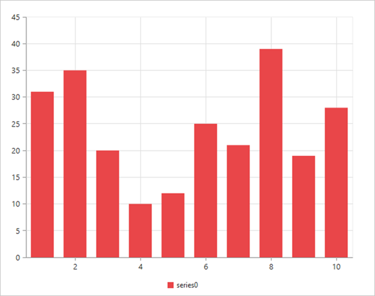
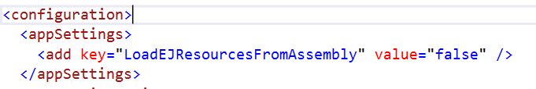

# Getting Started

This section explains briefly you on how to create a Chart in your application with ASP.NET.

## Create your first Chart in ASP.NET

This section encompasses how to configure the ASP.NET Charts for your business needs. You can also pass the required data to default Chart and customize it according to your requirements. In this example, you can see how to display the average climate data for Washington, DC during the period 1961 -1990.

 

### Configure Chart

Getting started with your ASP.NET Chart is very easy.  You can start by creating a simple line Chart.

Create an ASP Project and add necessary Dll’s and Scripts by referring [ASP-Getting Started](http://help.syncfusion.com/aspnetmvc/chart/getting-started) Documentation.

Create the web form named as default and add the following template



<%@ Page Language="C#" AutoEventWireup="true" CodeBehind="default.aspx.cs" Inherits="Chart_ASP.Chart._default" %>

<!DOCTYPE html>

<html xmlns="http://www.w3.org/1999/xhtml">

<head runat="server">    

    <title>Getting started for ASP.NET Chart Control</title>

    <link href="../Content/ej/default-theme/ej.theme.min.css" rel="stylesheet" />

    <link href="../Content/ej/ej.widgets.core.min.css" rel="stylesheet" />

    

    

    

    

    

</head>


Initialize the Chart like below code snippet



//...    

        <ej:Chart ID="Chart1" runat="server">

        </ej:Chart>            

//...  


The above code example renders a Chart with the default Column series type and some random values assigned to the column series. 

The following screenshot displays the Chart.

### Add a Chart Series

By default, line series is used. To create a series, you need to add the following code example to the scripts. For example, the following steps illustrate how to add a column series to the Chart.

1. You need to add the name of the series displayed in the Chart legend.
2. Then, you need to specify the type of series you want to render using “type” property.
3. You can add x and y points to the series as in the following code example.

   ~~~ html

        <ej:Chart ID="Chart1" runat="server>

            <Series>

                <ej:Series Name="Precipitation" Type="Column">

                    <Points>                   

                        <ej:Points  X="Jan" Y="3.03"/>

                        <ej:Points  X="Feb" Y="2.48"/>

                        <ej:Points  X="Mar" Y="3.23"/>

                        <ej:Points  X="Apr" Y="3.15"/>

                        <ej:Points  X="May" Y="4.13 "/>

                        <ej:Points  X="Jun" Y="3.23"/>

                        <ej:Points  X="Jul" Y="4.88"/>

                        <ej:Points  X="AUg" Y="3.82"/>

                        <ej:Points  X="Sep" Y="2.83"/>

                        <ej:Points  X="Oct" Y="2.8"/>

                        <ej:Points  X="Nov" Y="3.07"/>

                        <ej:Points  X="Dec" Y="2.8"/>

                    </Points>

                </ej:Series>

            </Series>

        </ej:Chart> 

   ~~~
   {:.pretty-print }

The following screenshot displays a Chart series:

### Add JSON data to the Chart

You can add JSON data to the Chart using the datasource property in Chart.



       

	List<chartData> data = new List<chartData>();

	data.Add(new chartData("Jan", 42, 27, 3.03));

	data.Add(new chartData("Feb", 44, 28, 2.48));

	data.Add(new chartData("Mar", 53, 35, 3.23));

	data.Add(new chartData("Apr", 64, 44, 3.15));

	data.Add(new chartData("May", 75, 54, 4.13));

	data.Add(new chartData("Jun", 83, 63, 3.23));

	data.Add(new chartData("Jul", 87, 68, 4.13));

	data.Add(new chartData("Aug", 84, 66, 4.88));

	data.Add(new chartData("Sep", 78, 59, 3.82));

	data.Add(new chartData("Oct", 67, 48, 3.07));

	data.Add(new chartData("Nov", 55, 38, 2.83));

	data.Add(new chartData("Dec", 45, 29, 2.8));

	this.Chart1.DataSource = data;

	this.Chart1.DataBind();

	public class chartData

		{

			public chartData(string xval, double yvalue1, double yvalue2, double yvalue3)

			{

				this.Xmonth = xval;

				this.Precipitation = yvalue1;

				this.Low = yvalue2;

				this.High = yvalue3;

			}

			public string Xmonth

			{

				get;

				set;

			}

			public double Precipitation

			{

				get;

				set;

			}

			public double Low

			{

				get;

				set;

			}

			public double High

			{

				get;

				set;

			}

		}





<ej:Chart ID="Chart1" runat="server" Width="970" Height="600" CanResize="true">

 <Series>

   <ej:Series EnableAnimation="True" Type="Column" Name="Sales" XName="Xmonth" YName="Precipitation"/>   

   <ej:Series EnableAnimation="True" Type="Line" Name="Sales" XName="Xmonth" YName="Low"/>   

   <ej:Series EnableAnimation="True" Type="Line" Name="Sales" XName="Xmonth" YName="High"/>                  

         </Series>

   </ej:Chart>





The following screenshot displays the Chart when JSON data is added.

 

### Add Chart Axis of your choice

In the Chart when data source is added, the axes are provided explicitly and the Chart initializes the right axis based on the data type. You can also specify the axis type of your choice using ValueType option and customize the options available in the axis. The following axis types are supported:

* Category -   String data can be plotted using category axis. Category axis can be initialized only as x-axis.
* Double -   Numeric values can be plotted using double axis.
* Datetime - DateTime can be plotted using datetime axis. This type of axis can be initialized only as x-axis.
* Logarithmic - Numeric values can be plotted using logarithm axis.

You can use PrimaryXAxis and PrimaryYAxis options to initialize the axes. As the data contains string values along x-axis, you can set ValueType as Category for PrimaryXAxis and Double for PrimaryYAxis. 

Since the values are in Fahrenheit for Temperature and Inches for Precipitation, you need to initialize different axis instance for each unit. You can use “LabelFormat” option to add suffix for axis labels.

In order to add additional Axes to the Chart other than PrimaryXAxis and PrimaryYAxis, you need to initialize axes option with collection of axis and set Name for axis in the Axes collection.

The following code example illustrates how to add Chart axis.


<ej:Chart ID="Chart1" runat="server">

            <PrimaryXAxis ValueType="Category"></PrimaryXAxis>   

            <PrimaryYAxis ValueType="Double"></PrimaryYAxis>

            <Axes>

                <ej:Axis OpposedPosition="true" Orientation="Vertical" Name="Precipitation"  

                 LabelFormat="{value} inch">

                 </ej:Axis>

            </Axes>         

 </ej:Chart>


### Assign the axis to the respective series

To assign the axis to the respective series you can set YAxisName property of the series. In the following code example, YAxisName of Column series is set to “Precipitation”. This is the name set to the axis in the above code example.


   <ej:Chart ID="Chart1" runat="server" CanResize="true">   

       <Series>

         <ej:Series EnableAnimation="True" Type="Column" YAxisName="Precipitation" Name="Sales"  

              XName="Xmonth" YName="Precipitation"/>   

         <ej:Series EnableAnimation="True" Type="Line" Name="Sales" XName="Xmonth" YName="Low"/>   

         <ej:Series EnableAnimation="True" Type="Line" Name="Sales" XName="Xmonth" YName="High"/> 

       </Series>

    </ej:Chart>



The following screenshot displays a Chart with desired output.

### Add Data Labels

Data Labels display the series points in Chart. To display the data labels, you need to enable the “Visible” property of DataLabel in the Marker of specific series. By default, it displays the Y value with label format provided in axis (For example: 4.88 inch). The following code example shows how to add DataLabels.


<ej:Chart ID="Chart1" runat="server" Width="970" Height="600" CanResize="true">

     <Series>

          <ej:Series EnableAnimation="True" Type="Column" XName="Xmonth" YName="Precipitation" Marker-DataLabel-Visible="true" Marker-DataLabel-TextPosition="Top" Marker-DataLabel-Fill="#FF7777" Marker-DataLabel-Offset="20" Marker-DataLabel-Shape="Rectangle"/>   

                <ej:Series EnableAnimation="True" Type="Line" XName="Xmonth" YName="Low"/>   

                <ej:Series EnableAnimation="True" Type="Line" XName="Xmonth" YName="High"/>                  

              </Series>

        </ej:Chart>


The following screenshot displays the Chart when data Labels are enabled.

 

### Enable ToolTip

To display the tooltip of Chart series, you can enable the “Visible” property of “Tooltip” in the specific series. By default, it displays X and Y value of points on mouse over the points. The following code example shows how to enable Tooltip.


  <ej:Chart ID="Chart1" runat="server">

            <Series>

                <ej:Series Name="Precipitation" Tooltip-Visible="true" />

            </Series>

         </ej:Chart>


The following screenshot displays the Chart when tooltip is enabled.

 

