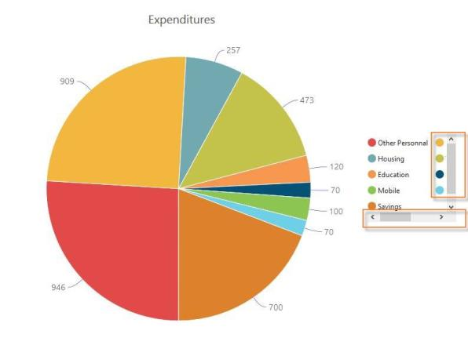

## Legend

Essential Chart allows you to customize its legend position, color, border, size, shape, padding, font styles, opacity etc. You can enable and disable Chart legends using legend Visible property. Default value of legendVisible property is set to “true”. 

### Legend Title

Essential Chart provides Legend Title support to the information about the series. It also provides options to customize the Legend Title with fonts and alignment.

[ASP.NET] 

  &lt;ej:Chart ID="Chart1" runat="server"&gt;    

 &lt;Legend Visible="true"&gt;&lt;Title Text="Countries" TextAlignment="Near" &gt;&lt;font Color="blue"    FontSize="18px"&gt;&lt;/font&gt; &lt;/Title&gt;&lt;/Legend&gt;

&lt;/ej:Chart&gt;

The following screenshot displays Legend Title:

{  | markdownify }
{:.image }

### Legend Position

You can position the legend at top, bottom, left or right position of the Chart. Default value of legendPosition is “Bottom”. And you can align the legend position using “Alignment” property of Legend.  This allows you to align the legend at Center, Far and Near position of Chart area. Default value of legendalignment is “Center”. 

[ASP.NET] 

  &lt;ej:Chart ID="Chart1" runat="server"&gt;       

        &lt;Legend   Visible="true" Alignment="Center" Position="Bottom"&gt;&lt;/Legend&gt;

  &lt;/ej:Chart&gt;

{  | markdownify }
{:.image }

### Customization

Legend border and shape:

In Essential Chart, you can customize the legend shape with different symbols like rectangle, circle, cross, diamond, pentagon, hexagon, star, ellipse, triangle etc. Default value of legend “Shape” is “Rectangle”. And you can draw and customize the outline of Chart legends using Border property of Legend. Default value of legend border color is “Transparent”. 

[ASP.NET] 

  &lt;ej:Chart ID="Chart1" runat="server"&gt;       

  &lt;Legend   Visible="true" Alignment="Center" Position="Bottom" Shape="Circle" Border-Width="2" Border-Color="red"&gt;&lt;/Legend&gt;

  &lt;/ej:Chart&gt;

{  | markdownify }
{:.image }

Legend rowCount and columnCount:

Essential Chart allows you to display the legend items for row and column wise using “RowCount” and “ColumnCount” property. This is used to avoid overlapping between legends and Chart area when using more legends in Chart area.

[ASP.NET]

        &lt;ej:Chart ID="Chart1" runat="server"&gt;

            &lt;Legend RowCount="2" ColumnCount="3"&gt;&lt;/Legend&gt;

        &lt;/ej:Chart&gt;

{  | markdownify }
{:.image }

Legend item style and border customization:

Essential Chart allows you to customize the legend item size, and border color and width using “ItemStyle” property. Default value of legend item size is (10, 10), and legend item border color is “Transparent”.

[ASP.NET] 

  &lt;ej:Chart ID="Chart1" runat="server"&gt;       

         &lt;Legend Visible="true"  ItemStyle-Width="12" ItemStyle-Height="12" ItemStyle-Border-Color="Magenta" ItemStyle-Border-Width="1.5" /&gt;  &lt;/ej:Chart&gt;

{  | markdownify }
{:.image }

Legend font

You can customize the legend font family, font style, font weight and size and font styles using “Font” property of Legend. This is illustrated in the following code example.

[ASP.NET]

        &lt;ej:Chart ID="Chart1" runat="server"&gt;

            &lt;Legend&gt;

                &lt;Font FontFamily="SegoeUI" FontSize="15px" FontStyle="Normal" FontWeight="Bold"&gt;&lt;/Font&gt;

            &lt;/Legend&gt;

        &lt;/ej:Chart&gt;

{  | markdownify }
{:.image }

Legend opacity and item padding:

Essential Chart allows you to set “Opacity” for Chart legends. And you can define the spacing between the legend items using “ItemPadding” property of legend. Default value of ItemPadding size is 10.

[ASP.NET] 

  &lt;ej:Chart ID="Chart1" runat="server"&gt;       

           &lt;Legend Visible="true" Opacity="1.5"  ItemPadding="20" /&gt; </ej:Chart

{  | markdownify }
{:.image }

Scrollbar for legends:

Essential Chart allows you to customize the legend Height and Width using Size property. Default value of the Height and Width are null and it varies depending upon the legend position. If the legend is in top or bottom of the chart, default value of Height is 20% of chart height and Width is 100% of chart width. Similarly if it is in the left or right side of the chart, default value of Height is 100% of chart height and Width is 20% of chart width.

This property supports both pixels and percentage values. E.g. 100 or 10%.

Scrollbar is enabled for the legends, when the legend size is greater than the user specified value or than the default value of the legend size. 

[ASP.NET]

&lt;ej:Chart ID="chartcontainer" runat="server"&gt;

// ...

       &lt;CommonSeriesOptions Type="Pie"/&gt;

       &lt;Size Height="600" Width="800"/&gt;

       &lt;Legend Visible="True" Type="Circle" ColumnCount="2" &gt;	

            &lt;Size Height="25%" Width="150"/&gt;

       &lt;Legend/&gt;

         // ...

   &lt;/ej:Chart&gt;	

{  | markdownify }
{:.image }

Custom Legend Icons:

You can customize the shape of the legend icon. Normally the available shapes are circle, rectangle, star, wedge, uparrow, downarrow, pentagon, etc. By default, the shape of the legend icon is rectangle, you can modify this by setting Shape property of Legend. If you want series type as icon then set the Shape property value as “SeriesType”. You can customize the height and width of the icon by setting ItemStyle property. 

[ASP.NET] 

  &lt;ej:Chart ID="Chart1" runat="server"&gt;   

         &lt;Legend Visible="true" Shape="SeriesType"&gt;

                 &lt;ItemStyle Height="15" Width="15" /&gt;

         &lt;/Legend&gt;

   &lt;/ej:Chart&gt;

{  | markdownify }
{:.image }

