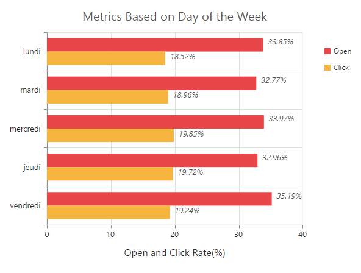

# Localization

EjChart supports localization for its axis labels and tooltip. To render the chart with specific culture you have to refer the corresponding **globalize** culture script and need to specify the culture name in **Locale** property of chart.   



<!--Refer french globalize culture script-->

<ej:Chart ID="Chart1" runat="server" Locale="fr-FR"> 
</ej:Chart>



[Click](http://asp.syncfusion.com/demos/web/chart/localization.aspx) here to view the localization chart online demo sample.

