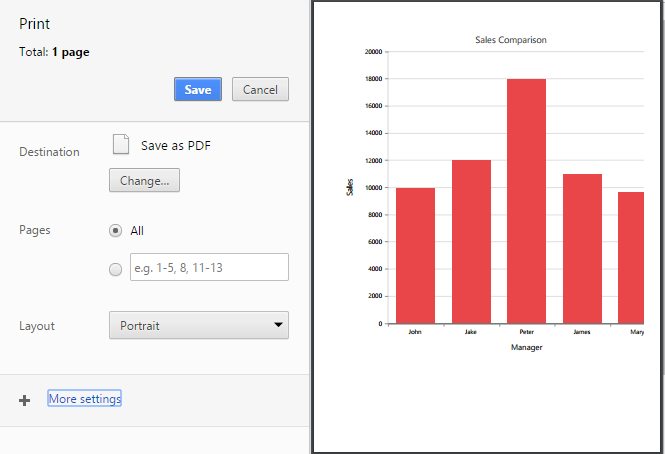
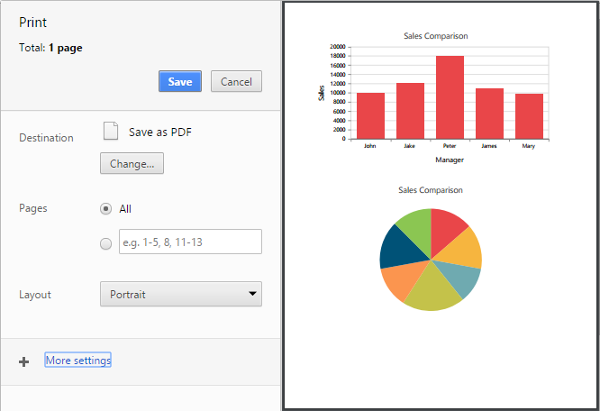

# Printing Chart
The rendered chart can be printed directly from the browser by calling the public method **print**. ID of the chart div element must be passed as argument to that method.



 <asp:Button ID="Button1" runat="server" Text="Button" OnClientClick="print()" />

<ej:Chart ID="Chart1">
</ej:Chart>



This print method can be called by performing any action on the web page. For example, by clicking a button. While calling the print method in chart, print preview will be displayed in the browser.

[Click](http://asp.syncfusion.com/demos/web/chart/export.aspx) here to view the Printing chart online demo sample

## Printing Multiple chart

Multiple charts in a web page can be printed together. For printing multiple charts, ID of the chart div elements have to be passed as shown in the below code 


<asp:Button ID="Button1" runat="server" Text="Button" OnClientClick="print()" />
<ej:Chart ID="Chart1">
</ej:Chart>
<ej:Chart ID="Chart2">
</ej:Chart>
       


The Print preview of multiple Charts is shown below 

## Page Setup

Some of print options are not configurable through JavaScript code. You need to customize layout, paper size, margins options through browser's page setup dialog. Please find the following guidelines link to browser page setup.

* [Chrome](https://support.google.com/chrome/answer/1379552?hl=en)
* [Firefox](https://support.mozilla.org/en-US/kb/how-print-web-pages-firefox)
* [Safari](http://www.mintprintables.com/print-tips/adjust-margins-osx/)
* [IE](http://www.helpteaching.com/help/print/index.htm) 

