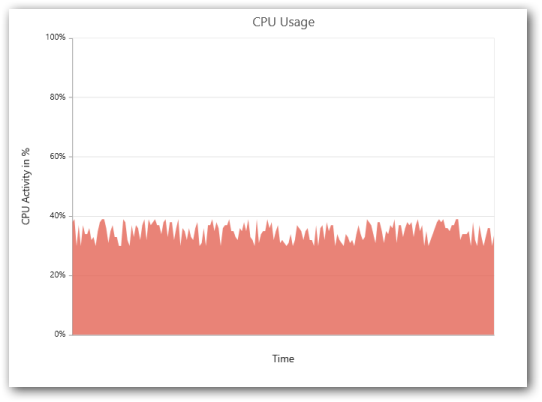

# Real-Time Charts

Essential Chart allows you to create dynamic Charts that update at given interval. They are highly useful in network monitoring applications, stock/finance monitoring applications and manufacturing process indicators where the most up-to-date data are displayed. Dynamic updates are supported by all Chart types including line, area, column, spline, spline area, polar and radar series.



<ej:Chart ID="Chart1" runat="server" OnClientLoad="onchartload">

</ej:Chart>



