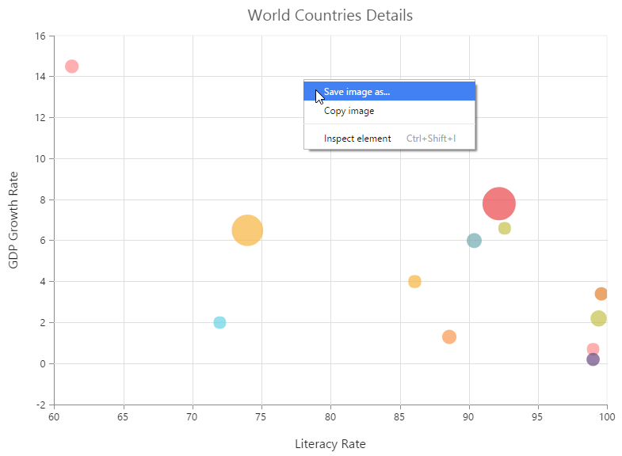

# Rendering Modes

Chart uses following three rendering technologies

   * VML
   * SVG
   * HTML5 Canvas

## VML

VML is used to render chart in IE lower versions such as IE7 and IE8. VML is used by default in these two browsers, as SVG and Canvas are not supported in these browsers.

**Limitations:**

* Label rotation is not supported.
* Animation is not supported.
* Patterns are not supported.
* Zooming and panning features are not supported.

## SVG

SVG is used to render Chart by default for all browsers other than IE7 and IE8.

## Canvas

You can switch between SVG and Canvas rendering by using the **EnableCanvasRendering** option. The canvas mode rendering is used in the following scenarios,

* Plotting large number of data points.
* Performing high frequency live updates.
 
The following code example shows how to enable HTML5 Canvas rendering in chart.



<%--Rendering with canvas mode--%>
<ej:Chart ID="Chart1" runat="server" EnableCanvasRendering="true"> 
 
</ej:Chart>



**Limitations:**
  
* Animation is not supported.
* 3D charts are not supported.

