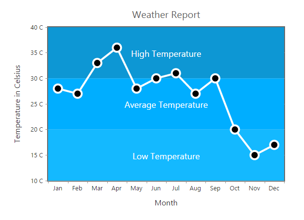
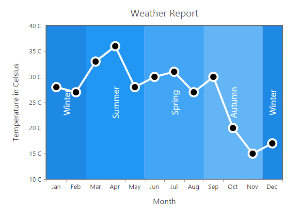
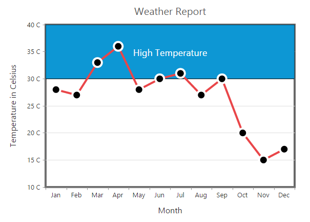
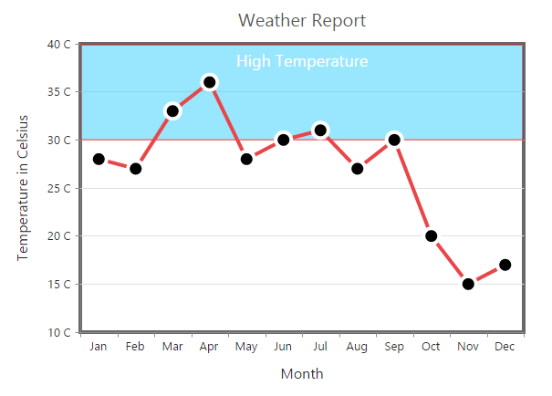
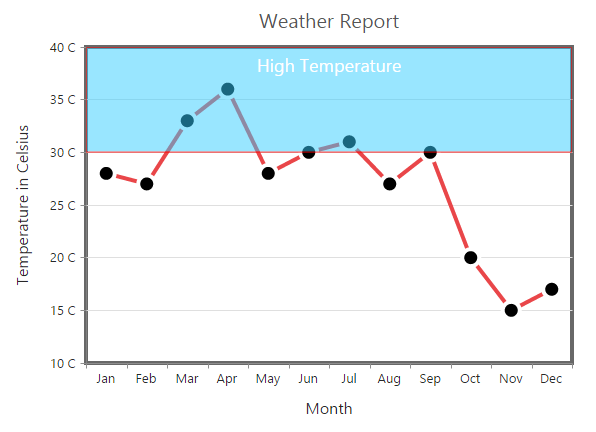

# Striplines

EjChart supports horizontal and vertical striplines. 

## Horizontal Stripline

You can create horizontal stripline by adding the **Stripline** in the *vertical axis* and set **Visible** option to *true*. Striplines are rendered in the specified **Start** to **End** range and you can add more than one stripline for an axis.



<ej:Chart ID="Chart1" runat="server"> 
    <%--Initializing Primary Y Axis--%>
    <PrimaryYAxis>
        <StripLine>
            <%--Enable Stripline--%>
            <ej:StripLine Start="30" End="40" />
        </StripLine>
    </PrimaryYAxis> 
</ej:Chart>



[Click](http://asp.syncfusion.com/demos/web/chart/striplinesample.aspx) here to view the Striplines online demo sample.

## Vertical Stripline

You can create vertical stripline by adding the Stripline in the *horizontal axis* and set Visible option to *true*.  



<ej:Chart ID="Chart1" runat="server"> 
    <%--Initializing Primary X Axis--%>
    <PrimaryXAxis>
        <StripLine>
            <%--Create vertical Stripline using horizontal Axis--%>
            <ej:StripLine Start="3" End="7" />
        </StripLine>
    </PrimaryXAxis> 
</ej:Chart>



## Customize the Text

To customize the stripLine text, use the **Text** and **Font** options. 



<ej:Chart ID="Chart1" runat="server"> 
    <%--Initializing Primary Y Axis--%>
    <PrimaryYAxis>
        <StripLine>
            <%--Customize the stripLine text and font styles--%>
            <ej:StripLine Text="High Temperature" Start="10" End="20">
                
            </ej:StripLine>
        </StripLine>
    </PrimaryYAxis> 
</ej:Chart>



**Text Alignment**

Stripline text can be aligned by using the **TextAlignment** property.  



<ej:Chart ID="Chart1" runat="server"> 
    <%--Initializing Primary Y Axis--%>
    <PrimaryYAxis>
        <StripLine>
            <%--Set stripLine text alignment to top position--%>
            <ej:StripLine TextAlignment="MiddleTop">
            </ej:StripLine>
        </StripLine>
    </PrimaryYAxis> 
</ej:Chart>



## Customize the Stripline

To customize the stripLine styles, use the *Color, Opacity, BorderWidth and BorderColor* properties. 



<ej:Chart ID="Chart1" runat="server"> 
    <%--Initializing Primary Y Axis--%>
    <PrimaryYAxis>
        <StripLine>
            <%--Customize the StripLine rectangle--%>
            <ej:StripLine Color="#33CCFF" BorderWidth="2" BorderColor="2">
            </ej:StripLine>
        </StripLine>
    </PrimaryYAxis> 
</ej:Chart>



## Change the Z-order of the stripline

Stripline **ZIndex** property is used to display the stripLine either behind or over the series.  



<ej:Chart ID="Chart1" runat="server"> 
    <%--Initializing Primary Y Axis--%>
    <PrimaryYAxis>
        <StripLine>
            <%--Change stripLine ZIndex--%>
            <ej:StripLine ZIndex="Over">
            </ej:StripLine>
        </StripLine>
    </PrimaryYAxis> 
</ej:Chart>



