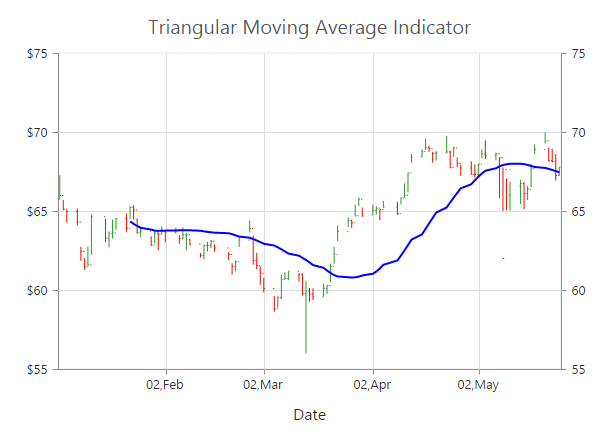
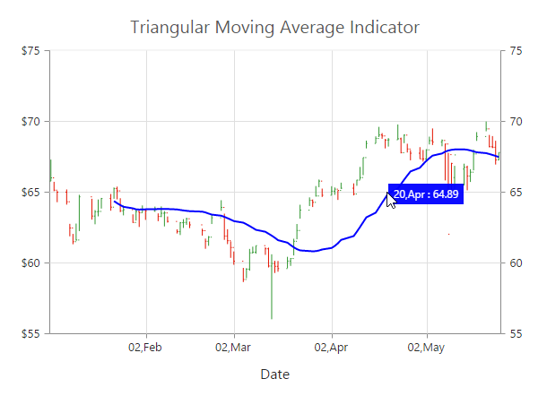

# Technical Indicators

EjChart control supports 10 types of technical indicators. 

## Bind data to render the indicator

You can bind the series **DataSource** to the indicator by setting the specific series name to the indicator by using the *Indicators.SeriesName* property.



<ej:Chart ID="Chart1" runat="server"> 
    <%--Initializing Series--%>
    <Series>
        <ej:Series XName="XDate" High="High" Low="Low" Open="Open" Close="Close" Name="Hilo">
        </ej:Series>
    </Series>

    <%--Initializing Indicators --%>
    <Indicators>
        <%--Set Hilo series dataSource to indicator using seriesName--%>
        <ej:ChartIndicator SeriesName="Hilo"></ej:ChartIndicator>
    </Indicators>
</ej:Chart>





           //// Create dataSource to chart
            List<ChartData> data = new List<ChartData>();
            data.Add(new ChartData("2010/7/1", 38, 10, 58, 27));
            data.Add(new ChartData("2010/7/8", 28, 15, 48, 58));
            data.Add(new ChartData("2010/7/9", 54, 35, 85, 98));
            data.Add(new ChartData("2010/7/10", 52, 21, 38, 85));
            //...
            //Binding DataSource to Chart
            this.Chart1.DataSource = data;
            this.Chart1.DataBind();



Also, you can add data to the indicator directly by using the DataSource option of the indicator.  



<ej:Chart ID="Chart1" runat="server"> 
    <%--Initializing Indicators --%>
    <Indicators>
        <%--Add dataSource to indicator directly--%>
        <ej:ChartIndicator  XName="XDate" High="High" Low="Low" Open="Open" Close="Close"></ej:ChartIndicator>
    </Indicators>
</ej:Chart>





           //// Create dataSource to chart
            List<ChartData> data = new List<ChartData>();
            data.Add(new ChartData("2010/7/1", 38, 10, 58, 27));
            data.Add(new ChartData("2010/7/8", 28, 15, 48, 58));
            data.Add(new ChartData("2010/7/9", 54, 35, 85, 98));
            data.Add(new ChartData("2010/7/10", 52, 21, 38, 85));
            //...
            //Binding DataSource to Chart
            this.Chart1.DataSource = data;
            this.Chart1.DataBind();


	
## Indicator Types

### Accumulation Distribution

To create an Accumulation Distribution indicator, set the *Indicators.Type* as **AccumulationDistribution**. Accumulation Distribution require **Volume** field additionally with the DataSource to calculate the signal line.



<ej:Chart ID="Chart1" runat="server"> 
    <%--Initializing Series--%>
    <Series>
        <ej:Series XName="XDate" High="High" Low="Low" Open="Open" Close="Close" Name="Hilo">
        </ej:Series>
    </Series>

    <%--Initializing Indicators --%>
    <Indicators>
        <%--Set indicator type--%>
        <ej:ChartIndicator SeriesName="Hilo" Type="AccumulationDistribution"></ej:ChartIndicator>
    </Indicators>
</ej:Chart>



[Click](http://asp.syncfusion.com/demos/web/chart/accumulationdistribution.aspx) here to view the Accumulation Distribution indicator online demo sample.

### Average True Range (ATR)

You can create an ATR indicator by setting the Indicators.Type as **ATR** in the Indicators. 



<ej:Chart ID="Chart1" runat="server"> 
    <Series>
        <%--Add series--%>
    </Series>

    <Indicators>
        <%--Set indicator type--%>
        <ej:ChartIndicator SeriesName="Hilo" Type="ATR">
        </ej:ChartIndicator>
    </Indicators>
</ej:Chart>



[Click](http://asp.syncfusion.com/demos/web/chart/atr.aspx) here to view the ATR indicator online demo sample.

### Bollinger Band 

Bollinger Band indicator is created by setting the Indicators.Type as **BollingerBand**. It contains three lines, namely upper band, lower band and signal line. Bollinger Band default value of the *Period* is 14 and *StandardDeviations* is 2.



<ej:Chart ID="Chart1" runat="server"> 
    <Series>
        <%--Add series--%>
    </Series>

    <Indicators>
        <%--Set indicator type--%>
        <ej:ChartIndicator SeriesName="Hilo" Type="BollingerBand">
        </ej:ChartIndicator>
    </Indicators>
</ej:Chart>



[Click](http://asp.syncfusion.com/demos/web/chart/bollingerband.aspx) here to view the Bollinger Band indicator online demo sample.

### Exponential Moving Average (EMA)

To render an EMA indicator, you have to set the Indicators.Type as **EMA**.  



<ej:Chart ID="Chart1" runat="server"> 
    <Series>
        <%--Add series--%>
    </Series>

    <Indicators>
        <%--Set indicator type--%>
        <ej:ChartIndicator SeriesName="Hilo" Type="EMA">
        </ej:ChartIndicator>
    </Indicators>
</ej:Chart>



[Click](http://asp.syncfusion.com/demos/web/chart/ema.aspx) here to view the EMA indicator online demo sample.

### Momentum 

Momentum Technical indicator is created by setting the Indicators.Type as **Momentum**. The momentum indicator renders two lines, namely upper band and signal line. Upper band always rendered at the value 100 and the signal line is calculated based on the momentum of the data.



<ej:Chart ID="Chart1" runat="server"> 
    <Series>
        <%--Add series--%>
    </Series>

    <Indicators>
        <%--Set indicator type--%>
        <ej:ChartIndicator SeriesName="Hilo" Type="Momentum">
        </ej:ChartIndicator>
    </Indicators>
</ej:Chart>



[Click](http://asp.syncfusion.com/demos/web/chart/momentum.aspx) here to view the Momentum indicator online demo sample.

### Moving Average Convergence Divergence (MACD)

To render an MACD indicator, you have to set the Indicators.Type as **MACD**.  MACD indicator contains MACD line, Signal line and Histogram column. Histogram is used to differentiate MACD and signal line.



<ej:Chart ID="Chart1" runat="server"> 
    <Series>
        <%--Add series--%>
    </Series>

    <Indicators>
        <%--Set indicator type--%>
        <ej:ChartIndicator SeriesName="Hilo" Type="MACD">
        </ej:ChartIndicator>
    </Indicators>
</ej:Chart>



[Click](http://asp.syncfusion.com/demos/web/chart/macd.aspx) here to view the MACD indicator online demo sample.

#### MacdType

By using the **MacdType** enumeration property, you can change the MACD rendering as *Line*, *Histogram* or *Both*. 



<ej:Chart ID="Chart1" runat="server"> 
    <Series>
        <%--Add series--%>
    </Series>

    <Indicators>
        <%--Set indicator type--%>
        <ej:ChartIndicator SeriesName="Hilo" Type="MACD" MacdType="Histogram">
        </ej:ChartIndicator>
    </Indicators>
</ej:Chart>



### Relative Strength Index (RSI)

To render the RSI indicator, set the Indicators.Type as **RSI**. It contains three lines, namely upper band, lower band and signal line. Upper and lower band always render at value 70 and 30 respectively and signal line is calculated based on the *RSI* formula.



<ej:Chart ID="Chart1" runat="server"> 
    <Series>
        <%--Add series--%>
    </Series>

    <Indicators>
        <%--Set indicator type--%>
        <ej:ChartIndicator SeriesName="Hilo" Type="RSI">
        </ej:ChartIndicator>
    </Indicators>
</ej:Chart>



[Click](http://asp.syncfusion.com/demos/web/chart/rsi.aspx) here to view the RSI indicator online demo sample.

### Simple Moving Average (SMA)

To render the SMA indicator, you should specify the Indicators.Type as **SMA**.  



<ej:Chart ID="Chart1" runat="server"> 
    <Series>
        <%--Add series--%>
    </Series>

    <Indicators>
        <%--Set indicator type--%>
        <ej:ChartIndicator SeriesName="Hilo" Type="SMA">
        </ej:ChartIndicator>
    </Indicators>
</ej:Chart>



[Click](http://asp.syncfusion.com/demos/web/chart/sma.aspx) here to view the SMA indicator online demo sample.

### Stochastic 

For the Stochastic indicator, you need to set the Indicators.Type as **Stochastic**. The Stochastic indicator renders four lines namely, upper line, lower line, stochastic line and the signal line. Upper line always rendered at value 80 and the lower line is rendered at value 20. Stochastic and Signal Lines are calculated based on the stochastic formula.



<ej:Chart ID="Chart1" runat="server"> 
    <Series>
        <%--Add series--%>
    </Series>

    <Indicators>
        <%--Set indicator type--%>
        <ej:ChartIndicator SeriesName="Hilo" Type="Stochastic">
        </ej:ChartIndicator>
    </Indicators>
</ej:Chart>



[Click](http://asp.syncfusion.com/demos/web/chart/stochastic.aspx) here to view the stochastic indicator online demo sample.

### Triangular Moving Average (TMA)

To render the TMA indicator, you should specify the Indicators.Type as **TMA**. 



<ej:Chart ID="Chart1" runat="server"> 
    <Series>
        <%--Add series--%>
    </Series>

    <Indicators>
        <%--Set indicator type--%>
        <ej:ChartIndicator SeriesName="Hilo" Type="TMA">
        </ej:ChartIndicator>
    </Indicators>
</ej:Chart>



[Click](http://asp.syncfusion.com/demos/web/chart/tma.aspx) here to view the TMA indicator online demo sample.

## Enable Tooltip 

To display the indicator tooltip, use *Visible* option of the **Indicators.Tooltip**. Also, you can change and customize the tooltip color, border, format and font properties similar to the series tooltip.



<ej:Chart ID="Chart1" runat="server"> 
    <Series>
        <%--Add series--%>
    </Series>

    <Indicators>
        <ej:ChartIndicator>
            <%--Enable Indicator tooltip--%>
            <Tooltip Visible="true"></Tooltip>
        </ej:ChartIndicator>
    </Indicators>
</ej:Chart>



