# Trendlines

EjChart can generate Trendlines for Cartesian type series *(Line, Column, Scatter, Area, Candle, HiLo etc.)* except Bar type series. You can add more than one trendline object to the **Trendlines** option.



<ej:Chart ID="Chart1" runat="server"> 
    <Series>
       <ej:Series>
           <Trendlines>
               <%--Enable Trendline to chart series--%>
               <ej:Trendlines Visibility="visible" />
           </Trendlines>
       </ej:Series>
    </Series>
</ej:Chart>



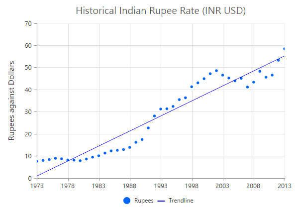

[Click](http://asp.syncfusion.com/demos/web/chart/trendlines.aspx) here to view the Trendlines online demo sample.

## Customize the trendline styles

A trendline can be customized by using the properties such as *Fill*, *Width*, *DashArray* and *Opacity*. The default type of Trendline is **Linear**.



<ej:Chart ID="Chart1" runat="server"> 
    <Series>
       <ej:Series>
           <Trendlines>
               <%--Customize the Trendline styles--%>
               <ej:Trendlines Fill="#99CCFF" Width="3" Opacity="1" DashArray="2,3" />
           </Trendlines>
       </ej:Series>
    </Series>
</ej:Chart>



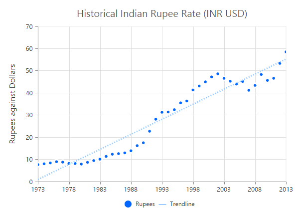

## Types of Trendline

EjChart supports the following type of Trendlines.

* Linear
* Exponential
* Logarithmic
* Power 
* Polynomial
* MovingAverage

### Linear

To render Linear Trendline, you have to set the **Type** as *Linear*. 



<ej:Chart ID="Chart1" runat="server"> 
    <Series>
       <ej:Series>
           <Trendlines>
               <%--Change Trendline type--%>
               <ej:Trendlines Type="Linear" />
           </Trendlines>
       </ej:Series>
    </Series>
</ej:Chart>



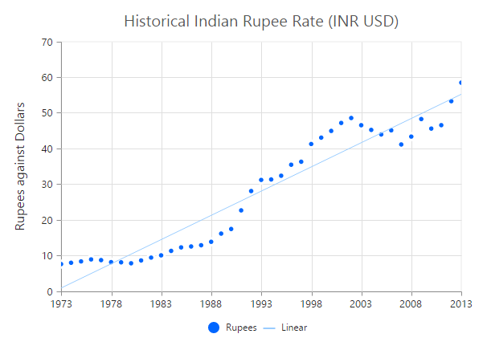

### Exponential

Exponential Trendline can be rendered by setting the *Type* as *Exponential*. 



<ej:Chart ID="Chart1" runat="server"> 
    <Series>
       <ej:Series>
           <Trendlines>
               <%--Change Trendline type--%>
               <ej:Trendlines Type="Exponential" />
           </Trendlines>
       </ej:Series>
    </Series>
</ej:Chart>



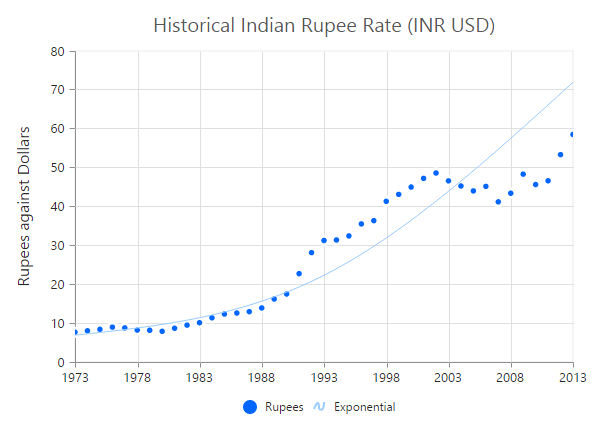

### Logarithmic

Logarithmic Trendline can be rendered by setting the *Type* as *Logarithmic*.  



<ej:Chart ID="Chart1" runat="server"> 
    <Series>
       <ej:Series>
           <Trendlines>
               <%--Change Trendline type--%>
               <ej:Trendlines Type="Logarithmic" />
           </Trendlines>
       </ej:Series>
    </Series>
</ej:Chart>



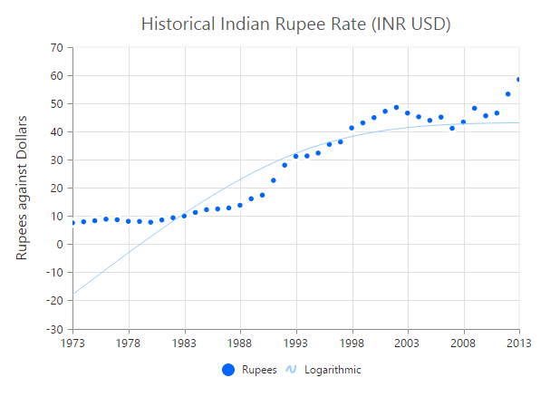

### Power

Power Trendline can be rendered by setting the *Type* of the trendline as *Power*. 



<ej:Chart ID="Chart1" runat="server"> 
    <Series>
       <ej:Series>
           <Trendlines>
               <%--Change Trendline type--%>
               <ej:Trendlines Type="Power" />
           </Trendlines>
       </ej:Series>
    </Series>
</ej:Chart>



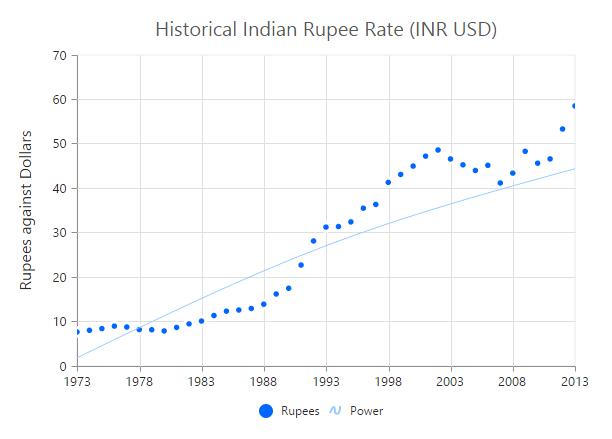

### Polynomial

Polynomial Trendline can be rendered by setting the trendline *Type* as *Polynomial*.  You can change the polynomial order by using the **PolynomialOrder** of the trendlines. It ranges from 2 to 6.



<ej:Chart ID="Chart1" runat="server"> 
    <Series>
       <ej:Series>
           <Trendlines>
               <%--Change Trendline type--%>
               <ej:Trendlines Type="Polynomial"  PolynomialOrder="2"/>
           </Trendlines>
       </ej:Series>
    </Series>
</ej:Chart>



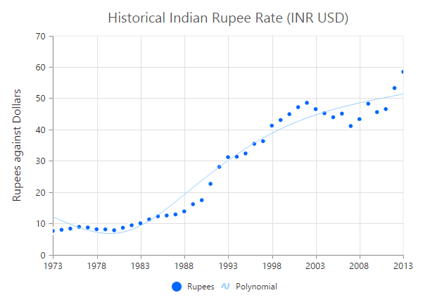

### MovingAverage

MovingAverage Trendline can be rendered by setting the *Type* of the trendline as *MovingAverage*. 



<ej:Chart ID="Chart1" runat="server"> 
    <Series>
       <ej:Series>
           <Trendlines>
               <%--Change Trendline type--%>
               <ej:Trendlines Type="MovingAverage"  Period="3"/>
           </Trendlines>
       </ej:Series>
    </Series>
</ej:Chart>



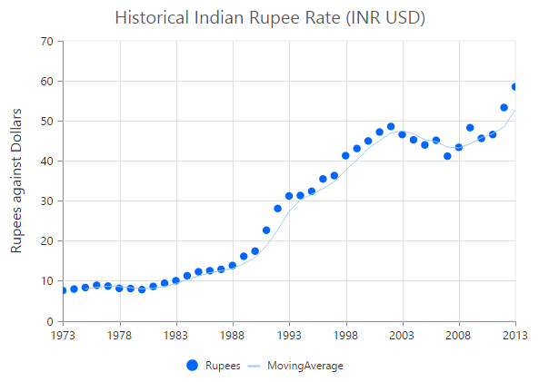

## Forecasting

**Trendline forecasting** is the prediction of future/past situations.  **Forecasting** can be classified into two types as follows.

  * Forward Forecasting
  * Backward Forecasting

### Forward Forecasting

The value set for **ForwardForecast** is used to determine the distance moving towards the future trend.



<ej:Chart ID="Chart1" runat="server"> 
    <Series>
       <ej:Series>
           <Trendlines>
               <%--Set forward forecasting value--%>
               <ej:Trendlines ForwardForecast="5" />
           </Trendlines>
       </ej:Series>
    </Series>
</ej:Chart>



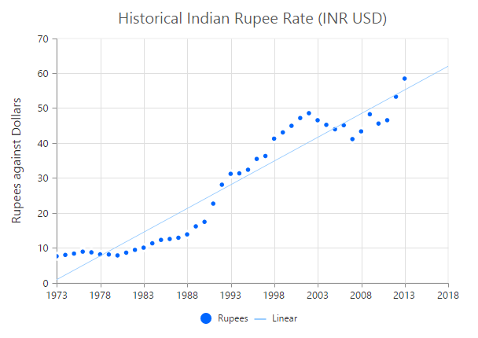

### Backward Forecasting

The value set for the **BackwardForecast** is used to determine the past trends.



<ej:Chart ID="Chart1" runat="server"> 
    <Series>
       <ej:Series>
           <Trendlines>
               <%--Set backward forecasting value--%>
               <ej:Trendlines BackwardForecast="5" />
           </Trendlines>
       </ej:Series>
    </Series>
</ej:Chart>



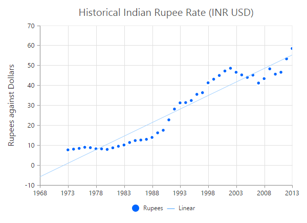

## Trendlines Legend

To display the legend item for trendline, use the **Name** property. You can interact with the trendline legends similar to the series legends *(show/hide trendlines on legend click)*.  



<ej:Chart ID="Chart1" runat="server"> 
    <Series>
       <ej:Series>
           <Trendlines>
               <%--Set Trendline name to display in the legend--%>
               <ej:Trendlines Name="Linear" />
           </Trendlines>
       </ej:Series>
    </Series>
</ej:Chart>



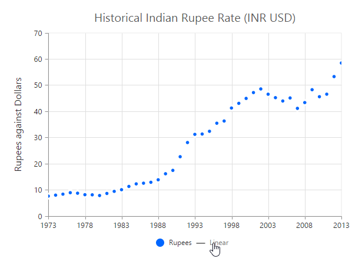
