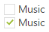
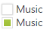
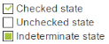
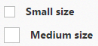
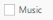
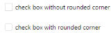
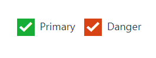

# Easy customization

By default, Checkbox contains two states; checked and unchecked. It allows you to make a binary choice. The Checkbox control allows you to check an option for performing action. Checkbox control allows you to set selected, unselected or an indeterminate option. Here, ASP check box control is rendered as Essential Checkbox control

## Checked status

By using **Checked property**, you can set the state of Checkbox. When checked property is true, then tick mark is displayed and Checkbox is in checked state. When it is false, the tick mark is not displayed and Checkbox is in unchecked state. When you want to use this Checked property, then checkbox should be in non Tri-state and EnableTriState property should be false.

The following step explains the details about rendering the Checkbox with above mentioned checked options, when the checkbox is in non tri-state.

In the ASPX page, add the following input elements to configure Checkbox.



  <%--Sets the state for non Tri-state Checkbox by using Checked property--%>

    <ej:CheckBox ID="UnChecked_CheckBox" runat="server" Checked="false"> Music</ej:CheckBox>

     

    <ej:CheckBox ID="Checked_CheckBox" runat="server" Checked="true"> Music</ej:CheckBox>



Run the above code to render the following output.

## Enable Tri-State

Sometimes, it is essential for you to represent the answer in partially true state. To represent the partially true types, an indeterminate state option is present. The state between checked and unchecked state is called indeterminate state. For example, a Checkbox presented to select files to send via FTP can use a TreeView so that files can be selected one at a time, or by folder. When only some of the files in a folder are selected, then the checkbox for that folder can be in indeterminate state.

When you enable Tri-state, then the Checkbox includes the indeterminate state. The Checkbox has three states. **EnableTriState** property specifies to enable or disable the Tri-State option for Checkbox. 

The following step explains the details about rendering the Checkbox with Tri-state options.

In the ASPX page, add the following input elements to configure Checkbox.



	<%--Enables or disables the Tri-state by using EnableTriState property --%>

    <ej:CheckBox ID="NonTriState_CheckBox" runat="server" EnableTriState="false"> Music</ej:CheckBox>

     

    <ej:CheckBox ID="TriState_CheckBox" runat="server" EnableTriState="true"> Music</ej:CheckBox>



Run the above code to render the following output.

## Check State

An option is required to set indeterminate state for Checkbox. By using CheckState property, you can set any state that is illustrated in the following table. Before using this property, enable the Tri-state for Checkbox by using EnableTriState property as true.

<table>
<tr>
<th>
Check</th><td>
Check box is in the checked state.</td></tr>
<tr>
<th>
Uncheck</th><td>
Check box is in the un-checked state.</td></tr>
<tr>
<th>
Indeterminate</th><td>
Check box is in the indeterminate state.</td></tr>
</table>

The following step explains the details about rendering the Checkbox with specified checked state, when the checkbox is in tri-state.

In the ASPX page, add the following input elements to configure Checkbox.



<%--Sets the state of Tri-state Checkbox by using CheckState property--%>

    <ej:CheckBox ID="Checked_CheckBox" runat="server" EnableTriState="true" CheckState="Check"> Checked state</ej:CheckBox>

     

      <ej:CheckBox ID="UnChecked_CheckBox" runat="server" EnableTriState="false" CheckState="Uncheck"> Unchecked state</ej:CheckBox>

     

    <ej:CheckBox ID="Indeterminate_CheckBox" runat="server" EnableTriState="true" CheckState="Indeterminate"> Indeterminate state</ej:CheckBox>



Run the above code to render the following output.

## Checkbox Size

You can render Checkbox in different sizes. The following table contains some predefined size option for rendering a Checkbox in easiest way. Each size option has different heights and widths. Mainly, it avoids the complexity in rendering the Checkbox with complex CSS class. 

<table>
	<tr>
		<td>{{ '**Small**' | markdownify }}</td>
		<td>Creates Checkbox with in-built small size height, width specified.</td>
	</tr>
	<tr>
		<td>{{ '**Medium**' | markdownify }}</td>
		<td>Creates Checkbox with in-built medium size height, width specified.</td>
	</tr>
</table>

The following step explains the details about rendering the Checkbox with different size.

In the ASPX page, add the following input elements to configure Checkbox.



    <%--Sets the size of Checkbox by using Size property--%>

    <ej:CheckBox ID="SmallSize_Checkbox" runat="server" Size="Small">Small size</ej:CheckBox>

     

    <ej:CheckBox ID="MediumSize_Checkbox" runat="server" Size="Medium">Medium size</ej:CheckBox>



Run the above code to render the following output.

## Text

It specifies the text content for the Checkbox. In previous programs, separate label for each Checkbox is created. You can also set the text for Checkbox by using **Text property**. Therefore, it is not essential to add label tag for each checkbox in HTML code.

The following step explains the details about rendering the Checkbox with text content and without writing label tag in the HTML code

In the ASPX page, add the following input elements to configure Checkbox.



	<%--set text for checkbox using Text property--%>

    <ej:CheckBox ID="CheckBox_Text" runat="server" Text="Music"> </ej:CheckBox>



Run the above code to render the following output.

## Rounded corner for checkbox

Specifies the corner of Checkbox in rounded shape. Checkbox does not have rounded corner by default. To set rounded corner, you can enable **ShowRoundedCorner** property.

The following step explains the details about rendering the Checkbox with rounded corner.

In the ASPX page, add the following input elements to configure Checkbox.



	<%--Sets the rounded corner for Checkbox--%>

    <ej:CheckBox ID="NormalCorner_Checkbox" runat="server" ShowRoundedCorner="false" Text="checkbox without rounded corner"> </ej:CheckBox>

     

    <ej:CheckBox ID="RoundedCorner_Checkbox" runat="server" ShowRoundedCorner="true" Text="checkbox with rounded corner"></ej:CheckBox>



Run the above code to render the following output.

## Styles Customization

CheckBox allows you to customize its appearance by using user-defined CSS and custom skin options such as colors and backgrounds. To apply custom themes, use  **CssClass** property. CssClass property sets the root class for CheckBox theme.

By using this CssClass, you can override the existing styles under the theme style sheet. The theme style sheet applies theme-specific styles like colors and backgrounds. From the root class, you can customize the CheckBox control theme.

In the following example, the border color and border width of the active CheckBox is customized through the custom classes to create the success, and danger indication with CheckBox.



<b>Agree terms & conditions:</b>
    
    <ej:CheckBox ID="check1" Text="Primary" runat="server" Size="Medium" Checked="true" CssClass="success">
        </ej:CheckBox>
        <ej:CheckBox ID="check2" Text="Danger" runat="server" Size="Medium" Checked="true" CssClass="danger">
        </ej:CheckBox>
    







