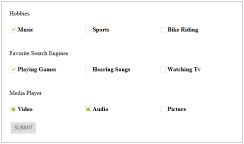
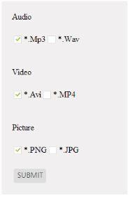

# Getting Started

This section explains briefly how to create a **Checkbox** in your application with ASP.NET.

## Create your first Checkbox in ASP.NET

ASP.NET Checkbox provides support for multiple selections, within your web page and allows you to specify an option from the list. From the following guidelines, you can select Multiple or Single Selection List Receiving App by using Checkbox. The following screenshot demonstrates the functionality with Checkbox button action.

In the above screenshot, you can select Hobbies, Interests list and Social networks Receiving App by using Checkbox, Tri-state Checkbox and perform the action to render the checked values when the button is clicked.

### Create a Checkbox 

ASP.NET Checkbox widget has built-in features like intermediate selections. You can create the Checkbox widget by using an input Checkbox element as follows.

You can create an ASP.NET Project and add necessary assemblies, styles and scripts with the help of the given [ASP.NET-Getting Started](https://help.syncfusion.com/aspnet/getting-started) Documentation.

Create an ASPX file and add ejCheckBox element to render the Checkbox.



        Hobbies
         
         
        <table>
            <tr>
                <td class="check-rad">
                    <ej:CheckBox ID="Checkbox1" runat="server" Value="Music">
                    </ej:CheckBox>
                    <label for="Checkbox1">Music</label>
                </td>
                <td class="check-rad">
                    <ej:CheckBox ID="Checkbox3" runat="server" Value="Sports">
                    </ej:CheckBox>
                    <label for="Checkbox3">Sports</label>
                </td>
                <td class="check-rad">
                    <ej:CheckBox ID="Checkbox4" runat="server" Value="Bike riding">
                    </ej:CheckBox>
                    <label for="Checkbox4" class="clslab">Bike Riding</label>
                </td>
            </tr>
        </table>
         
         
        Favorite Search Engines 
         
        <table>
            <tr>
                <td class="check-rad">
                    <ej:CheckBox ID="Checkbox9" runat="server" Value="Playing Games">
                    </ej:CheckBox>
                    <label for="Checkbox9">Playing Games</label>
                </td>
                <td class="check-rad">
                    <ej:CheckBox ID="Checkbox5" runat="server" Value="Hearing Songs">
                    </ej:CheckBox>
                    <label for="Checkbox5">Hearing Songs</label>
                </td>
                <td class="check-rad">
                    <ej:CheckBox ID="Checkbox6" runat="server" Value="Watching tv">
                    </ej:CheckBox>
                    <label for="Checkbox6">Watching TV</label>
                </td>
            </tr>
        </table>
         
         
        Media Player 
         
        <table>
            <tr>
                <td class="check-rad">
                    <ej:CheckBox ID="Checkbox2" runat="server" Value="Video" EnableTriState="true">
                    </ej:CheckBox>
                    <label for="Checkbox2">
                        Video</label>
                </td>
                <td class="check-rad">
                    <ej:CheckBox ID="Checkbox7" runat="server" Value="Audio" EnableTriState="true">
                    </ej:CheckBox>
                    <label for="Checkbox7">
                        Audio</label>
                </td>
                <td class="check-rad">
                    <ej:CheckBox ID="Checkbox8" runat="server" Value="Picture" EnableTriState="true">
                    </ej:CheckBox>
                    <label for="Checkbox8">
                        Picture</label>
                </td>
            </tr>
        </table>
         
        <table>
            <tr>
                <td class="btnsht">
                    <ej:Button ID="Button" runat="server" Text="SUBMIT" Type="Button"
ClientSideOnClick="click" ShowRoundedCorner="true">
                    </ej:Button>
            </tr>
        </table>
    



Add the following styles to show the Checkbox control in an order.



        .frame
        {
            width: 600px;
            padding: 20px;
            border: 1px solid gray;
        }
        .e-check-rad
        {
            font-weight: bold;
            width: 200px;
        }    



Add the script into your ASPX page.



        function click() {
            var checkedItem = "";
            $(".e-checkbox").each(function (index, args) {
                if ($(this).data('ejCheckBox').isChecked) {
                    checkedItem += $(this).data('ejCheckBox').model.value;
                }
            });
            alert("Checked items are -"+checkedItem);
        }



## File Selection in Media Player

You can get the file type of Media player applications such as video, audio and picture by using Checkbox. Follow the given steps to get media player file types.

Add the following code in the <body> element of the corresponding ASPX page.



    

        Audio
         
         
        <table>
            <tr>
                <td>
                    <ej:CheckBox ID="Checkbox1" runat="server" Value="Mp3">
                    </ej:CheckBox>
                    <label for="Checkbox1">
                        *.Mp3</label>
                </td>
                <td>
                    <ej:CheckBox ID="Checkbox2" runat="server" Value="WAV">
                    </ej:CheckBox>
                    <label for="Checkbox2">
                        *.WAV</label>
                </td>
            </tr>
        </table>
         
         
        Video 
         
        <table>
            <tr>
                <td>
                    <ej:CheckBox ID="Checkbox3" runat="server" Value="AVI">
                    </ej:CheckBox>
                    <label for="Checkbox3">
                        *.AVI</label>
                </td>
                <td>
                    <ej:CheckBox ID="Checkbox4" runat="server" Value="MP4">
                    </ej:CheckBox>
                    <label for="Checkbox4">
                        *.MP4</label>
                </td>
            </tr>
        </table>
         
         
        Picture 
         
        <table>
            <tr>
                <td>
                    <ej:CheckBox ID="Checkbox5" runat="server" Value="PNG">
                    </ej:CheckBox>
                    <label for="Checkbox5">
                        *.PNG</label>
                </td>
                <td>
                    <ej:CheckBox ID="Checkbox6" runat="server" Value="JPG">
                    </ej:CheckBox>
                    <label for="Checkbox6">
                        *.JPG</label>
                </td>
            </tr>
        </table>
         
        <table>
            <tr>
                <td>
                    <ej:Button ID="Button" runat="server" Text="SUBMIT" Type="Button"
ClientSideOnClick="click" ShowRoundedCorner="true">
                    </ej:Button>
                </td>
            </tr>
        </table>
    



Add the script into your ASPX page.



        function click() {
                var checkedItem = "";
                $(".e-checkbox").each(function (index, args) {
                    if ($(this).data('ejCheckBox').isChecked) {
                        checkedItem += $(this).data('ejCheckBox').model.value;
                    }
                });
                alert("Checked Items are -"+checkedItem);
            }   



Add the following styles to show the Checkbox control in an order.



        .frame
        {
            padding: 20px;
            background: #f1efef;
        }



Run the code to render the resultant output.

