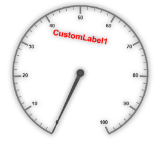
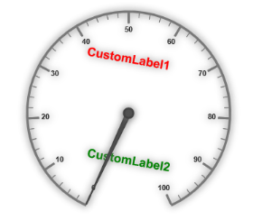
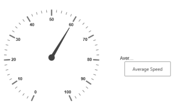

# Custom labels

Custom labels are the texts that you can use them in any location of the Gauge.

## Adding Custom Label Collection

Custom labels collection is directly added to the scale object. Refer the following code to add `CustomLabels` collection in a Gauge control.



<%--For Circular Gauge rendering-- %>

<ej:CircularGauge runat="server" ID="CircularGauge1"  >

<Scales>

<ej:CircularScales showLabels="true">

<%--custom label -- %>

<CustomLabelCollection>

<ej:CircularCustomLabel TextAngle="10" Color="red" Value="CustomLabel1">

<Position X="180" Y="100" />

</ej:CircularCustomLabel>

</CustomLabelCollection>

</ej:CircularScales>

</Scales>

</ej:CircularGauge>



### Basic Customization

* You can customize custom labels using the properties such as `TextAngle`, `Color` and `Font`. **TextAngle** attribute is used to display the custom labels in the specified angles and **Color** attribute is used to display the custom labels in specified color. 
* You can use `Value` attribute to set the text value in the custom labels. To display the custom labels, set `ShowCustomLabels` as ‘true’. To set the location of the custom label in Circular Gauge, `Position` property is used. By using `X` and `Y` axis you can adjust the position of the custom labels.
* Font option is also available on  custom labels. The basic three properties of fonts such as size, family and style can be achieved by `Size`, `FontStyle` and `FontFamily` attributes. 



        <%--For Circular Gauge rendering-- %>

        <ej:CircularGauge runat="server" ID="CircularGauge1"  >

        <Scales>

        <ej:CircularScales size="2" ShadowOffset="10" showRanges="true" ShowScaleBar="true" radius="150" showLabels="true">

        <%--For setting custom label text angle, color, font option, position-- %>

        <CustomLabelCollection>

        <ej:CircularCustomLabel TextAngle="10" Color="red" Value="CustomLabel1">

        

        <Position X="180" Y="100" />

        </ej:CircularCustomLabel>

        </CustomLabelCollection>

        </ej:CircularScales>

        </Scales>

        </ej:CircularGauge>


	
Execute the above code to render the following output.

 

## Multiple Custom Labels

You can set multiple custom labels in a single Circular Gauge by adding an array of custom label objects. Refer the following code example for multiple custom label functionality.



<%--For Circular Gauge rendering-- %>

<ej:CircularGauge runat="server" ID="CircularGauge1"  >

<Scales>

<ej:CircularScales size="2" ShadowOffset="10" showRanges="true" ShowScaleBar="true" radius="150" showLabels="true">

<CustomLabelCollection>

<ej:CircularCustomLabel TextAngle="10" Color="red" Value="CustomLabel1">

<Position X="180" Y="100" />

</ej:CircularCustomLabel>

<ej:CircularCustomLabel TextAngle="10" Color="green" Value="CustomLabel2">

<Position X="180" Y="250" />

</ej:CircularCustomLabel>

</CustomLabelCollection>

</ej:CircularScales>

</Scales>

</ej:CircularGauge>



Execute the above code to render the following output.

 

## Outer Custom Label

* Outer Custom Label is used to show custom labels outside the gauge control. The Outer Custom Label can be positioned with API called `OuterCustomLabelPosition`. The value for this API is enumerable type and its possible values are,
  
  1. Right
  
  2. Left
  
  3. Top
  
  4. Bottom
  
* When a custom label is to be displayed as an Outer Custom Label, set the API `PositionType` as Outer. Refer to the following code example to get the Outer Custom Label.



        <ej:circulargauge runat="server" id="circularGaugeTooltip" backgroundcolor="transparent" enableanimation="false"

        OuterCustomLabelPosition="Right">

        <%-- Defines the tooltip object-- %>

        <Tooltip ShowCustomLabelTooltip="true" ShowLabelTooltip="true" />

        <%-- Customizes the scale options-- %>

        <Scales>

        <ej:CircularScales ShowLabels="true" Radius="130" >

        <%-- Customizes the pointers options-- %>

        <PointerCollection>

        <ej:Pointers Value="60" Length="95" >

        </ej:Pointers>

        </PointerCollection>

        <%-- Customizes the custom label options-- %>

        <CustomLabelCollection>

        <ej:CircularCustomLabel Value="Average Speed">

        

        <Position X ="360" Y="30" />

        </ej:CircularCustomLabel>

        </CustomLabelCollection>

        </ej:CircularScales>

        </Scales>

        </ej:circulargauge>



Execute the above code to render the following output.

 

