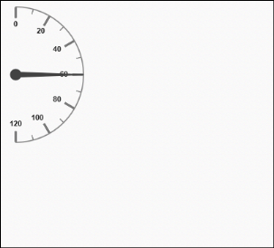

# Gauge Position

Semi-circular Gauge can be positioned within the canvas element which provides better appearance for the gauge in the canvas.

## Positioning

* Semi-circular Gauge can be positioned with the help of the attribute called `GaugePosition`. It is an enumerable value. You can position the gauge away from the corner with the help of the `DistanceFromCorner` attribute. 
* The possible enum values for the gaugePosition are as follows:
  
  
  1. TopLeft
  2. TopCenter
  3. TopRight
  4. MiddleLeft
  5. Center
  6. MiddleRight
  7. BottomLeft
  8. BottomCenter
  9. BottomRight

  

        <ej:CircularGauge runat="server" ID="SemiCircularGauge" Value="60"

        <%--setting basic dimension-- %>

        BackgroundColor="transparent" Width="500" Height="500" Radius="100"

        <%--setting gauge position-- %>

        GaugePosition="TopLeft"

        <%--setting gauge distance from corner-- %>

        DistanceFromCorner="25">

        <%--<setting frame values--%>

        <Frame FrameType="HalfCircle"

        HalfCircleFrameEndAngle="90"

        HalfCircleFrameStartAngle="270"/>

        <%--setting gauge distance from corner-- %>

        <Scales>

        <ej:CircularScales SweepAngle="180" StartAngle="270" Radius="100"

        ShowScaleBar="true" Size="1" Maximum="120"

        MajorIntervalValue="20" MinorIntervalValue="10">

        <%--setting scale border-- %>

        <Border Width="0.5">

        </Border>

        </ej:CircularScales>

        </Scales>

        </ej:CircularGauge>



Execute the above code to render the following output.

 

