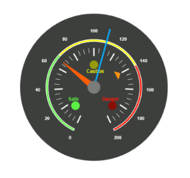
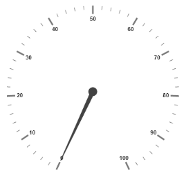
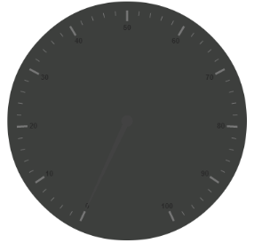
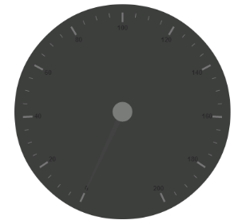
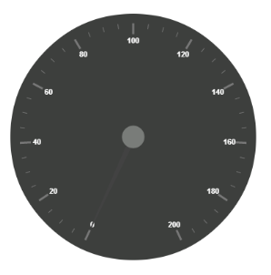
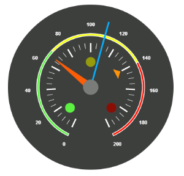

#  Getting Started

* The ASP.NET Circular Gauge provides support to display the CircularGauge within your web page and allows you to customize it. This section encompasses the details on how to configure Circular Gauge. 
* You will learn how to provide data for a Circular Gauge and to display that data in the required way. In addition, you will learn how to customize the default Circular Gauge appearance to your requirements. 
* As a result, you will get a Circular Gauge that shows how the Automobile speedometer works with rpm (Rotation per Minute), KmpH (Kilometer per hour) and denotes the speed level indication (Safe, Caution and Danger). 

## Speedometer Gauge

 
{:.image }

## Create a Circular Gauge

ASP.NET Circular Gauge widget basically renders with animation and flexible API’s. You can easily create the Circular Gauge widget by using simple code example as follows.

1. First create an ASP Project and adding necessary Dll’s and Scripts with the help of the given ASP-Getting Started Documentation.
2. Add the mentioned code to the corresponding designer page for Circular Gauge rendering.

[ASPX]

&lt;ej:CircularGauge runat="server" ID="CircularGauge1"&gt;

&lt;/ej:CircularGauge&gt;

Run the above code to get a default CircularGauge with default values as follows.

 
{:.image }

### Set Height and Width values

Pointers have different height and width range so you can set the height and width of the gauge according to your requirements.Set the basic values of the gauge such as height and width of the canvas element.

Code:

[ASPX]

&lt;ej:CircularGauge runat="server" ID="CircularGauge1" Height="500" Width="500"&gt;

&lt;/ej:CircularGauge&gt;

Run the above code to get the following output.

 
{:.image }

### Set Background Color

You can draw the speedometer with dark background and to vary the speed of the pointer you can set ReadOnly to ‘false’ for user Interaction. 

Code:

[ASPX]

&lt;ej:CircularGauge runat="server" ID="CircularGauge1" Height="500" Width="500" BackgroundColor="#3D3F3D" ReadOnly="false"&gt;

&lt;/ej:CircularGauge&gt;

Run the above code to get the following output.

 
{:.image }

### Provide scale values

* The pointer cap is customized with the following options. Cap radius, cap border color, cap background color, pointer cap border width are some of the properties that are customizable.
* The speed limit in the gauge has maximum value of 200KmpH.So you can set maximum value for the gauge as 200.
* Major Ticks have the interval value of 20 and minor ticks have the interval value of 5. Show ranges and show indicators are used to display the ranges and indicators in their respective positions.

Code:

[ASPX]

&lt;ej:CircularGauge runat="server" ID="CircularGauge1" Height="500" Width="500" BackgroundColor="#3D3F3D" ReadOnly="false"&gt;

&lt;Scales&gt;

<ej:CircularScales ShowRanges="true" ShowIndicators="true"

Maximum="200" MajorIntervalValue="20" MinorIntervalValue="5">

<PointerCap Radius="15" BackgroundColor="#797C79"

BorderColor="#797C79" BorderWidth="0">

&lt;/PointerCap&gt;

&lt;/ej:CircularScales&gt;

&lt;/Scales&gt;

&lt;/ej:CircularGauge&gt;

Run the above code to get the following output.

 
{:.image }

## Add Label Customization

To display the value around the scale, labels are used. By customizing the label color it displays as specified 

Code:

[ASPX]

&lt;ej:CircularGauge runat="server" ID="CircularGauge1" Height="500" Width="500" BackgroundColor="#3D3F3D" ReadOnly="false"&gt;

&lt;Scales&gt;

<ej:CircularScales ShowRanges="true" ShowIndicators="true"

Maximum="200" MajorIntervalValue="20" MinorIntervalValue="5">

<PointerCap Radius="15" BackgroundColor="#797C79"

BorderColor="#797C79" BorderWidth="0">

&lt;/PointerCap&gt;

&lt;%--Add the labels customization code here-- %&gt;

&lt;LabelCollection&gt;

&lt;ej:CircularLabels Color="#FFFFFF"&gt;&lt;/ej:CircularLabels&gt;

&lt;/LabelCollection&gt;

&lt;%--Add the pointers customization code here-- %&gt;

&lt;%--Add the ticks customization code here-- %&gt;

&lt;%--Add the ranges customization code here-- %&gt;

&lt;%--Add the indicators customization code here-- %&gt;

&lt;%--Add the Custom labels customization code here-- %&gt;

&lt;/ej:CircularScales&gt;

&lt;/Scales&gt;

&lt;/ej:CircularGauge&gt;

Run the above code to get the following output.

 
{:.image }

## Add pointers data

Here, you have three pointers that denote the kilometer value, rotation per minute value and torque value.The torque value pointer needs not to be similar to the other two pointers. You can set torque pointer as marker pointer. And you can set other attributes for pointer such as background color, border color, Length, width and distance from scale.

Code:

[ASPX]

&lt;ej:CircularGauge runat="server" ID="CircularGauge1" Height="500" Width="500" BackgroundColor="#3D3F3D" ReadOnly="false"&gt;

&lt;Scales&gt;

<ej:CircularScales ShowRanges="true" ShowIndicators="true"

Maximum="200" MajorIntervalValue="20" MinorIntervalValue="5">

<PointerCap Radius="15" BackgroundColor="#797C79"

BorderColor="#797C79" BorderWidth="0">

&lt;/PointerCap&gt;

&lt;%--Add the labels customization code here-- %&gt;

&lt;%--Add the pointers customization code here-- %&gt;

&lt;PointerCollection&gt;

<ej:Pointers Value="140" DistanceFromScale="60"

ShowBackNeedle="false" Length="20" Type="Marker"

MarkerType="Triangle" Width="10" BackgroundColor="#FF940A">

&lt;Border Color="#FF940A"/&gt;

&lt;/ej:Pointers&gt;

<ej:Pointers Value="110" ShowBackNeedle="false" Length="150"

NeedleType="Rectangle" Width="2" BackgroundColor="#05AFFF">

&lt;Border Color="#05AFFF"/&gt;

&lt;/ej:Pointers&gt;

<ej:Pointers Value="67" ShowBackNeedle="false" Length="100"

Width="15" BackgroundColor="#FC5D07">

&lt;Border Color="#FC5D07"/&gt;

&lt;/ej:Pointers&gt;

&lt;/PointerCollection&gt;

&lt;%--Add the ticks customization code here-- %&gt;

&lt;%--Add the ranges customization code here-- %&gt;

&lt;%--Add the indicators customization code here-- %&gt;

&lt;%--Add the Custom labels customization code here-- %&gt;

&lt;/ej:CircularScales&gt;

&lt;/Scales&gt;

&lt;/ej:CircularGauge&gt;

Run the above code to get the following output.

 
{:.image }

Add Ticks Details

You can set major ticks with their width and height greater than Minor ticks. Color must be given for better visibility in dark backgrounds.

Code:

[ASPX]

&lt;ej:CircularGauge runat="server" ID="CircularGauge1" Height="500" Width="500" BackgroundColor="#3D3F3D" ReadOnly="false"&gt;

&lt;Scales&gt;

<ej:CircularScales ShowRanges="true" ShowIndicators="true"

Maximum="200" MajorIntervalValue="20" MinorIntervalValue="5">

<PointerCap Radius="15" BackgroundColor="#797C79"

BorderColor="#797C79" BorderWidth="0">

&lt;/PointerCap&gt;

&lt;%--Add the labels customization code here-- %&gt;

&lt;%--Add the pointers customization code here-- %&gt;

&lt;%--Add the ticks customization code here-- %&gt;

&lt;TickCollection&gt;

<ej:CircularTicks Type="Major" DistanceFromScale="70"

Height="20" Width="3" Color="#FFFFFF"/>

<ej:CircularTicks Type="Minor" DistanceFromScale="70"

Height="12" Width="1" Color="#FFFFFF" />

&lt;/TickCollection&gt;

&lt;%--Add the ranges customization code here-- %&gt;

&lt;%--Add the indicators customization code here-- %&gt;

&lt;%--Add the Custom labels customization code here-- %&gt;

&lt;/ej:CircularScales&gt;

&lt;/Scales&gt;

&lt;/ej:CircularGauge&gt;

Run the above code to get the following output.

 
{:.image }

Add Range Values

* Ranges denote the property of the scale value in the speedometer. The color values of the ranges specifiy the speed variation. Set ShowRanges to ‘true’ for showing the ranges in the Circular Gauge.
* For Low speed, you can mention it as safe zone; for moderate speed, you can  give as caution zone and for high speed, you can notify it as high speed.
* You can customize the range with the properties such as start value, end value, start width, end width,  background color , border color, etc.,

Code:

[ASPX]

&lt;ej:CircularGauge runat="server" ID="CircularGauge1" Height="500" Width="500" BackgroundColor="#3D3F3D" ReadOnly="false"&gt;

&lt;Scales&gt;

<ej:CircularScales ShowRanges="true" ShowIndicators="true"

Maximum="200" MajorIntervalValue="20" MinorIntervalValue="5">

<PointerCap Radius="15" BackgroundColor="#797C79"

BorderColor="#797C79" BorderWidth="0">

&lt;/PointerCap&gt;

&lt;%--Add the labels customization code here-- %&gt;

&lt;%--Add the pointers customization code here-- %&gt;

&lt;%--Add the ticks customization code here-- %&gt;

&lt;%--Add the ranges customization code here-- %&gt;

&lt;RangeCollection&gt;

<ej:CircularRanges DistanceFromScale="30" StartValue="0"

EndValue="70"

BackgroundColor="#5DF243">

&lt;Border Color="#FFFFFF"/&gt;

&lt;/ej:CircularRanges&gt;

<ej:CircularRanges DistanceFromScale="30" StartValue="70"

EndValue="140"

BackgroundColor="#F6FF0A">

&lt;Border Color="#FFFFFF"/&gt;

&lt;/ej:CircularRanges&gt;

<ej:CircularRanges DistanceFromScale="30" StartValue="140"

EndValue="200"

BackgroundColor="#FF1807">

&lt;Border Color="#FFFFFF"/&gt;

&lt;/ej:CircularRanges&gt;

&lt;/RangeCollection&gt;

&lt;%--Add the indicators customization code here-- %&gt;

&lt;%--Add the Custom labels customization code here-- %&gt;

&lt;/ej:CircularScales&gt;

&lt;/Scales&gt;

&lt;/ej:CircularGauge&gt;

Run the above code to get the following output.

 
{:.image }

Add Indicator Details

* Indicators denote whether the pointers values are in their respective zones or not. Positioning the indicator on the respective range value gives the required changes.
* By using Position property, you can set location of the indicator. StateRanges defines how the indicator should behave when the pointer is in certain values. 

Code:

[ASPX]

&lt;ej:CircularGauge runat="server" ID="CircularGauge1" Height="500" Width="500" BackgroundColor="#3D3F3D" ReadOnly="false"&gt;

&lt;Scales&gt;

<ej:CircularScales ShowRanges="true" ShowIndicators="true"

Maximum="200" MajorIntervalValue="20" MinorIntervalValue="5">

<PointerCap Radius="15" BackgroundColor="#797C79"

BorderColor="#797C79" BorderWidth="0">

&lt;/PointerCap&gt;

&lt;%--Add the labels customization code here-- %&gt;

&lt;%--Add the pointers customization code here-- %&gt;

&lt;%--Add the ticks customization code here-- %&gt;

&lt;%--Add the ranges customization code here-- %&gt;

&lt;%--Add the indicators customization code here-- %&gt;

&lt;IndicatorCollection&gt;

<ej:CircularIndicators Type="Circle"

Height="10" Width="10">

&lt;Position X="210" Y="300"/&gt;

&lt;StateRangeCollection&gt;

<ej:CircularStateRanges StartValue="0" EndValue="70"

BackgroundColor="#5DF243" BorderColor="#5DF243">

&lt;/ej:CircularStateRanges&gt;

<ej:CircularStateRanges StartValue="70" EndValue="200"

BackgroundColor="#145608" BorderColor="#145608">

&lt;/ej:CircularStateRanges&gt;

&lt;/StateRangeCollection&gt;

&lt;/ej:CircularIndicators&gt;

<ej:CircularIndicators Type="Circle"

Height="10" Width="10">

&lt;Position X="255" Y="200"/&gt;

&lt;StateRangeCollection&gt;

<ej:CircularStateRanges StartValue="0" EndValue="70"

BackgroundColor="#969B0C" BorderColor="#969B0C">

&lt;/ej:CircularStateRanges&gt;

<ej:CircularStateRanges StartValue="70" EndValue="140"

BackgroundColor="#F6FF0A" BorderColor="#F6FF0A">

&lt;/ej:CircularStateRanges&gt;

<ej:CircularStateRanges StartValue="140" EndValue="200"

BackgroundColor="#969B0C" BorderColor="#969B0C">

&lt;/ej:CircularStateRanges&gt;

&lt;/StateRangeCollection&gt;

&lt;/ej:CircularIndicators&gt;

<ej:CircularIndicators Type="Circle"

Height="10" Width="10">

&lt;Position X="300" Y="300"/&gt;

&lt;StateRangeCollection&gt;

<ej:CircularStateRanges StartValue="140" EndValue="200"

BackgroundColor="#FF1807" BorderColor="#FF1807">

&lt;/ej:CircularStateRanges&gt;

<ej:CircularStateRanges StartValue="0" EndValue="140"

BackgroundColor="#890F06" BorderColor="#890F06">

&lt;/ej:CircularStateRanges&gt;

&lt;/StateRangeCollection&gt;

&lt;/ej:CircularIndicators&gt;

&lt;/IndicatorCollection&gt;

&lt;%--Add the Custom labels customization code here-- %&gt;

&lt;/ej:CircularScales&gt;

&lt;/Scales&gt;

&lt;/ej:CircularGauge&gt;

Run the above code to get the following output.

 
{:.image }

Add Custom Label Details

Custom labels are used to specify the texts that need to be displayed in the gauge .you can customize it using various properties.To display the three range description, custom texts are used here.

Code:

[ASPX]

&lt;ej:CircularGauge runat="server" ID="CircularGauge1" Height="500" Width="500" BackgroundColor="#3D3F3D" ReadOnly="false"&gt;

&lt;Scales&gt;

<ej:CircularScales ShowRanges="true" ShowIndicators="true"

Maximum="200" MajorIntervalValue="20" MinorIntervalValue="5">

<PointerCap Radius="15" BackgroundColor="#797C79"

BorderColor="#797C79" BorderWidth="0">

&lt;/PointerCap&gt;

&lt;%--Add the labels customization code here-- %&gt;

&lt;%--Add the pointers customization code here-- %&gt;

&lt;%--Add the ticks customization code here-- %&gt;

&lt;%--Add the ranges customization code here-- %&gt;

&lt;%--Add the indicators customization code here-- %&gt;

&lt;%--Add the Custom labels customization code here-- %&gt;

&lt;CustomLabelCollection&gt;

&lt;ej:CircularCustomLabel Color="#5DF243" Value="Safe"&gt;

&lt;Position X="200" Y="280"/&gt;

&lt;/Font&gt;

&lt;/ej:CircularCustomLabel&gt;

&lt;ej:CircularCustomLabel Color="#F6FF0A" Value="Caution"&gt;

&lt;Position X="253" Y="212"/&gt;

&lt;/Font&gt;

&lt;/ej:CircularCustomLabel&gt;

&lt;ej:CircularCustomLabel Color="#FF1807" Value="Danger"&gt;

&lt;Position X="290" Y="280"/&gt;

&lt;/Font&gt;

&lt;/ej:CircularCustomLabel&gt;

&lt;/CustomLabelCollection&gt;

&lt;/ej:CircularScales&gt;

&lt;/Scales&gt;

&lt;/ej:CircularGauge&gt;

The final output is as follows.

 
{:.image }

