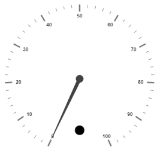
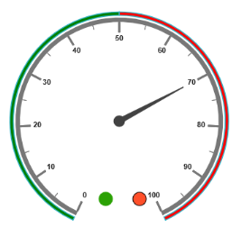

# Indicators

Indicators simply indicates the current status of the pointer. `Indicators` are in several formats such as in shape format, textual format and image format.

## Adding Indicator Collection 

Indicators collection is directly added to the scale object. Refer the following code to add indicator collection in a Gauge control.



<%--For Circular Gauge rendering-- %>

<ej:CircularGauge runat="server" ID="ScaleCircularGauge">

<Scales>

<ej:CircularScales Showindicators="true" >

<IndicatorCollection>

<ej:CircularIndicators Height="10" width="10" Type="Circle">

<Position X="185" Y="300" />

</ej:CircularIndicators>

</IndicatorCollection>

</ej:CircularScales>

</Scales>

</ej:CircularGauge>



Execute the above code to render the following output.

 

## Basic Customization

* You can enable indicators by setting `ShowIndicators` to ‘true’. The `Height` and `Width` property for the indicators are used to specify the area allocated to the indicator for the width and height respectively. You can use the `Position` collection to position the indicators along `X` and `Y` axis. 
* Indicators are of several types such as, circle, rectangle, rounded rectangle, text and image. By using the `Type` property you can avail those shapes. For image type `ImageUrl` property is used. 



        <%--For Circular Gauge rendering-- %>

        <ej:CircularGauge runat="server" ID="ScaleCircularGauge">

        <Scales>

        <ej:CircularScales Showindicators="true" backgroundColor="#5DF243" ShowscaleBar="true"  Size="5" radius="120" MinorIntervalValue="5" >

        <Border Width="1.5" Color="black" />

        <PointerCollection>

        <ej:Pointers BackgroundColor="#5DF243" length="110"></ej:Pointers>

        </PointerCollection>

        <labelCollection>

        <ej:CircularLabels type="major" />

        </labelCollection>

        <IndicatorCollection>

        <ej:CircularIndicators Height="10" width="10" Type="Circle" >

        <Position X="185" Y="300" />

        </ej:CircularIndicators>

        </IndicatorCollection>

        </ej:CircularScales>

        </Scales>

        </ej:CircularGauge>



Execute the above code to render the following output.

 

## State Ranges

* State ranges are used to specify the indicator behavior in the specified region. Use `StartValue` and `EndValue` to set the range bound for the pointer. Whenever the pointer cross the specified region, the indicator attributes are applied for ranges. 
* The `BackgroundColor` and `BorderColor` sets the appearance behavior for the indicators. For text type indicators you can give value for text. And `Text` can be changed whenever the pointer crosses its state range area. There are many basic `Font` options available for the text in the state range such as `Size`, `FontStyle` and `FontFamily`.



        <%--For Circular Gauge rendering-- %>

        <ej:CircularGauge runat="server" ID="ScaleCircularGauge">

        <Scales>

        <ej:CircularScales Showindicators="true" backgroundColor="#5DF243" ShowscaleBar="true"  Size="5" radius="150" MinorIntervalValue="5" >

        <Border Width="1.5" Color="black" />

        <PointerCollection>

        <ej:Pointers BackgroundColor="#5DF243" length="110"></ej:Pointers>

        </PointerCollection>

        <IndicatorCollection>

        <ej:CircularIndicators Height="10" width="10" Type="Circle" >

        <Position X="185" Y="300" />

        <StateRangeCollection> <ej: CircularStateRanges EndValue="100" startValue="0" text="" TextColor="#870505" BackgroundColor="#5DF243" BorderColor="black"></ej: CircularStateRanges></StateRangeCollection><%--For setting state range end value, start value, text, text color, background color and bordercolor-- %>

        </ej:CircularIndicators>

        </IndicatorCollection>

        </ej:CircularScales>

        </Scales>

        </ej:CircularGauge>



Execute the above code to render the following output.

 

## Multiple Indicators

You can use multiple indicators for a single Gauge. Each indicator have a list of `StateRanges`. Refer the following code example for multiple Indicators.



<%--For Circular Gauge rendering-- %>

<ej:CircularGauge runat="server" ID="ScaleCircularGauge">

<Scales>

<ej:CircularScales Showindicators="true" ShowRanges="true"  ShowscaleBar="true"  Size="5" radius="150" MinorIntervalValue="5" >

<PointerCollection>

<ej:Pointers  Value="70"  length="110"></ej:Pointers>

</PointerCollection>

<IndicatorCollection>

<%--indicator1 -- %>

<ej:CircularIndicators Height="10" width="10" Type="Circle"

<Position X="165" Y="300" />

<StateRangeCollection>

<ej:CircularStateRanges EndValue="50" startValue="0" BackgroundColor="#24F92F" BorderColor="black"></ej:CircularStateRanges>

<ej:CircularStateRanges EndValue="50" startValue="100" BackgroundColor="#322C04" BorderColor="black"></ej:CircularStateRanges></StateRangeCollection>

</ej:CircularIndicators>

<%--indicator2-- %>

<ej:CircularIndicators Height="10" width="10" Type="Circle" >

<Position X="215" Y="300" />

<StateRangeCollection>

<ej:CircularStateRanges EndValue="50" startValue="0" BackgroundColor="#600000" BorderColor="black"></ej:CircularStateRanges>

<ej:CircularStateRanges EndValue="100" startValue="50" BackgroundColor="#FF4F2A" BorderColor="black"></ej:CircularStateRanges></StateRangeCollection>

</ej:CircularIndicators>

</IndicatorCollection>

<RangeCollection>

<ej:CircularRanges DistanceFromScale="-30" startvalue="0" EndValue="50" BackgroundColor="green" Placement="Far"></ej:CircularRanges>

<ej:CircularRanges DistanceFromScale="-30" StartValue="50" EndValue="100" BackgroundColor="red" Placement="Far"></ej:CircularRanges>

</RangeCollection>

</ej:CircularScales>

</Scales>

</ej:CircularGauge>



Execute the above code to render the following output.

 

