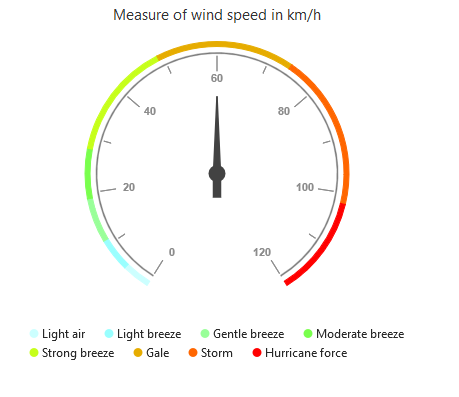
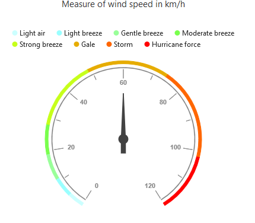
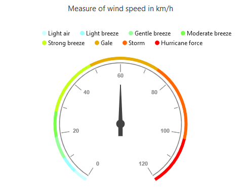
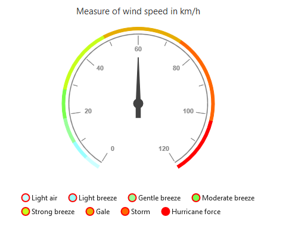
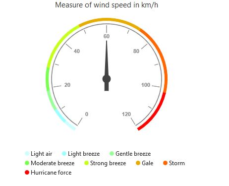
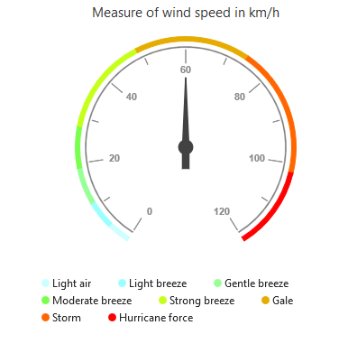
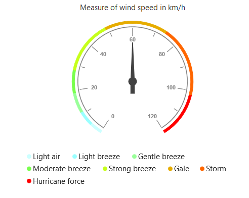

# Legend

The `Legend` contains the list of the ranges that appear in the circular gauge  

## Legend Visibility

By default, the legend will not be displayed in the circular gauge. You can enable or disable it by using the `Visible` property of the legend.



<ej:CircularGauge runat="server" ID="ScaleCircularGauge">
 <Legend Visible="true"></Legend>
</ej:CircularGauge>



[Click](http://asp.syncfusion.com/demos/web/circulargauge/legend.aspx) here to view the online demo sample for  legend in the circular Gauge.

### Legend Text

The text displayed in the legend can be customized by using the `LegendText` property present in the ranges of the circular gauge. When the legendText is not specified in the ranges, then the legend item for that particular range will not displayed. By default the legendText value is null . 



<ej:CircularGauge runat="server" ID="ScaleCircularGauge">
<Scales>
<ej:CircularScales >
<RangeCollection>
<ej:CircularRanges LegendText="Light air">
</ej:CircularRanges>
</RangeCollection>
</ej:CircularScales>
</Scales>
</ej:CircularGauge>



## Position and Align the Legend

By using the `Position` property, you can position the legend at *left*, *right*, *top* or *bottom* of the CircularGauge. The legend is positioned at the **bottom** of the circular gauge, by default.



<ej:CircularGauge runat="server" ID="ScaleCircularGauge">
 <Legend Visible="true" Position="Top"></Legend>
</ej:CircularGauge>



### Legend Alignment

You can align the legend to the *center*, *far* or *near* based on its position by using the `Alignment` property.



<ej:CircularGauge ID="ScaleCircularGauge" runat="server"> 
   <%--The below two settings will place the legend at the top-right corner of the chart--%>
    <Legend Position="Top" Alignment="Far">
    </Legend>
</ej:CircularGauge>



## Customization

### Legend Fill and Opacity

You can change the opacity and fill color of legend text using `Opacity` and `Fill` property of legend. 



<ej:CircularGauge ID="ScaleCircularGauge" runat="server"> 
   <%--Change legend shape--%>
    <Legend Fill="red" Opacity="0.5">
    </Legend>
</ej:CircularGauge>



### Legend shape

To change the legend item shape, you have to specify the desired shape in the `Shape` property of the legend. By default, the shape of the legend is **circle**.It also supports rectangle,diamond,triangle,slider,line,pentagon,trapezoid and wedge shapes.



<ej:CircularGauge ID="ScaleCircularGauge" runat="server"> 
   <%--Change legend shape--%>
    <Legend Shape="Slider">
    </Legend>
</ej:CircularGauge>



### Legend Item Size and Border

You can change the size of the legend items by using the `Width` and `Height` properties in the **ItemStyle**. To change the legend item border, use `Border` property of the legend itemStyle.



<ej:CircularGauge ID="ScaleCircularGauge" runat="server"> 
   
    <Legend>
        <%--Change legend items border, height and width--%>
        <ItemStyle Width="13" Height="13">
            <Border Width="2" Color="#FF0000" />
        </ItemStyle>
    </Legend>
</ej:CircularGauge>



### Legend size

You can change the default legend size by using the `Size` property of the legend. The height and width of legend size can customized using `Height` and `Width` property.    



<ej:CircularGauge ID="ScaleCircularGauge" runat="server"> 
   
    <Legend>
        <%--Change legend size--%>
        <Size Height="100" Width="350" />
    </Legend>
</ej:CircularGauge>



### Legend Item Padding

You can control the spacing between the legend items by using the `ItemPadding` option of the legend.  The default value is 20. 


  <ej:CircularGauge ID="ScaleCircularGauge" runat="server"> 
   <%--Add space between each legend item--%>
    <Legend ItemPadding="30">
    </Legend>
</ej:CircularGauge>



### Legend border

You can customize the legend border by using the `Border` option in the legend. 



<ej:CircularGauge ID="ScaleCircularGauge" runat="server"> 
   <%--Set border color and width to legend--%>
    <Legend>
        <Border Color="#FFC342" Width="2" />
    </Legend>
</ej:CircularGauge>



### Font of the legend text

The `Font` of the legend item text can be customized by using properties such as `FontFamily`, `FontStyle`, `FontWeight` and `Size` of legend font.



<ej:CircularGauge ID="ScaleCircularGauge" runat="server"> 
    <Legend>
        <%--Customize the legend item text--%>
        
       </Legend>
</ej:CircularGauge>



## Events

### Legend Item Render

`OnClientLegendItemRender` event triggers before rendering the legend items. This event is triggered for each legend item in Circular gauge. You can use this event to customize legend item shape or add custom text to legend item dynamically



<ej:CircularGauge ID="ScaleCircularGauge" runat="server" OnClientLegendItemRender="onLegendRender"> 
   
</ej:CircularGauge>

 
     
   
     
     function onLegendRender(sender) {
        //Get legend item details on legend item click.
        var legendItem = sender.data;
      }



### Legend Item Click

You can get the legend item details such as *RangeIndex, bounds and shape* by subscribing the **OnClientLegendItemClick** event of the circular gauge. When the legend item is clicked, it triggers the event and returns the legend information 



<ej:CircularGauge ID="ScaleCircularGauge" runat="server" OnClientLegendItemClick="onLegendClicked"> 
</ej:CircularGauge>

 
     
   
     
     function onLegendClicked(sender) {
        //Get legend item details on legend item click.
        var legendItem = sender.data;
      }

