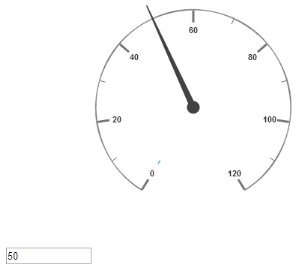
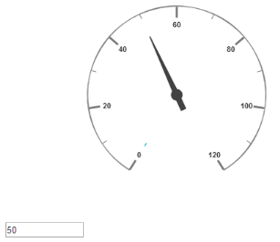
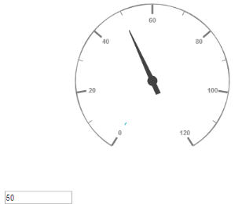
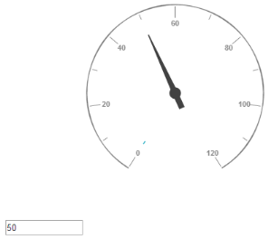
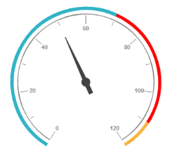
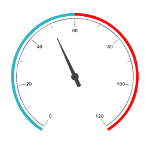

# MVVM

## Angular JS

Circular Gauge contains angular support. You can add object as well as array object in the Circular Gauge. The two way binding support is given to the pointer value, minimum scale value and maximum scale value. 

### Rendering the Circular Gauge

ej-CircularGauge is the control tag in which ej is tag prefix and CircularGauge is the control name.The following code example helps you to render Circular Gauge.



&lt;asp:Content ID="ControlContent" runat="server" ContentPlaceHolderID="ControlsSection"&gt;

&lt;div ng-app="syncApp"&gt;

&lt;div ng-controller="CircularGauge"&gt;

<ej-CircularGauge id="CircularGauge1" e-backgroundColor="transparent" e-value="50"

e-width="500" e-readOnly="false" e-load= "loadGaugeTheme"

e-enableAnimation="false">

&lt;/ej-CircularGauge&gt;

&lt;asp:Content&gt;

&lt;/div&gt;

&lt;/div&gt;

&lt;script type="text/javascript"&gt;

&lt;!—binding the value to the scope variables in application controller--&gt;

angular.module('syncApp', ['ejangular'])

.controller('CircularGauge', function ($scope) {

$scope.nvalue = 50;

$scope.nminimum = 0;

$scope.nmaximum = 120;

});

&lt;/script&gt;



Execute the above code to render the output as follows.

 
{:.image }

### Adding Scale Collection

Scale is an array object and you can use the inner tag for it. Object in the array collection (i.e. border) is extended with hyphen in the same tag.

Example: e-border-width and e-border-color. 



&lt;!--To Render the Circular gauge--&gt;

&lt;ej-CircularGauge id="CircularGauge1"&gt;

&lt;!--Adding Scale collection to the Circular gauge--&gt;

&lt;e-scales&gt;

<e-scale e-showRanges="true" e-startAngle="122" e-sweepAngle="296"

e-radius="130" e-showScaleBar="true" e-size="1" e-maximum="120"

e-majorIntervalValue="20" e-minorIntervalValue="10"

e-border-width="0.5">

&lt;/e-scale&gt;

&lt;/e-scales&gt;

&lt;/ej-CircularGauge&gt;



Execute the above code to render the following output.

 
{:.image }

### Adding Pointer Collection

Pointer is an array object and you can use the inner tag for it. Object in the array collection (i.e. pointer cap) is extended with hyphen in the same tag.

Example: e-pointerCap-radius. 



&lt;!--To Render the Circular gauge--&gt;

&lt;ej-CircularGauge id="CircularGauge1"&gt;

&lt;!--Adding Scale collection to the Circular gauge--&gt;

&lt;e-scales&gt;

&lt;e-scale&gt;

&lt;!--Adding pointer collection to the scale collection--&gt;

&lt;e-pointers&gt;

<e-pointer e-showBackNeedle="true" e-backNeedleLength="20"

e-length="95" e-width="7" e-value="80"

e-pointerCap-radius="12">

&lt;/e-pointer&gt;

&lt;/e-pointers&gt;

&lt;/e-scale&gt;

&lt;/e-scales&gt;

&lt;/ej-CircularGauge&gt;



Execute the above code to render the output as follows.

 
{:.image }

### Adding Label Collection

Label is also an array object. You can use the inner tag for it. 



&lt;!--To Render the Circular gauge--&gt;

&lt;ej-CircularGauge id="CircularGauge1"&gt;

&lt;!--Adding Scale collection to the Circular gauge--&gt;

&lt;e-scales&gt;

&lt;e-scale&gt;

&lt;!--Adding pointer collection to the scale collection--&gt;

&lt;e-pointers&gt;…&lt;/e-pointers&gt;

&lt;!--Adding labels collection to the scale collection--&gt;

&lt;e-labels&gt;

&lt;e-label e-color="#8c8c8c"&gt;

&lt;/e-label&gt;

&lt;/e-labels&gt;

&lt;/e-scale&gt;

&lt;/e-scales&gt;

&lt;/ej-CircularGauge&gt;



Execute the above code to render the following output.

 
{:.image }

### Adding Tick Colection

Tick is an array object. You can use the inner tag for it. 



&lt;!--To Render the Circular gauge--&gt;

&lt;ej-CircularGauge id="CircularGauge1"&gt;

&lt;!--Adding Scale collection to the Circular gauge--&gt;

&lt;e-scales&gt;

&lt;e-scale&gt;

&lt;!--Adding pointer collection to the scale collection--&gt;

&lt;e-pointers&gt;…&lt;/e-pointers&gt;

&lt;!--Adding labels collection to the scale collection--&gt;

&lt;e-labels&gt;…&lt;/e-labels&gt;

&lt;!--Adding ticks collection to the scale collection--&gt;

&lt;e-ticks&gt;

<e-tick e-type="major" e-distanceFromScale="2" e-height="16"

e-width="1" e-color="#8c8c8c">

&lt;/e-tick&gt;

<e-tick e-type="minor" e-distanceFromScale="2" e-height="8"

e-width="1" e-color="#8c8c8c">

&lt;/e-tick&gt;

&lt;/e-ticks&gt;

&lt;/e-scale&gt;

&lt;/e-scales&gt;

&lt;/ej-CircularGauge&gt;



Execute the above code to render the following output.

 
{:.image }

### Adding Range Collection

Range is an array object. You can use the inner tag for it. Object in the array collection (i.e. border) is extended with hyphen in the same tag.

Example: e-border-color. 



&lt;!--To Render the Circular gauge--&gt;

&lt;ej-CircularGauge id="CircularGauge1"&gt;

&lt;!--Adding Scale collection to the Circular gauge--&gt;

&lt;e-scales&gt;

&lt;e-scale&gt;

&lt;!--Adding pointer collection to the scale collection--&gt;

&lt;e-pointers&gt;…&lt;/e-pointers&gt;

&lt;!--Adding labels collection to the scale collection--&gt;

&lt;e-labels&gt;…&lt;/e-labels&gt;

&lt;!--Adding ticks collection to the scale collection--&gt;

&lt;e-ticks&gt;…&lt;/e-ticks&gt;

&lt;!--Adding ranges collection to the scale collection--&gt;

&lt;e-ranges&gt;

&lt;e-range e-distanceFromScale="-30" e-startValue="0" e-endValue="70"&gt;

&lt;/e-range&gt;

<e-range e-distanceFromScale="-30" e-startValue="70"

e-endValue="110" e-backgroundColor="#fc0606"

e-border-color="#fc0606">

&lt;/e-range&gt;

<e-range e-distanceFromScale="-30" e-startValue="110"

e-endValue="120" e-backgroundColor="#f5b43f"

e-border-color="#f5b43f">

&lt;/e-range&gt;

&lt;/e-ranges&gt;

&lt;/e-scale&gt;

&lt;/e-scales&gt;

&lt;/ej-CircularGauge&gt;



Execute the above code to render the following output.

 
{:.image }

### Two Way Binding 

Circular Gauge support the two way binding for the property value, minimum and maximum as mentioned earlier. The following code example explains how to achieve the two way binding in Circular Gauge.



&lt;asp:Content ID="ControlContent" runat="server" ContentPlaceHolderID="ControlsSection"&gt;

&lt;div ng-app="syncApp"&gt;

&lt;div ng-controller="CircularGauge"&gt;

&lt;ej-CircularGauge id="CircularGauge1" e-backgroundColor="transparent" e-value="nvalue" e-width="500" e-readOnly="false" e-load= "loadGaugeTheme" e-enableAnimation="false"&gt;

&lt;e-scales&gt;

<e-scale e-showRanges="true" e-startAngle="122" e-sweepAngle="296"

e-radius="130" e-showScaleBar="true" e-size="1"

&lt;!—binding maximum value using angular JS --&gt;

e-maximum="nmaximum"

&lt;!—binding minimum value using angular JS --&gt;

e-minimum="nminimum"

e-majorIntervalValue="20"

e-minorIntervalValue="10" e-border-width="0.5">

&lt;e-pointers&gt;

<e-pointer e-showBackNeedle="true" e-backNeedleLength="20"

e-length="95" e-width="7"

&lt;!—binding pointer value using angular JS --&gt;

e-value="nvalue"

e-pointerCap-radius="12">

&lt;/e-pointer&gt;

&lt;/e-pointers&gt;

&lt;e-labels&gt;

&lt;e-label e-color="#8c8c8c"&gt;&lt;/e-label&gt;

&lt;/e-labels&gt;

&lt;e-ticks&gt;

<e-tick e-type="major" e-distanceFromScale="2" e-height="16"

e-width="1" e-color="#8c8c8c">

&lt;/e-tick&gt;

<e-tick e-type="minor" e-distanceFromScale="2" e-height="8"

e-width="1" e-color="#8c8c8c">

&lt;/e-tick&gt;

&lt;/e-ticks&gt;

&lt;e-ranges&gt;

&lt;e-range e-distanceFromScale="-30" e-startValue="0" e-endValue="70"&gt;

&lt;/e-range&gt;

<e-range e-distanceFromScale="-30" e-startValue="70"

e-endValue="110" e-backgroundColor="#fc0606"

e-border-color="#fc0606">

&lt;/e-range&gt;

<e-range e-distanceFromScale="-30" e-startValue="110"

e-endValue="120" e-backgroundColor="#f5b43f"

e-border-color="#f5b43f">

&lt;/e-range&gt;

&lt;/e-ranges&gt;

&lt;/e-scale&gt;

&lt;/e-scales&gt;

&lt;/ej-CircularGauge&gt;

&lt;input type="text" id="txtMax" e-value="nvalue" ej-numerictextbox ng-model="nvalue"  e-decimalplaces="2" e-showspinbutton="false" Style="width:110px"/&gt;

&lt;/asp:Content&gt;

&lt;/div&gt;

&lt;/div&gt;

&lt;script type="text/javascript"&gt;

&lt;!—binding the value to the scope variables in application controller--&gt;

angular.module('syncApp', ['ejangular'])

.controller('CircularGauge', function ($scope) {

$scope.nvalue = 50;

$scope.nminimum = 0;

$scope.nmaximum = 120;

});

&lt;/script&gt;



Execute the above code to render the following output.

 
{:.image }

### Knockout JS

* Knockout support allows you to bind the HTML elements against any of the available data models.Two types of knockout binding is supported as of angular,
1. one-way binding
2. two-way binding
* One way binding refers to the process of applying observable values to all the available properties of the Circular Gauge control, but the changes made in gauge control does not reflect and trigger in turn to the observable collection. This kind of binding applies to all the properties of the circular gauge control.
* Two-way binding supports both the processes – it applies the observable values to the Circular Gauge properties as well as the changes made in the Circular Gauge control also reflects back and triggers within the observable collections. Only few of the schedule properties support two-way binding and they are as follows
1. value
2. maximum 
3. minimum



&lt;%--content section to refer script files-- %&gt;

&lt;%--control section-- %&gt;

&lt;/div&gt;

&lt;script type="text/javascript"&gt;

window.viewModel = {

samplevalue: ko.observable(50),

sampleminimum: ko.observable(0),

samplemaximum: ko.observable(120),

};

$(function () {

ko.applyBindings(viewModel);

$("#sampleProperties").ejPropertiesPanel();

});

&lt;/script&gt;



Execute the above code to render the following output. The following screenshot is the output of ASP.

 
{:.image }

