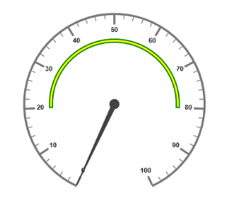
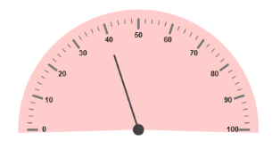

#  Ranges and Frames

`Ranges` are used to specify or group the scale values. By using ranges, you can describe the values in the pointers. 

## Adding Range Collection

Range collection is directly added to the scale object. Refer the following code example to add range collection in a Gauge control. 



<%--For Circular Gauge rendering-- %>

<ej:CircularGauge runat="server" ID="ScaleCircularGauge">

<Scales>

<ej:CircularScales ShowRanges="true">

<RangeCollection>

<ej:CircularRanges StartValue="20" EndValue="80" BackgroundColor="green" Placement="far">

</ej:CircularRanges>

</RangeCollection>

</ej:CircularScales>

</Scales>

</ej:CircularGauge>



### Range Customization

#### Appearance

* The API `Size` is used to specify the width of the ranges.  The major attributes for ranges are `StartValue` and `EndValue`. **StartValue** defines the start position of the ranges and **EndValue** defines the end position of the ranges.
* `StartWidth` and `EndWidth` are used to specify the range width at the starting and ending position of the ranges. You can add the gradient effects and opacity to the ranges by using `Gradient` object and `Opacity` property.



        <%--For Circular Gauge rendering-- %>

        <ej:CircularGauge runat="server" ID="CircularGauge1">

        <Scales>

        <ej:CircularScales ShowRanges="true"  ShowscaleBar="true" radius="150" Size="5">

        <PointerCollection>

        <ej:Pointers  Value="0"  length="110"></ej:Pointers>

        </PointerCollection>

        <labelCollection>

        <ej:CircularLabels type="major" />

        </labelCollection>

        <RangeCollection>

        <ej:CircularRanges StartValue="20" endValue="80" BackgroundColor="green" Placement="far">

        </ej:CircularRanges>

        </RangeCollection>

        </ej:CircularScales>

        </Scales>

        </ej:CircularGauge>



Execute the above code to render the following output.

 

#### Colors and Border

* By customizing the ranges, the appearance of the Gauge can be improved. The range border is modified with the object called `Border`. It has two border property such as `Color` and `Width`. These are used to customize the border color of the ranges and border width of the ranges. 
* You can set the background color to improve the look and feel of the Circular Gauge. For customizing the background color of the ranges, `BackgroundColor` is used.



        <%--For Circular Gauge rendering-- %>

        <ej:CircularGauge runat="server" ID="CircularGauge1">

        <Scales>

        <ej:CircularScales ShowRanges="true"  ShowscaleBar="true" radius="150" Size="2">

        <%--For setting range start value, end value, background color and border color-- %>

        <RangeCollection>

        <ej:CircularRanges StartValue="20" endValue="80" BackgroundColor="yellow" Placement="far">

        <Border Color="green" Width="2" />

        </ej:CircularRanges>

        </RangeCollection>

        </ej:CircularScales>

        </Scales>

        </ej:CircularGauge>



Execute the above code to render the following output.

 

#### Position the ranges

* You can position ranges using two properties such as `DistanceFromScale` and `Placement`. 
* **DistanceFromScale** property defines the distance between the scale and range. 
* **Placement property** is used to locate the pointer with respect to scale either inside the scale or outside the scale or along the scale. It is an enumerable data type.



        <%--For Circular Gauge rendering-- %>

        <ej:CircularGauge runat="server" ID="CircularGauge1">

        <Scales>

        <ej:CircularScales ShowRanges="true"  ShowscaleBar="true" radius="150" Size="2">

        <%--For setting range start value, end value, distance between scale and ranges-- %> 

        <RangeCollection>

        <ej:CircularRanges StartValue="0" endValue="100" BackgroundColor="green" Placement="far" DistanceFromScale="-30">

        <Border width="2" Color="black" />

        </ej:CircularRanges>

        </RangeCollection>

        </ej:CircularScales>

        </Scales>

        </ej:CircularGauge>



Execute the above code to render the following output.

  

### Multiple Ranges

You can set multiple ranges by adding an array of ranges objects. Refer the following code example for multiple ranges functionality.



<%--For Circular Gauge rendering-- %>

<ej:CircularGauge runat="server" ID="CircularGauge1">

<Scales>

<ej:CircularScales ShowRanges="true"  ShowscaleBar="true" radius="150" Size="2" Maximum="100">

<PointerCollection>

<ej:Pointers  Value="40" showbackneedle="true" length="100"></ej:Pointers>

</PointerCollection>

<RangeCollection>

<%--For setting range1-- %>

<ej:CircularRanges StartValue="0" endValue="50" BackgroundColor="green" Placement="far" DistanceFromScale="-30"></ej:CircularRanges>

<%--For setting range2 -- %>

<ej:CircularRanges StartValue="50" endValue="80" BackgroundColor="yellow" Placement="far" DistanceFromScale="-30"> </ej:CircularRanges>

<%--For setting range3--%>

<ej:CircularRanges StartValue="80" endValue="100" BackgroundColor="red" Placement="far" DistanceFromScale="-30"></ej:CircularRanges>

</RangeCollection>

</ej:CircularScales>

</Scales>

</ej:CircularGauge>



Execute the above code to render the following output.

 

### Frames

* Frame is the element that decides the appearance of the Circular Gauge. You can customize it using the object called `Frame`.  It has the properties such as frameType, backGroundUrl, halfCircleFrameStartAngle and halfCircleFrameEndAngle.
* `FrameType` is used to specify whether frame is a half circle frame or full circle frame. `HalfCircleFrameStartAngle` and `HalfCircleFrameEndAngle` are used to specify the angle for Gauge with frame type as half circle. `BackgroundUrl` is used to set the background image for the frame.



        <%--For Circular Gauge rendering-- %>

        <ej:CircularGauge runat="server" ID="CircularGauge1" backgroundColor="#FFCCCC">

        <Scales>

        <ej:CircularScales startAngle="180" SweepAngle="180">

        <PointerCap Radius="8" />

        <PointerCollection>

        <ej:Pointers  type="Needle" needleType="Rectangle" Value="40" width="1" length="120"></ej:Pointers>

        </PointerCollection>

        </ej:CircularScales>

        </Scales>

        <%--For setting halfcircle frame start angle and end angle-- %>

        <Frame FrameType="HalfCircle" HalfCircleFrameStartAngle="205" HalfCircleFrameEndAngle="335" />

        </ej:CircularGauge>



Execute the above code to render the following output.

 

