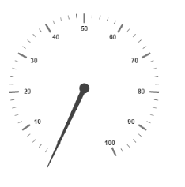
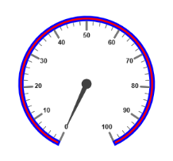
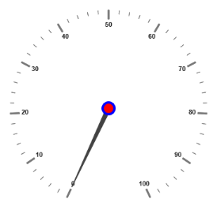

# Scales

`Scales` are the basic functional block of the Circular Gauge. By customizing the scales, the appearance of the Gauge can be improved. The functional blocks of Circular Gauge are 

* Pointers
* Labels
* CustomLabels
* Indicators
* Ticks
* Ranges
* Sub-gauges.

## Adding Scale Collection

Scale collection is directly added to the Gauge object. Refer the following code example to add scale collection in Gauge control.



<%--For Circular Gauge rendering-- %>

<ej:CircularGauge runat="server" Id="CircularGauge1">

<Scales>

<ej:CircularScales  Radius="130">

</ej:CircularScales>

</Scales>

</ej:CircularGauge>



Execute the above code to render the following output.

 

## Scale Customization

### Colors and Border

* The Scale border is modified with the object called `Border`. It has two border property namely `Color` and `Width` which are used to customize the border color of the scale and border width of the scale. 
* Setting the background color improves the look and feel of the **Circular Gauge**. You can customize the background color of the scale using `BackgroundColor`. 
* The scale bar of circular gauge can be enabled by setting `ShowScaleBar` property as true.



        <%--For Circular Gauge rendering-- %>

        <ej:CircularGauge runat="server" ID="ScaleCircularGauge">

        <Scales>

        <ej:CircularScales ShowScaleBar="true" Radius="110" BackgroundColor="Red">

        <%--For setting scale border width and color-- %>

        <Border Width="3" Color="blue" />

        <PointerCollection>

        <ej:Pointers Length="80"></ej:Pointers>

        </PointerCollection>

        </ej:CircularScales>

        </Scales>

        </ej:CircularGauge>



Execute the above code to render the following output.

 

### Pointer Cap

* **Pointer cap** is a circular shape element that is located at the center of the **Circular Gauge**. The pointer cap is one of the cynosure of the Circular Gauge. By customizing the pointer cap, Gauge style is improved. The pointer cap is modified with the object `PointerCap`. 
* It contains `Radius`, `BorderColor`, `BorderWidth`, `InteriorGradient` and `BackgroundColor` properties. The property `radius` is used to set the radius for the pointer cap. `InteriorGradient` is used to provide the gradient effects to the pointer cap.



        <%--For Circular Gauge rendering-- %>

        <ej:CircularGauge runat="server" ID="ScaleCircularGauge">

        <Scales>

        <ej:CircularScales>

        <PointerCap Radius="10" BackgroundColor="Red"

        BorderColor="Blue" BorderWidth="4">

        </PointerCap>

        </ej:CircularScales>

        </Scales>

        </ej:CircularGauge>



Execute the above code to render the following output.

  

### Appearance

* Circular Gauge contains two types of scale direction such as clockwise and counter clockwise. You can set them by enumerable property called `Direction`. And you can set the minimum and maximum values for the scale with the properties `Minimum` and `Maximum`. The two properties `MinorIntervalValue` and `MajorIntervalValue` are the values used to set interval value for the ticks and labels. 
* The `Radius` property is used to set the radius value for the circular scale and the `Size` property is used to set the scale bar width. You can also adjust the Opacity of the scale with the property `Opacity`. The value for opacity lies between 0 and 1. You can also give some shadow effects for the scale by using the property `ShadowOffset`. The property `StartAngle` is used to set starting position of the scale at certain angle and `SweepAngle` is used to shrink or expand the scale to certain angle. 



        <%--For Circular Gauge rendering-- %>

        <ej:CircularGauge runat="server" ID="ScaleCircularGauge">

        <%--For setting scale bar size, scale radius, minimum value, maximum value, majorinterval value, minorinterval value and direction-- %>

        <Scales>

        <ej:CircularScales Size="30" BackgroundColor="red" opacity="0.5" ShadowOffset="20" minimum="20" Maximum="120" MajorIntervalValue="20" MinorIntervalValue="5" Direction="CounterClockwise">

        </ej:CircularScales>

        </Scales>

        </ej:CircularGauge>



Execute the above code to render the following output.

 

### Enable/Disable properties

You can enable / disable properties in Circular Gauge using some properties in scale collection. The `ShowIndicators` property is used to enable/disable the indicators. `ShowLabels`, `ShowTicks`, `ShowRanges`, `ShowPointers` ans `ShowScaleBar` are used to enable/ disable labels, ticks, ranges, pointers and scale bar respectively. 

## Multiple Scales

You can set Multiple scales for a single Circular Gauge control by using an array of scale objects. Each scale object is independent of each other. The following code example refers to two scale objects in a Gauge.



<%--For Circular Gauge rendering-- %>

<ej:CircularGauge runat="server" ID="ScaleCircularGauge">

<Scales>

<%--For setting scale1 -- %>

<ej:CircularScales ShowScalebar="true" Size="10" radius="150" ShadowOffset="20" minimum="20" Maximum="120" MajorIntervalValue="20" MinorIntervalValue="5" Direction="Clockwise">

<PointerCollection>

<ej:Pointers Value="50" ShowBackNeedle="true" Length="120" Width="7" BackNeedleLength="0"></ej:Pointers>

</PointerCollection>

</ej:CircularScales>

<%--For setting scale2 -- %>

<ej:CircularScales ShowScalebar="false" Size="10" radius="80" opacity="0.5" ShadowOffset="5" MajorIntervalValue="10"  Direction="CounterClockwise">

<labelCollection>

<ej:CircularLabels DistanceFromScale="-40" Color="red"></ej:CircularLabels>

</labelCollection>

<TickCollection>

<ej:CircularTicks Color="red"/>

</TickCollection>

<PointerCollection>

<ej:Pointers Value="40" distanceFromScale="-30" Length="50"></ej:Pointers>

</PointerCollection>

</ej:CircularScales>

</Scales>

</ej:CircularGauge>



Execute the above code to render the following output.

 

