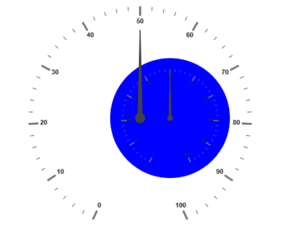
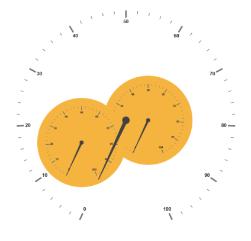

# Sub Gauges

A Circular Gauge containing another circular gauge is said to be `SubGauges`. In order to make  a sample like watch that has second gauge, minute gauge and hour gauge, sub gauges are used.

## Adding Sub Gauges

Sub gauge collection is directly added to the scale object. Refer the following code example to add custom sub gauge collection in a Gauge control



<%--For Circular Gauge rendering-- %>

<%--For setting sub gauge -- %>

<ej:CircularGauge  runat="server" ID="Subgauge1" value="50" BackgroundColor="blue"  Radius="150"></ej:CircularGauge>

<ej:CircularGauge runat="server" Value="50" ID="CircularGauge1">

<Scales>

<ej:CircularScales radius="190">

<PointerCollection>

<ej:Pointers  Value="0"  length="110"></ej:Pointers>

</PointerCollection>

<labelCollection>

<ej:CircularLabels type="major" />

</labelCollection>

<SubGaugeCollection>

<ej:SubGauge ControlID="Subgauge1" Height="200"  Width="200">

<Position X="100" Y="120"/>

</ej:SubGauge>

</SubGaugeCollection>

</ej:CircularScales>

</Scales>

</ej:CircularGauge>



### Basic Customization

Basic attributes such as `Height` and `Width` property are used to set height and width of the sub gauge. You can easily position the gauge in another gauge using the `Position` object and by giving the `X` and `Y` Coordinates value. **ControlID** attribute is used to specify the sub gauge ID.



<%--For Circular Gauge rendering-- %>

<ej:CircularGauge  runat="server" ID="Subgauge1" value="50" BackgroundColor="blue" radius="110">

<Scales>

<ej:CircularScales radius="110">

</ej:CircularScales>

</Scales>

</ej:CircularGauge>

<ej:CircularGauge runat="server" ID="CircularGauge1" Height="500" Width="500" Value="50">

<Scales>

<ej:CircularScales radius="190">

<SubGaugeCollection>

<%--For enabling animation and setting animation speed-- %>

<ej:SubGauge ControlID="Subgauge1" Height="200"  Width="200">

<Position X="200" Y="150"/>

</ej:SubGauge>

</SubGaugeCollection>

</ej:CircularScales>

</Scales>

</ej:CircularGauge>



Execute the above code to render the following output.

 

### Multiple Sub Gauges

You can set multiple sub gauges in a single Circular Gauge by adding an array of sub gauge objects. Refer the following code example for multiple sub gauges functionality.



<%--For Circular Gauge rendering-- %>

<ej:CircularGauge  runat="server" ID="Subgauge1"  BackgroundColor="#f5b43f" >

</ej:CircularGauge>

<ej:CircularGauge  runat="server" ID="Subgauge2"  BackgroundColor="#f5b43f" >

</ej:CircularGauge>

<ej:CircularGauge runat="server" ID="CircularGauge1" Height="500" Width="500" >

<Scales>

<ej:CircularScales ShowRanges="true"  ShowscaleBar="false" radius="250" Size="5" Maximum="100">

<SubGaugeCollection>

<%--subgauge1--%>

<ej:SubGauge ControlID="Subgauge1" Height="200"  Width="200">

<Position X="200" Y="150"/>

</ej:SubGauge>

<%--subgauge2-- %>

<ej:SubGauge ControlID="Subgauge2" Height="200"  Width="200">

<Position X="50" Y="200"/>

</ej:SubGauge>

</SubGaugeCollection>

</ej:CircularScales>

</Scales>

</ej:CircularGauge>



Execute the above code to render the following output.

 

