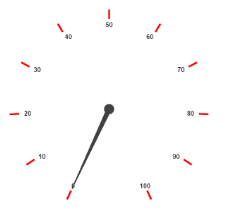
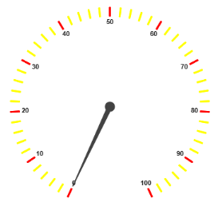

# Ticks

`Ticks` are used to mark some values on the scale. Based on the tick’s `Value` you can set the labels on the required position.

### Adding Tick Collection 

Tick collection is directly added to the scale object. Refer the following code example to add tick collection in a Gauge control.



<%--For Circular Gauge rendering-- %>

<ej:CircularGauge runat="server" ID="ScaleCircularGauge">

<Scales>

<ej:CircularScales>

<TickCollection>

<ej:CircularTicks Type="major" Color="red" />

</TickCollection>

</ej:CircularScales>

</Scales>

</ej:CircularGauge>



Execute the above code to render the following output.

 

### Tick Customization

* Height and width of the ticks can be applied by using the properties `Height` and `Width`. You can customize ticks with the properties such as angle, color, etc. `Angle` attribute is used to display the labels in the specified angles and `Color` attribute is used to display the labels in specified color. Ticks are two types such as major and minor.
* Major `Type` ticks are for major interval values and minor type ticks are for minor interval values.You can position ticks with the help of two properties such as `DistanceFromScale` and `Placement`. **DistanceFromScale** property defines the distance between the scale and ticks. **Placement** property is used to locate the ticks with respect to scale either inside the scale or outside the scale or along the scale. It is an enumerable data type.



<%--For Circular Gauge rendering-- %>

<ej:CircularGauge runat="server" ID="ScaleCircularGauge">

<Scales>

<ej:CircularScales >

<TickCollection>

<%--For setting tick1-- %>

<ej:CircularTicks Type="major" Color="red" placement="Near"  DistanceFromScale="5"/>

<%--For setting tick2-- %>

<ej:CircularTicks Type="minor" Color="yellow" placement="Near" DistanceFromScale="5"/>

</TickCollection>

</ej:CircularScales>

</Scales>

</ej:CircularGauge>



Execute the above code to render the following output.

