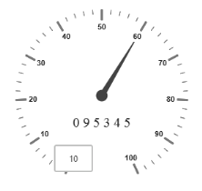
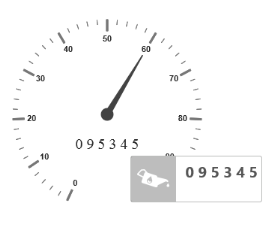

# Tooltip

* Tooltip feature has been added to the Circular Gauge. Circular Gauge has several elements such as pointers, label, customLabel, scales, etc.  
* There is a need for Tooltip feature in the Circular Gauge control because whenever the text hides or overrides with other gauge elements, it may not be fully visible. For resolving those problems Tooltip feature has been implemented in the Circular Gauge control.

## Default Tooltip

* `Tooltip` has three attributes in it. The first two attributes such as `ShowLabelTooltip` and `ShowCustomLabelTooltip` are for enabling the Tooltip for label as well as custom label in default appearance. 
* `ShowLabelTooltip` is to enable the Tooltip for labels and `ShowCustomLabelTooltip` is for enabling the Tooltip option for customLabels.

  

        <ej:circulargauge runat=”server” id=”circularGaugeTooltip” backgroundcolor=”transparent” enableAnimation=”false”>

        <%-- Defines the tooltip object-- %>

        <Tooltip ShowCustomLabelTooltip=”true” ShowLabelTooltip=”true” />

        <%-- Customizes the scale options-- %>

        <Scales>

        <ej:CircularScales ShowLabels=”true” Radius="130" >

        <PointerCollection>

        <ej:Pointers Value=”60” Length=”95” >

        </ej:Pointers>

        </PointerCollection>

        <%-- Customizes the custom label options-- %>

        <CustomLabelCollection>

        <ej:CircularCustomLabel Value=”0 9 5 3 4 5”>

        

        <Position X ="180" Y="200" />

        </ej:CircularCustomLabel>

        </CustomLabelCollection>

        </ej:CircularScales>

        </Scales>

        </ej:circulargauge>



Execute the above code to render the following output.

 

## Tooltip Template

In Tooltip option, you can customize the Tooltip window by adding the tooltip template on that page with the help of API `TemplateID`. Refer to the following code example to know more about Tooltip template.



<ej:circulargauge runat=”server” id=”circularGaugeTooltip” backgroundcolor=”transparent” nableAnimation=”false”>

<%-- Defines the tooltip object-- %>

<Tooltip>

<%-- Enables the custom label tooltip-- %>

ShowCustomLabelTooltip=”true”

<%-- Enables the label tooltip-- %>

ShowLabelTooltip=”true”

<%-- Enables the Tooltip Template-- %>

TemplateID=”Tooltip”/>

<%-- Customizes the scale options-- %>

<Scales>

<ej:CircularScales ShowLabels=”true” Radius="130" >

<%-- Customizes the pointers options-- %>

<PointerCollection>

<ej:Pointers Value=”60” Length=”95” >

</ej:Pointers>

</PointerCollection>

<%-- Customizes the custom label options-- %>

<CustomLabelCollection>

<ej:CircularCustomLabel Value=”0 9 5 3 4 5”>

<Position X ="180" Y="200" />

</ej:CircularCustomLabel>

</CustomLabelCollection>

</ej:CircularScales>

</Scales>

</ej:circulargauge>


Execute the above code to render the following output.

 

